# 								CSAPP

# 1 A Tour of Computer System

## 1.1 Information Is Bits + Context 信息就是位+上下文

一串hello.c的程序，你看到的是ASCII码表示的语句，其实都是一串串二进制的信息。

像hello.c这样的只由ASCII字符构成的文件称为**文本文件**，所有其他文件都称为**二进制文件**

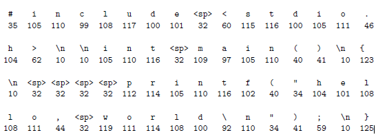

> tip: 了解C程序的起源

## 1.2 Programs Are Translated by Other Programs into Different Forms 程序被其他程序翻译成不同的格式：

hello.c是高级语言形式，给人看的，但是机器不懂，所有需要把高级语言翻译成低级语言，由**编译器**完成。

>  unix> gcc -o hello hello.c

四个阶段：

* 预处理

  > 处理宏定义等，#include <>

* 编译阶段

  > 翻译为汇编语言

* 汇编阶段

  > 翻译为机器语言指令，并将其打包成**可重定位目标程序**的格式

* 链接阶段

  > 合并不同的**目标文件**成为**可执行文件**

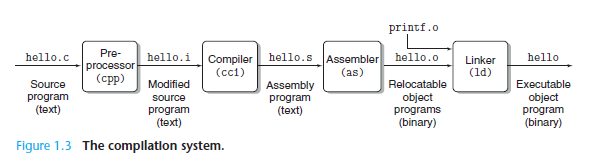

> tip: 了解GNU项目


## 1.3 It Pays to Understand How Compilation Systems Work 了解编译系统如何工作大有裨益

这里只是概述说下有必要了解，细节在之后的章节。

* 优化程序性能

  > switch 性能比if else if 高效？
  >
  > 一个函数调用开销多大？
  >
  > while 比 for 更有效？

* 理解链接时出现的错误

  > 无法解析一个引用是什么意思？
  >
  > 静态变量和全局变量区别是什么？
  >
  > 静态库和动态库区别是什么？

* 避免安全漏洞

  > 缓冲区溢出是造成大多数网络和服务器安全漏洞的主要原因

## 1.4 Processors Read and Interpret Instructions Stored in Memory 处理器读取并且解释内存中的指令

就是讲shell环境。

unix> ./hello
hello, world
unix>

### 1.4.1 Hardware Organization of a System系统的硬件组成

简单的介绍下硬件信息：


* 总线Buses

  > 贯彻整个系统的一组电子管道，携带信息字节并负责在各个部件之间传输，4字节32位，8字节64位

* I/O设备 I/O Devices

* 主存

  > 动态随机存取存储器DRAM

* 处理器

  > 解释（执行）存储在主存中中的指令引擎
  >
  > cpu一直在执行指令，这些是**指令集架构**决定的。
  >
  > 处理器看上去是指令集架构的简单实现，比如加载、存储、操作（add等）、跳转（jmp), 但是实际上现代处理器使用了非常复杂的机制来加速程序的执行！！！（流水线？）
  >
  > 因此要区分：**指令集架构**、**微体系结构**

### 1.4.2 Running the hello Program运行hello程序

前面简单讲了硬件的组成，现在讲讲一个hello.c程序运行具体经历了些什么。

* 键盘上输入“./hello"

  > 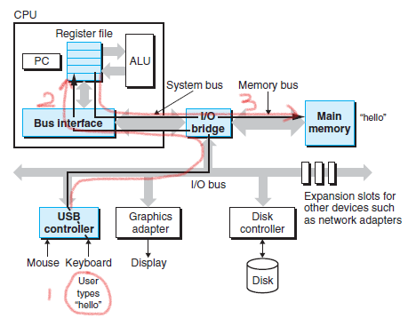
  >
  > 1 用户键盘输入hello	2shell程序将字符逐一读入寄存器	3再把字符放到内存

* 键盘回车一敲，shell知道命令结束，然后执行一系列指令将hello目标文件代码从磁盘复制到内存

  > 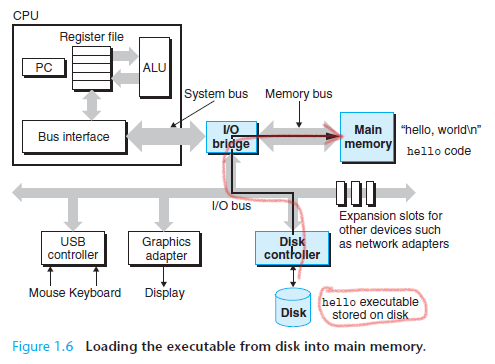

* 一旦hello中的代码和数据被加载到内存，处理器就开始执行程序的main的机器指令，这些指令将”hello world\n"字符中的字节从主存复制到寄存器，再从寄存器复制到显示设备

  > 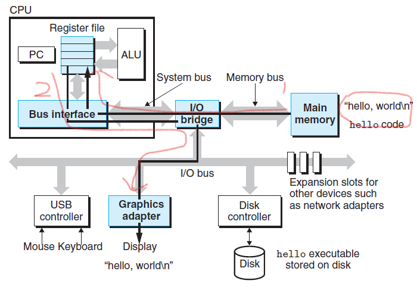

  

## 1.5 Caches Matter 高速缓冲至关重要

CPU与主存之间的矛盾，CPU很快，主存慢，数据一存一取耗时。引入cache，贵且小，但是这个桥梁很好，提高了效率。

## 1.6 Storage Devices Form a Hierarchy 存储设备形成层次

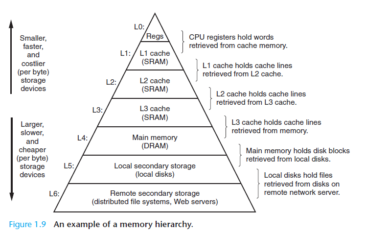


## 1.7 The Operating System Manages the Hardware 操作系统管理硬件

操作系统有两个基本功能：

* **防止硬件被失控的应用程序滥用**
* **向应用程序提供简单一致的机制来控制复杂而不同的硬件设备**

操作系统通过两个基本的抽象概念（**进程、虚拟内存和文件**）来实现这两功能

### 1.7.1 Processes进程

**进程**：是操作系统对一个正在运行的程序的一种抽象。一个系统可运行多个进程，看上去都是独占硬件。

**并发运行**：一个进程的指令与另一进程指令交错执行。操作系统实现这种交错执行的机制称为**上下文切换**

一个进程切换到另一进行的由**操作系统内核（Kernel)**管理的，内核是操作系统常驻主存的部分。内核不是一个独立的进程，相反，<u>它是系统管理全部进程所用代码和数据结构的集合</u>。

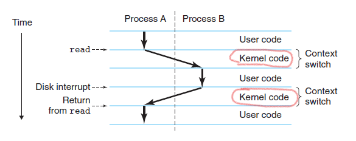

> 狭义定义：进程是正在运行的程序的实例（an instance of a computer program that is being executed）。
>
> 广义定义：进程是一个具有一定独立功能的程序关于某个数据集合的一次运行活动。它是[操作系统](https://baike.baidu.com/item/操作系统/192)动态执行的[基本单元](https://baike.baidu.com/item/基本单元)，在传统的[操作系统](https://baike.baidu.com/item/操作系统)中，进程既是基本的[分配单元](https://baike.baidu.com/item/分配单元)，也是基本的执行单元。
>
> 进程的概念主要有两点：第一，进程是一个实体。每一个进程都有它自己的地址空间，一般情况下，包括[文本](https://baike.baidu.com/item/文本)区域（text region）、数据区域（data region）和[堆栈](https://baike.baidu.com/item/堆栈)（stack region）。文本区域存储处理器执行的代码；数据区域存储变量和进程执行期间使用的动态分配的内存；堆栈区域存储着活动过程调用的指令和本地变量。第二，进程是一个“执行中的程序”。程序是一个没有生命的实体，只有[处理](https://baike.baidu.com/item/处理)器赋予程序生命时（操作系统执行之），它才能成为一个活动的实体，我们称其为[进程](https://baike.baidu.com/item/进程)。 [3] 
>
> 进程是操作系统中最基本、重要的概念。是多道程序系统出现后，为了刻画系统内部出现的动态情况，描述系统内部各道程序的活动规律引进的一个概念,所有多道程序设计操作系统都建立在进程的基础上。

### 1.7.2 Threads线程

现代操作系统中，一个进程实际上可由多个称为线程的执行单元组成。

> **线程**（英语：thread）是[操作系统](https://baike.baidu.com/item/操作系统)能够进行运算[调度](https://baike.baidu.com/item/调度)的最小单位。它被包含在[进程](https://baike.baidu.com/item/进程)之中，是[进程](https://baike.baidu.com/item/进程)中的实际运作单位。一条线程指的是[进程](https://baike.baidu.com/item/进程)中一个单一顺序的控制流，一个进程中可以并发多个线程，每条线程并行执行不同的任务。在Unix System V及[SunOS](https://baike.baidu.com/item/SunOS)中也被称为轻量进程（lightweight processes），但轻量进程更多指内核线程（kernel thread），而把用户线程（user thread）称为线程。

之后12章细讲

### 1.7.3 Virtual Memory 虚拟内存

是一个抽象概念，它为每一个进程提供一个独占使用主存的假象，每个进程看到的内存都是一致的，称为**虚拟内存**

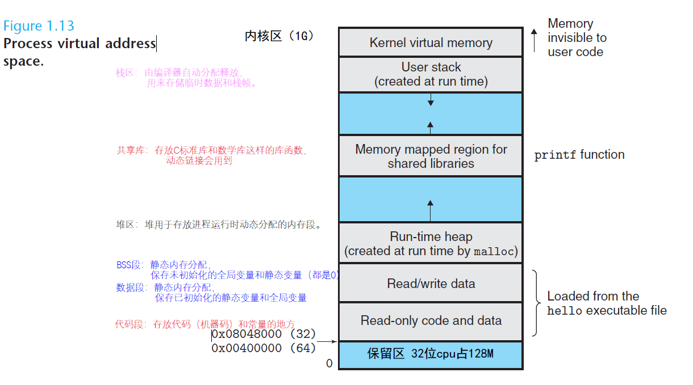

### 1.7.4 Files 文件

unix 一切皆文件，然后还要了解下文件系统。

## 1.8 Systems Communicate with Other Systems Using Networks 系统之间利用网络通信

站在单独的系统看，网络可以看成一个IO设备，实际上那是很复杂的，路由器、交换机等设备都是保证网络间通信的东西。

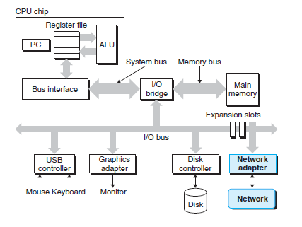


## 1.9 Important Themes 

### 1.9.1 Concurrency and Parallelism并发和并行

并发：concurrency, 是一个通用概念，一个同时具有多个活动的系统

并行：parallelism， 指的是用并发来使一个系统运行的更快，并行在计算机系统的多个抽象层次上应用：

* 线程级并发

  构建在进程的基础上，我们能设计出同时有多个程序执行的系统，这导致了并发，这种并发是模拟出来的，是进程间快速切换实现的。多核就更加好了咯

* 指令级并行

  现代处理器可以同时执行多条指令的属性称为指令级并行。

* 单指令、多数据并行


### 1.9.2 The Importance of Abstractions in Computer Systems计算机系统中抽象的重要性

学习操作系统时我们介绍了三个抽象：

* 文件是对I/O设备的抽象

* 虚拟内存是对程序存储器的抽象

* 进程是对一个正在运行的程序的抽象

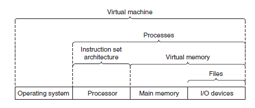


## 1.10 Summary 

# PART one ：Program Structure and Executionc程序结构和执行

# 2 Representing and Manipulating Information信息的表示和处理

## 2.1 Information Storage 信息存储

概述：现代计算机存储和处理信息是以二值信号为基础的。

三种数字表示：

* 无符号
* 补码
* 浮点数

### 2.1.1 Hexadecimal Notation十六进制表示法

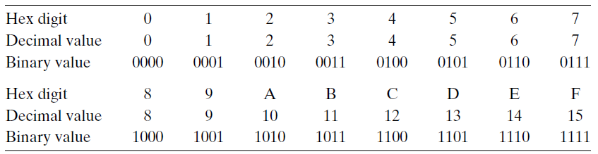

背会这个转换表

要会二进制、十六进制、十进制的相互转换。

### 2.1.2 Words and Data Size字数据大小

每台计算机都有一个**字长**，指明指针数据的标称大小。比如32位机器的字长就是4字节，64位机器的字长是8字节。64位机器能运行32位机器编译的程序。

32位程序和64位程序的差别是根据编译器如何编译来区别的，而不是看机器。

> linux> gcc -m32 prog.c
>
> linux> gcc -m64 prog.c

不同位的程序对C语言的数据类型典型大小有所差别：

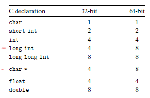

这种不同导致程序在不同编译器下编译会带来奇奇怪怪的问题，为了避免这种情况，ISO C99引入了一类数据类型，其数据大小固定，不随机器变化而变化：int 32_t 、 int 64_t	、int 16_t  uint 16_t 、uint 32_t等（stdint.h)

### 2.1.3 Addressing and Byte Ordering寻址和字节顺序

一个int类型变量 地址是 0x100,那么四个字节就存储在0x100 0x101 0x102 0x103中。

**大端法：高字节在前** 低地址是高字节

**小端法：低字节在前** 低地值是低字节

一个数据 0x01234567	**//注意：0是高字节，7是低字节！！！**

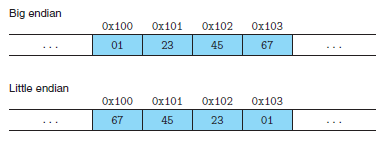

一般电脑是小端法。

一张图看清：机器大小端，浮点数编码和整数编码不同，指针的不同

0x00003039 的表示：

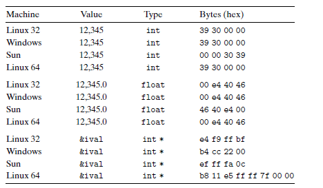

###  2.1.4 Representing Strings表示字符串

字符串被编码为ASCII码（英文情况），“12345”字符串表示为low add：31 32 33 34 35 00,

除了ASCII编码，还要Unicode编码等不同的编码。

### 2.1.5 Representing Code表示代码

指令编码是不同的，不同的机器使用不同且不兼容的指令和编码方式。

>  int sum(int x, int y) {
>  	return x + y;
>  }

不同系统编译出的机器代码是不同的

> Linux 32:	  55 89 e5 8b 45 0c 03 45 08 c9 c3
> Windows: 	55 89 e5 8b 45 0c 03 45 08 5d c3
> Sun: 			 81 c3 e0 08 90 02 00 09
> Linux 64: 	55 48 89 e5 89 7d fc 89 75 f8 03 45 fc c9 c3

### 2.1.6 Introduction to Boolean Algebra布尔代数简介

与& 	或| 	非~ 	异或^

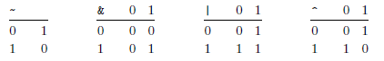

> tip:
>
> 布尔代数和布尔环的故事，位向量有一些分配了：a&(b|c) = (a&b)|(a&c); a|(b&c) = (a|b)&(a|c)
>
> 布尔环，整数运算有一个加法逆元，x+(-x) = 0;布尔环也有类似属性，a ^ a = 0;利用这个属性，(a\^b)\^a = b;

> 位向量来表示集合：
>
> 也就是用位运算来表示 并 交 的集合运算概念，
>
> n位置1： v = v|1<<n
>
> n位置0： v = v&~(1<<n) 

### 2.1.7 Bit-Level Operations in C C语言的位运算

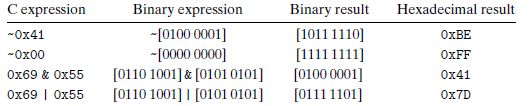

### 2.1.8 Logical Operations in C C语言的逻辑运算

!0x41 			 	     0x00
!0x00			  	     0x01
!!0x41 				     0x01
0x69 && 0x55 	   0x01
0x69 || 0x55 		0x01

### 2.1.9 Shift Operations in C C语言的位移

向左位移<<还好说，高位丢掉即可，但是右移>>就有点东西：

**逻辑右移**：左边补0

**算术右移**：左边补原来的数//负数就...

C语言标准并没有明确对有符号数应该使用哪种右移，但是实际上几乎所有编译器和机器都是 **对有符号数使用算术右移**。 

> tip: 
>
> k比较大的时候，比如32位数据左移32位？？？不就没了?实际上很多计算机上，要位移w位的数据时候 移位指令只考虑低的log_2_ ^w^
>
> 优先级的问题，不明确就加括号，C中位移优先级低于+-

## 2.2 Integer Representations 整数表示

我们描述用位来编码整数的两种不同的方式：**一种只能表示非负数**，**另一种能够表示负数、0、正数。**

先来确定几种编码形式的表示方式：

> U	无符号数
>
> T	补码
>
> B	二进制数

### 2.2.1 Integral Data Types 整数数据类型

C语言中整数类型的典型取值范围：

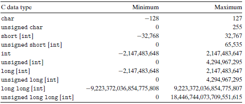

### 2.2.2 Unsigned Encodings 无符号数编码

定义：$B2U_w(\vec{x}) = \sum_{i=0}^{w-1}x_i2^i$

例子：$B2U_{4}([1011]) = 1*2^3+0*2^2+1*2^1+1*2^0 = 11$

### 2.2.3 Two’s-Complement Encodings补码编码

定义：$B2T_w(\vec{x}) = -x_{w-1}2^{w-1}+\sum_{i=0}^{w-2}x_i2^i$

例子：$B2T_{4}([1011]) = -1*2^3 + (0*2^2+1*2^1+1*2^0) = -5$


一些特殊属性：

UMAX = 2*TMAX+1

### 补充：反码和原码

>  原码：最高位确定正负，余下位按U解码
>
> $B2S_w(\vec{x}) = -1^{x_{w-1}}(\sum_{i=0}^{w-2}x_i2^i)$
>
> $B2S_{4}([1011]) = -1^{1}*(0*2^2+1*2^1+1*2^0) = -3$

> 反码：$B2T_w(\vec{x}) = -x_{w-1}（2^{w-1}-1）+\sum_{i=0}^{w-2}x_i2^i$
>
> 符号不变，其余取反

> 原码转补码：
>
> S2T = 正不变。负数余下取反加一
>
> 补码转原码：T2S = 正不变。负数余下取反加一
>
> 例子：-3的原码是 1 000   0011 => 1 111  1100+1 =>1111 1101 =>FD

### 2.2.4 Conversions Between Signed and Unsigned有符号数和无符号数之间的转换

**记住：强制类型转换的结果保持位值不变，只是改变解释这些位的方式**

* T2U 补码转换为有符号数

  $T2U_w(x) = \begin{cases}x+2^w, x<0  \\ x,x\geq0 \end{cases} $

* U2T 无符号数转补码

  $U2T_w(u) = \begin{cases}u, u\leq TMax  \\ u-2^w,u>TMax \end{cases} $

### 2.2.5 Signed vs. Unsigned in C C语言中的有符号数和无符号数

* 几乎所有机器的有符号数都是按补码进行编码
* 默认的数是有符号数
* 类型转换的隐藏bug //有符号数和无符号数的比较大小

### 2.2.6 Expanding the Bit Representation of a Number 扩展一个数字的位表示

* U无符号数的扩展：填零
* T 补码的扩展：符号扩展//书上有证明

### 2.2.7 Truncating Numbers 截断数字

* U 无符号数截断：之间截断
* T补码的截断：先按U截断再U2T

## 2.3 Integer Arithmetic 整数运算

### 2.3.1 Unsigned Addition 无符号加法

**溢出后截断再看成无符号数咯**

$x+_w^uy = \begin{cases}x+y, &x+y< 2^w &正常  \\ x+y-2^w,&2^w\leq x+y<2^{w+1} &溢出 \end{cases} $

**检测无符号加法的溢出**：

> 对满足定义域的x,y; s = x+y; 当且仅当 s<x 或者 s<y时 发生了溢出。

**无符号数求反：**

> $-_w^ux = \begin{cases} x,&x=0\\2^w-x,&x>0 \end{cases}$

### 2.3.2 Two’s-Complement Addition 补码加法

**溢出后截断然后按照补码编码咯**

$x+_w^ty = \begin{cases}x+y-2^w, &2^w-1\leq x+y&正溢出\\x+y,&-2^{w-1}\leq x+y<2^w &正常  \\ x+y+2^w,&x+y<2^{w+1} &负溢出 \end{cases} $

定义域边界是：$[-2^{w-1},2^{w-1})$

**检测补码加法的溢出：**

> 对于满足定义域内的x,y； s = x+y, 当且仅当x >0,y>0但是s<0 时候发生正溢出；当且仅当x<0,y<0 但是s>0时候发生负溢出

> 想通过检查s - x == y? 来判断溢出是不可取的，为什么呢？
>
> 补码会形成一个阿贝尔群，（x+y)-x 一定等于 y。

### 2.3.3 Two’s-Complement Negation 补码的非

**补码的非：（补码求反？）**

> $-_w^tx = \begin{cases} TMin_w,&x=TMin_w\\-x,&x>TMin_w \end{cases}$
>
> 位级的补码的非：求反再加1

### 2.3.4 Unsigned Multiplication无符号乘法

超出直接截断：

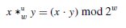

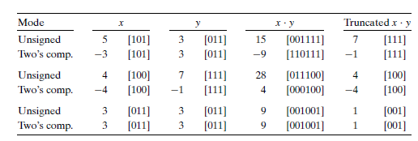

### 2.3.5 Two’s-Complement Multiplication 补码乘法

先按无符号截断再按补码编码

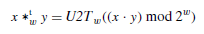

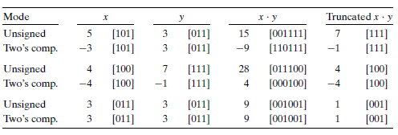

判断溢出可以用除法来判断（证明过程略）

```c
int tmult_ok(int x, int y) {
	int p = x*y;
	/* Either x is zero, or dividing p by x gives y */
	return !x || p/x == y;
}
```

### 2.3.6 Multiplying by Constants乘以常数

这节主要是说用位移方法来表示乘以常数。

* 无符号数的乘法

  > 14*x中 $14 = 2^3+2^2 +2^1 = 2^4 - 2^1$

  > 因此： 14*x = (x<<3) +(x<<2)+(x<<1) = (x<<4)-(x<<1)

* 补码的乘法

  

### 2.3.7 Dividing by Powers of Two 除以2的幂

* 无符号数的除法

  > 与乘法同理，只是右移>>,然后向下取整

* 补码的除法

  > 对于正数，右移>> 即可，是向下取整，12340/$2^4$ = 771(771.25) 
  >
  > 对于负数，右移是向下取值，-12340/$2^4$ = -772(-771.25)
  >
  > 但是我们希望是舍去小数的，负数想要向上取整，那么需要一个偏置，这个偏置是多少呢？应该是 除数-1；所以 要除以$2^k$,那么偏置 bias = $2^k-1$.
  >
  > 所以 （x +(1<<k)-1)>>k = 向上取值的$x/2^k$

一个表达式是：

```c
x<0?(x+(1<<k)-1:x)>>k
```


## 2.4 Floating Point 浮点数

### 2.4.1 Fractional Binary Numbers 二进制小数

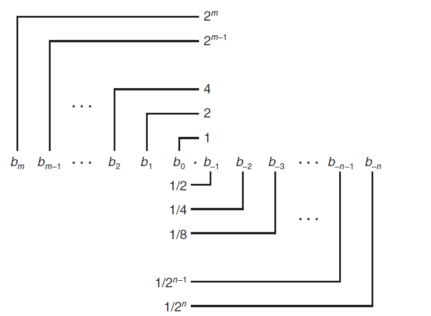


### 2.4.2 IEEE Floating-Point RepresentationIEEE浮点表示

再说吧，这个编码有点烦。

## 2.5 Summary 

* 无符号、有符号的编码
* 基本运算及溢出防备
* 小数的编码

# 3 Machine-Level Representation of Programs程序的机器级表示

## 3.1 A Historical Perspective 历史观点

发展史、摩尔定律：每年晶体管数量翻翻

## 3.2 Program Encodings 程序编码

> unix> gcc -O1 -o p p1.c p2.c
>
> * 编译选项 -O1 是使用1级优化，符合原程序结构
> * -o是包含全套的：预处理、编译、汇编、链接

### 3.2.1 Machine-Level Code机器级代码

两种抽象很重要：

* 由指令集体系结构来定义机器级程序的格式和级别
* 机器级程序使用的地址是虚拟地址

其他没讲什么东西。

### 3.2.2 Code Examples示例代码

//注意英文版的pdf的示例和纸质版中文书本的示例是不一样的。

```c
 int accum = 0;

 int sum(int x, int y)
 {
     int t = x + y;
     accum += t;
     return t;
 }
```

> unix> gcc -O1 -S code.c //-S是**编译**生成汇编文件.s

```assembly
sum:
pushl %ebp
movl %esp, %ebp
movl 12(%ebp), %eax
addl 8(%ebp), %eax
addl %eax, accum
popl %ebp
ret
```

> unix> gcc -O1 -c code.c //-C是**编译且汇编**生成二进制.o文件

55 89 e5 8b 45 0c 03 45 08 01 05 00 00 00 00 5d c3

**反汇编**：有二进制文件就可以反汇编成汇编代码。

> **unix> objdump -d code.o**

```assembly
 00000000 <sum>:
Offset Bytes Equivalent assembly language
 0: 55 					push %ebp
 1: 89 e5 				mov %esp,%ebp
 3: 8b 45 0c 			mov 0xc(%ebp),%eax
 6: 03 45 08 			add 0x8(%ebp),%eax
 9: 01 05 00 00 00 00 	add %eax,0x0
 f: 5d 					pop %ebp
10: c3 					ret
```

实际生成可执行代码是要完整的c程序，需要main函数的，并且连接器是要运行的，比如下面这段：

```c
int main(){
    return sum(1,3)
}
```

> unix> gcc -O1 -o prog code.o main.c//这里的code.o是之前汇编的包含sum函数的文件

反汇编

> unix> objdump -d prog

```assembly
;//从全部的汇编文件提取sum函数部分的汇编，对比之前的，差别有二
;1 开始的地址变了
;2 全局变量accum的地址变了
Disassembly of function sum in executable file prog
08048394 <sum>:
Offset Bytes Equivalent assembly language
8048394: 55 					push %ebp
8048395: 89 e5 					mov %esp,%ebp
8048397: 8b 45 0c 				mov 0xc(%ebp),%eax
804839a: 03 45 08 				add 0x8(%ebp),%eax
804839d: 01 05 18 a0 04 08 		add %eax,0x804a018
80483a3: 5d 					pop %ebp
80483a4: c3 					ret
```

### 3.2.3 Notes on Formatting 关于格式的注解

一个完整的汇编如下：

```c
int simple(int *xp, int y)
{
    int t = *xp + y;
    *xp = t;
    return t;
}
```

> Linux> gcc -O1 -S simple.s

```assembly
.file "simple.c"
.text
.globl simple
.type simple, @function
simple:
pushl %ebp
movl %esp, %ebp
movl 8(%ebp), %edx
movl 12(%ebp), %eax
addl (%edx), %eax
movl %eax, (%edx)
popl %ebp
ret
.size simple, .-simple
.ident "GCC: (Ubuntu 4.3.2-1ubuntu11) 4.3.2"
.section .note.GNU-stack,"",@progbits
```

其中以‘ . ’开头的的行都是指导汇编和链接器工作的伪指令，通常可忽略。

我们经常是在汇编旁边注释每一行干什么：

```assembly
simple:
pushl 	 %ebp 					;Save frame pointer
movl 	 %esp, %ebp 			;Create new frame pointer
movl	 8(%ebp), %edx 			;Retrieve xp
movl 	 12(%ebp), %eax 		;Retrieve y
addl 	 (%edx), %eax 			;Add *xp to get t
movl 	 %eax, (%edx) 			;Store t at xp
popl	 %ebp 					;Restore frame pointer
ret 							;Return
```

> tip:
>
> 本书用的汇编代码风格是AT&T的，还有一种intel格式是，就是push、move、 pop等这样的
>
> unix> gcc -O1 -S -masm=intel code.c
>
> ```assembly
> Assembly code for simple in Intel format
> simple:
> push ebp
> mov ebp, esp
> mov edx, DWORD PTR [ebp+8]
> mov eax, DWORD PTR [ebp+12]
> add eax, DWORD PTR [edx]
> mov DWORD PTR [edx], eax
> pop ebp
> ret
> ```

## 3.3 Data Formats 数据格式

由于是从16位系统结构扩展到32位体系结构，字表示16位，双字表示32位，四字表示64位。

一张表（IA32）就可以：

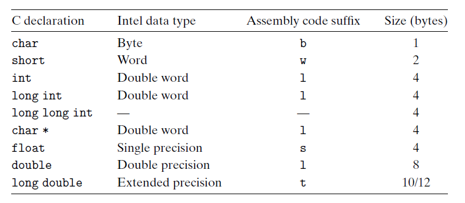

> 64位系统的 long long int 类型是64位;32位系统的long long int 也是64位。
>
> 32位系统的long int 是32位， 64位系统的long int 是32位

不重要，记得常用的是多少字节就好了。

## 3.4 Accessing Information 访问信息

**x86-64 架构中的整型寄存器如下图所示（**暂时不考虑浮点数的部分）


> 仔细看看寄存器的分布，我们可以发现有不同的颜色以及不同的寄存器名称，黄色部分是 16 位寄存器，也就是 16 位处理器 8086 的设计，然后绿色部分是 32 位寄存器（这里我是按照比例画的），给 32 位处理器使用，而蓝色部分是为 64 位处理器设计的。这样的设计保证了令人震惊的向下兼容性，几十年前的 x86 代码现在仍然可以运行！


前六个寄存器(%rax, %rbx, %rcx, %rdx, %rsi, %rdi)称为**通用寄存器**，有其『特定』的用途：

- %rax(%eax) 用于做累加
- %rcx(%ecx) 用于计数
- %rdx(%edx) 用于保存数据
- %rbx(%ebx) 用于做内存查找的基础地址
- %rsi(%esi) 用于保存源索引值
- %rdi(%edi) 用于保存目标索引值

### 3.4.1 Operand Specifiers 操作数指示符

不同的**操作数**分成三种类型：

* 立即数 immediate	\$-577 或者\$0x1f
* 寄存器 register          R[$r_a$]
* 内存引用                     $M_b[Addr]$

多种**寻址方式**：

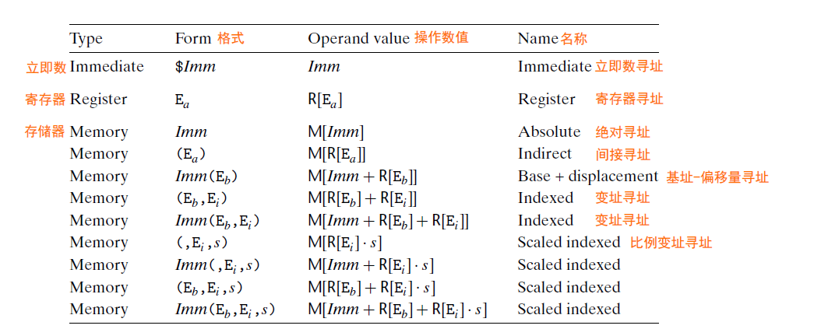

**例题：**

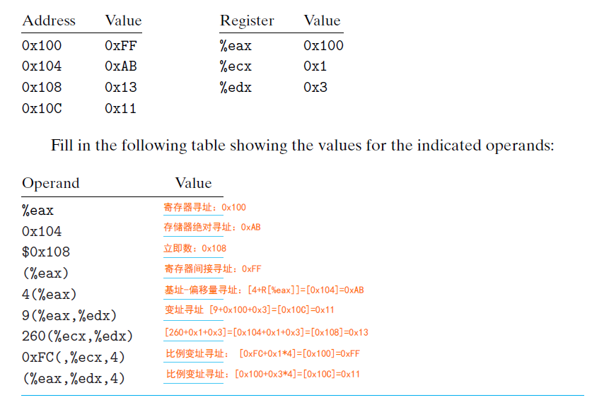

### 3.4.2 Data Movement Instructions 数据传送指令

**MOV、PUSH系列**

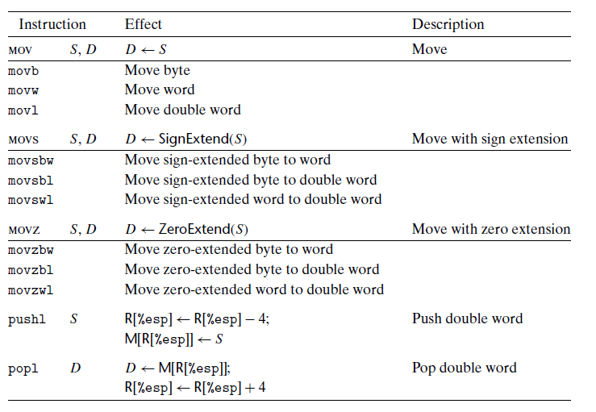

**记住几点：**

* x86-64加入了限制，传送指令两个操作符不能都是内存位置！
* **movl指令以寄存器为目的时候，会将该寄存器高4字节设置为0**
* movabsq指令能够以任意64位立即数为源操作数，只能以寄存器为目的

**以下是五种可能的组合， （men ---mem是不可以的）**

> movl 	  $0x4050,%eax 		Immediate--Register,	 4 bytes
>
> movw 	%bp,%sp 				  Register--Register, 		2 bytes
>
> movb 	(%edi,%ecx),%ah 	 Memory--Register, 		1 byte
>
> movb 	$-17,(%esp) 			  Immediate--Memory, 	1 byte
>
> movl 	 %eax,-12(%ebp) 	   Register--Memory, 		4 bytes

**理解数据传送如何改变目的寄存器**

b 	0xFF	

w	0xFFFF

l	  0xFFFFFFFF

```assembly
movabsq	$0x0011223344556677, %rax	%rax = 0011223344556677
movb	$-1,				 %al	%rax = 00112233445566FF
movw	$-1,				 %ax	%rax = 001122334455FFFF
movl	$-1,				 %eax 	%rax = 00000000FFFFFFFF
movq	$-1, 				 %rax	%rax = FFFFFFFFFFFFFFFF
```

**字节传送指令比较**(重点看movsbq、movzbq)

```assembly
movabsq	$0x0011223344556677, %rax	%rax = 0011223344556677
movb	$0xAA,				 %dl	%dl  = AA ;movb是移动1字节
movb	%dl,				 %al 	%rax = 00112233445566AA
movsbq  %dl,				 %rax	%rax = FFFFFFFFFFFFFFAA
movzbq  %dl,				 %rax	%rax = 00000000000000AA
```

### 3.4.3 Data Movement Example数据传送案例

一个例题看清转换的过程

先记着：

* mov 根的字母b\w\l\q 要和寄存器匹配
* （%reg）是内存取址

>  src_t *sp;  dest_t *dp;  *dp = (dest_t) sp;

> **大2小；读大的到合适的reg，存reg低位**
>
> **小2大：扩展到合适的reg(有符号的sxx,无符号的zxx)，存reg**
>
> | src_t         | dest_t      | 指令                                                         |
> | ------------- | ----------- | ------------------------------------------------------------ |
> | long//q,rax   | long//q,rax | movq (%rdi),%rax      movq %rax,(%rsi)                       |
> | char//b       | int//l,eax  | mov**sbl** (%rdi),%**eax**      movl %**eax**,(%rsi)         |
> | char//b       | uint//l,eax | mov**sbl** (%rdi),%**eax**      movl %**eax**,(%rsi)         |
> | uchar//b,usig | long//q,rax | mov**zbl** (%rdi),%**eax**      movq %**rax**,(%rsi)//扩展只能到l |
> | int//l        | char//b,al  | mov**l** (%rdi),%**eax**      mov**b** %**al**,(%rsi)        |
> | uint          | uchar       | mov**l** (%rdi),%**eax**      mov**b** %**al**,(%rsi)        |
> | char//b       | short//w    | mov**sbw** (%rdi),%ax      movw %ax,(%rsi)                   |

#### 3.4.4 push and pop 压栈和出栈

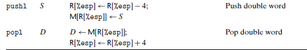

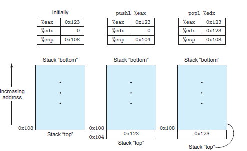

push:

> subl $4,%esp 			 Decrement stack pointer
> movl %ebp,(%esp) 	Store %ebp on stack

pop:

> movl (%esp),%eax 	Read %eax from stack
> addl $4,%esp 			Increment stack pointer

## 3.5 Arithmetic and Logical Operations 算术和逻辑操作

整数算术操作：

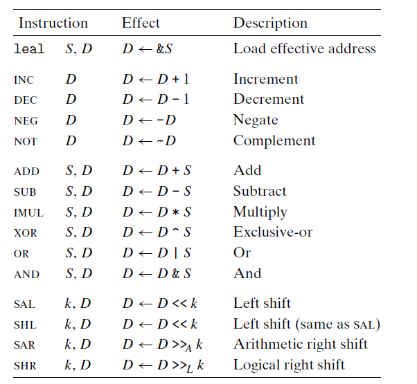

### 3.5.1 Load Effective Address 加载有效地址lea

leal其实是mov指令的变形，从内存读取数据到寄存器，但是它实际上没有引用内存。&s--D就看得出是从s取址的结果给D。

看个例子就好：练习题3.6

> %eax = x	%ecx = y	%edx 要求的表达式
>
> 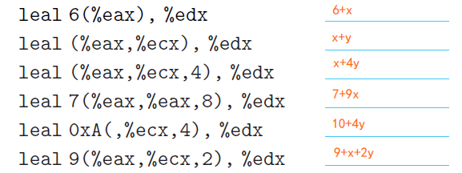

### 3.5.2 Unary and Binary Operations 一元和二元操作

顾名思义，一元操作如：inc，二元操作如add

易混淆的点：

* 指令 S, D; 无论D多复杂都在算完D后的地址内容进行操作
* 指令 reg 和 指令（reg) 是不同的！

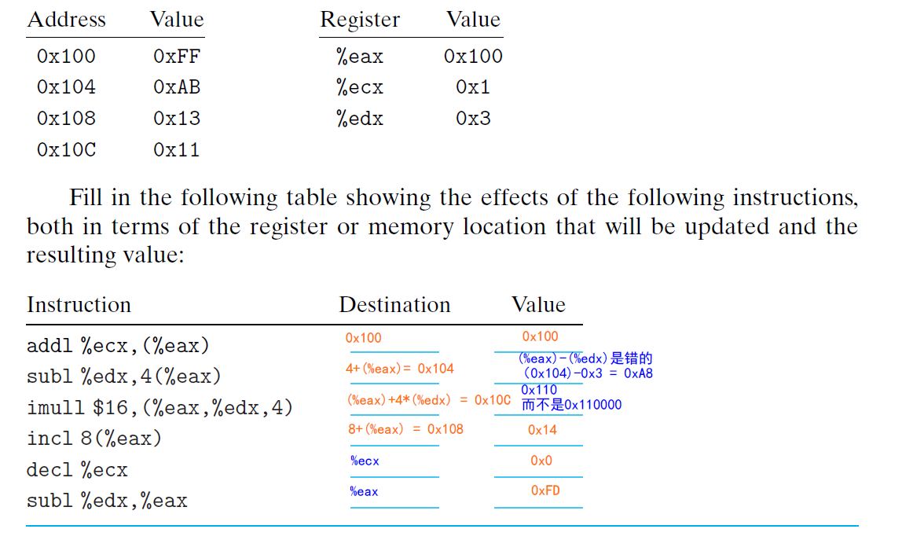

### 3.5.3 Shift Operations 移位操作

* 分清楚是算术的A，还是逻辑的H

  > SAL\SHL\SAR\SHR
  >
  > A:算术，带符号
  >
  > H:逻辑，无符号

* 位移量的问题

  > 理论上一个字节位移量可以表示到255了。
  >
  > 一个w长度的数据，其位移量由低$log_2w$位决定。
  >
  > b--3(k最多是7)	w--4(k最多是15)	l--5(k最多是31)	q--6(k最多是63)

例子：

> movl 	8(%ebp), %eax		   Get x
> sall		$2, %eax 					x <<= 2
> movl 	12(%ebp), %ecx		 Get n
> sarl 	   %**cl**, %eax 					 x >>= n//n的长度是4字节，**但是记住只有最低的那字节才指示位移量**

### 3.5.4 Discussion讨论

3.5的图所示的大多数指令既可以用于无符号运算、又可以用于补码运算；只有右移>>要区分补码与否。所以补码运算成为实现有符号整数运算的一种比较好的方法原因之一。

然后就是解释 & ^ 一些操作：

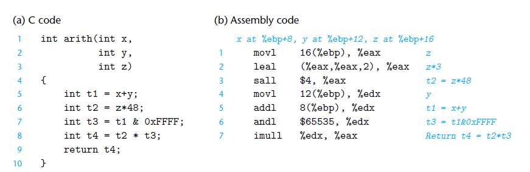

异或置0的好处：

xorl %edx,%edx   操作就是给%edx置0；

比mov \$0 %edx 好处的，反汇编字节数少些。

### 3.5.5 Special Arithmetic Operations 特殊的算术操作

这节主要是考虑如果两个64位的数相乘或者相除咋么办？x86-64系统提供有限的128位数的支持，主要是利用%rax（低64），%rdx(高64)；mulq无符号的、imulq有符号的；**要求必须有寄存器%rax参与**。

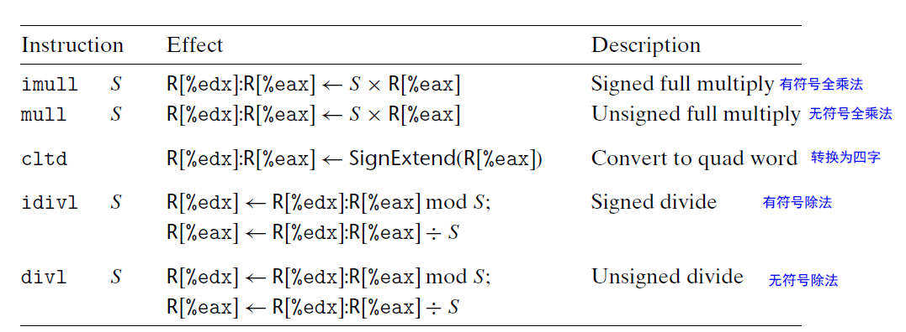

> 截图的是32位系统的情况，在64位系统上是q结尾的。clto 则是转为8字

举个栗子：

> 还是自己手打吧，就打书本64位系统的例子吧：

```c
void store_uprod(uint128_t *dest, uint64_t x, uint64_t y){
    *dest = x+(uint128_t) y;
}
```

```assembly
;dest in %rdi,	x in %rsi,	y in %rdx;(记得要用到%rax)
store_uprod:
	movq	%rsi,%rax		;x复制到 被乘数(也就是放到寄存器 rax)
	mulq	%rdx			;%rdx = %rdx * %rax//y = y*%rax//y=y*x
	movq	%rax,(%rdi)		;得到的结果低64位在%rax，复制到输出结果的低64位（8字节）
	movq	%rdx,8(%rdi)	;得到的结果高64位在%rdx，复制到结果地址的往后8字节
	ret
;//pdf的例子是32位系统的，注意差别，思路一样的。而且小端法的原因，低字节在低地址，高字节在高地址。
```

关于除法：

* %rax 用来放商；%rdx 用来放余数
* cqto 隐含读出%rax的符号位，并复制到%rdx的所有位

例子：

```c
void remdiv( long x, long y, long* pq, long* rp){
    long q  x/y;
    long r = x%y;
    *qp = q;
    *rp = r;
}
```

```assembly
;x in %rdi
;y in %rsi
;pq in %rdx
;rp in %rcx
remdiv:
	movq	%rdx, %r8		;因为%rdx之后要用，先把pq地址放到%r8暂存
	movq	%rdi, %rax		;被除数 x放到 %rax
	cqto					;符号位 %rax -- %rdx	
	idivq	%rsi			;%rax/y
	movq	%rax, (%r8)		;商在%rax，放到pq地址（%r8）
	movq	%rdx, (%rcx)	;余数在%rdx, 放到rp
```


## 3.6 Control 控制

这节主要考虑分支结构的汇编表示。

### 3.6.1 Condition Codes 条件码

就是CF\ZF\SF\OF等标志位。

> CF: Carry Flag进位标记
>
> ZF: Zero Flag零标记
>
> SF: Sign Flag符号标记
>
> OF: Overflow Flag溢出标记

leaq指令不会改变任何条件码；其他的例如XOR、ADD等都是改变一些不改变一些，具体看指令了。

**CMP** s1 s2    	====  s2 - s1;	不同的是CMP不改变寄存器值，只改变条件码的值。

**TEST** s1 s2    	==== s1&s2; 也是不改变寄存器值，只影响条件码。

### 3.6.2 Accessing the Condition Codes 访问条件码

条件码通常不可读，一般三种方法使用：

* 根据条件码的某种组合将一个字节设置为0或1；SET指令
* 可以条件跳转到程序其他部分
* 可以有条件的传送数据

SET指令满足条件就置位（1）

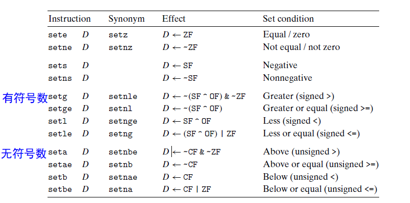

举个栗子：

cmp %rsi %rdi	//cmp b a	//a - b

想比较a与b大小，就是检测a-b；

a=b好说，就是ZF = 0;那就是sete;

a<b：有符号数时候，没有溢出即OF = 0时候， 要a<b 那就要a-b<0,此时 SF = 1；有溢出即OF = 1时候，要a<b,那句要 a-b>0,此时SF = 0;	综上， 要有符号的a<b 那就要满足 SF^OF = 1;

a<b: 无符号数时候，因为没有负溢出，a-b<0 就会导致进位 CF = 1；

### 3.6.3 Jump Instructions and Their Encodings 跳转指令及其编码

说明下间接跳转：

> JMP \*%rax	跳转到寄存器%rax的值的目标
>
> JMP\*(%rax)   跳转到寄存器%rax的值的地址内存中读出跳转目标

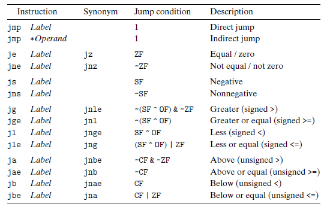

关于编码：

这里主要是说连接前的汇编的跳转是相对地址：**将目标指令地址与jmp指令下一指令的地址之差为编码**

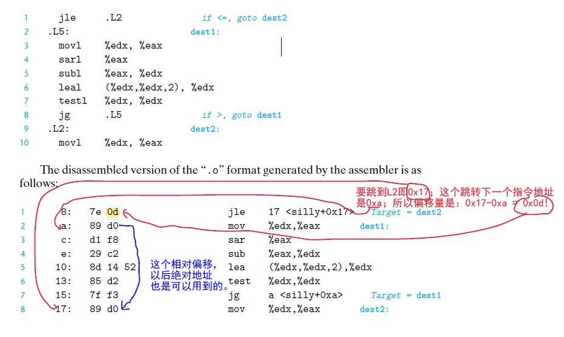

然后那个跳转的偏移量是补码形式表示的，比如 89 f4 中f4是-12！！！

### 3.6.4 Translating Conditional Branches 用条件控制来实现条件分支。  

```c
if (test-expr)
	then-statement
else
	else_statement
```

改成会表达逻辑

```c
	t = test-expr;
	if (!t)
	goto false;
	then-statement
	goto done;
false:
	else-statement
done:	
```

记住：分支else是不满足条件情况；

```c
if(a-b<0):
	A;
else
	B;
//////////
cmp b,a
jmp if a-b>=0 else
A
else:
B
```

### 3.6.6 Conditional Move Instructions用条件传送来实现条件分支

传统的使用**条件控制**来 实现条件分支的机制简单通用，但是现代处理器上可能非常低效！！！

为什么？因为现代的处理器是流水线形式处理指令，当遇到跳转指令时候，只有当分支条件求值完成后才能决定往哪条分支走，这个时段只能求条件值，不符合流水线的高效要求，并且处理器会去猜测（分支预处逻辑）往哪条分支走，猜错的话会导致惩戒（错误猜测的指令全丢掉）。

**与条件跳转不同，处理器无需预测测试的结果就能执行条件传送！**

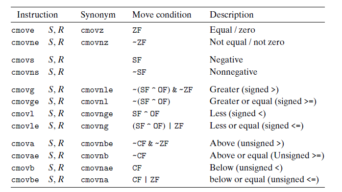

通过伪代码看看 **条件控制转移** 和 **条件传送 **的区别：

```c
v = test-expr ? then-expr : else_expr;
```

条件控制思路：

> ​	if (!test-expr)
> ​		goto false;
> ​	v = true-expr;
> ​	goto done;
> false:
> ​	v = else-expr;
> done:

条件传送思路：

> vt = then-expr;
> v = else-expr;
> t = test-expr;
> if (t) v = vt;

**记住：不是所有的条件表达式都可以用条件传送来编译**

两个表达式计算量很大的时候gcc还是会使用条件控制转移。

还有就是当两个表达式中任意一个可能产生错误条件或者副作用的时候就不可以。

例子：

```c
int cread(int *xp) {
	return (xp ? *xp : 0);
}
```

条件传送：

```assembly
;Invalid implementation of function cread
;xp in register %edx
movl $0, %eax 			;Set 0 as return value
testl %edx, %edx 		;Test xp
cmovne (%edx), %eax 	;if !0, dereference xp to get return value
```

其实上诉的例子是非法的，想想看，当xp！=0时候是没问题，但是当xp==0时候也会对（%edx）进行访问。所有这个例子就应该用条件控制。

### tip:为什么说条件传送指令就好了呢？

**条件控制**转移指<u>依据代码的条件结果来选择运行的路径</u>。

**条件传送**指先把结果运行，在依据条件结果选择结果值在同样的情况下，条件传送性能比条件控制转移高

### 3.6.7Loops 循环

汇编没用专门的循环的指令，那么也就是用 goto形式来实现咯：

#### Do-While Loops

> ```c
> do
> body-statement
> while (test-expr);
> ```
>
> 可以下次以下形式：
>
> ```c
> loop:
> body-statement
> t = test-expr;
> if (t)
> goto loop;
> ```

举个例子其实很好理解的：

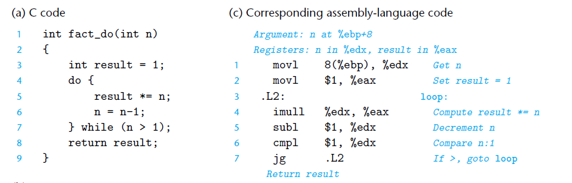

#### While Loops

while循环不是一开始先执行一遍主体，而是先判断。

> ```c
> while (test-expr)
> body-statement
> ```
>
> 转变为：
>
> ```c
> goto test;
> loop:
> 	body-statement
> test:
> 	t=test-expr;
> 	if(t)
>         goto loop;
> ```

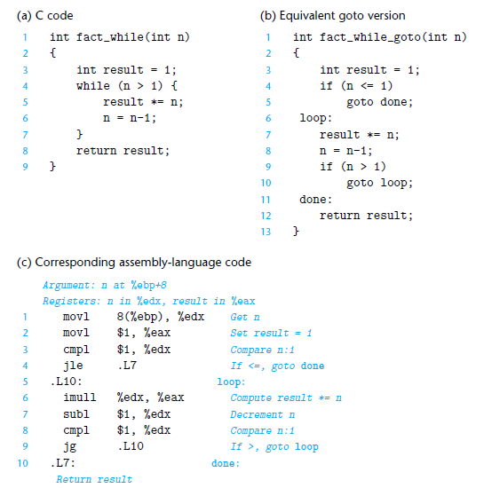

#### For Loops

一切循环都可以翻译的：

> ```c
> for (init-expr; test-expr; update-expr)
> body-statement
> ```
>
> ==>
>
> ```c
> init-expr;
> while (test-expr) {
> 	body-statement
> 	update-expr;
> }
> ```
>
> ==>
>
> ```c
> //gguraded-do策略
> 	init-expr;
> 	t=test-expr;
> 	if (!t)
> 		goto done;
> loop:
> 	body-statement
> 	update-expr;
> 	
> 	t=test-expr;
> 	if(t)
>         goto loop
> done:
> ```

看个例子就好了：

```c
int fact_for(int n)
{
    int i;
    int result = 1;
    for (i = 2; i <= n; i++)
        result *= i;
    return result;
}
//#########################################
init-expr i = 2
test-expr i <= n
update-expr i++
body-statement result *= i;
//#########################################
int fact_for_goto(int n)
{
    int i = 2;//init-expr
    int result = 1;
    if (!(i <= n))//test-expr
   		goto done;
loop:
    result *= i;//body-statement
    i++;//update-expr
    if (i <= n)
    	goto loop;
done:
    return result;
}
//#########################################
//Argument: n at %ebp+8
//Registers: n in %ecx, i in %edx, result in %eax
	movl 8(%ebp), %ecx 				//Get n
	movl $2, %edx 					//Set i to 2 (init)
	movl $1, %eax 					//Set result to 1
	cmpl $1, %ecx 					//Compare n:1 (!test)
	jle .L14 						//If <=, goto done
.L17: 						//loop:
	imull %edx, %eax 				//Compute result *= i (body)
	addl $1, %edx 					//Increment i (update)
	cmpl %edx, %ecx 				//Compare n:i (test)
	jge .L17 						//If >=, goto loop
.L14: 						//done:
```

### 3.6.8 Switch Statements //Switch 语句（跳转表）

先看例子：

待翻译的C源程序：

```c
int switch_eg(int x, int n) {
    int result = x;
    switch (n) {
    case 100:
   		result *= 13;
    	break;
            
    case 102:
    	result += 10;
    	/* Fall through */
    case 103:
    	result += 11;
    	break;
            
    case 104:
    case 106:
    	result *= result;
    	break;
    default:
    	result = 0;
    }
    return result;
}
```

先翻译成伪代码：

1、开关选择项n的值是100、102、103、104、106；先按[min,max]取一个范围数组：[100,106],变为相对值：[0,6],于是建立一个这么大数组表格，用于跳转时候选择地址，没用用上的数对应default；

```c
int switch_eg_impl(int x, int n) {
    /* Table of code pointers */
    static void *jt[7] = {
   		&&loc_A, &&loc_def, &&loc_B,
    	&&loc_C, &&loc_D, &&loc_def,
    	&&loc_D
    };
    unsigned index = n - 100;
    int result;
    
    if (index > 6)//超范围的去 default
    goto loc_def;
    
    /*选着去路 */
    goto *jt[index];//表格对应各个跳转路口的地址
    
    loc_def: /* Default case*/
    	result = 0;
    	goto done;
    loc_C: /* Case 103 */
    	result = x;
    	goto rest;//对应break
    loc_A: /* Case 100 */
    	result = x * 13;
    	goto done;
    loc_B: /* Case 102 */
    	result = x + 10;
    	/* Fall through */
    rest: /* Finish case 103 */
    	result += 11;
    	goto done;
    loc_D: /* Cases 104, 106 */
    	result = x * x;
    	/* Fall through */
    	done:
    return result;
}
```

对应的汇编语言是：

```assembly
;//纸质书和电纸书pdf有些许出入，纸质数的64位系统的，所以表格是按8字节读取的

;int switch_eg_impl(int x, int n)
;x at %ebp+8, n at %ebp+12
	movl 	8(%ebp), 	%edx 			Get x
	movl 	12(%ebp), 	%eax 			Get n
;Set up jump table access
	subl 	$100, 		%eax 			Compute index = n-100
	cmpl 	$6, 		%eax 			Compare index:6
	ja 		.L2 						If >, goto loc_def;超出范围是default
	jmp 	*.L7(,%eax,4) 				Goto *jt[index]
;Default case
.L2: 								loc_def:
	movl 	$0, 		%eax 			result = 0;
	jmp 	.L8 						Goto done
;Case 103
.L5: 								loc_C:
	movl 	%edx,		%eax 			result = x;
	jmp 	.L9 						Goto rest
;Case 100
.L3: 								loc_A:
	leal 	(%edx,%edx,2), %eax 		result = x*3;
	leal 	(%edx,%eax,4), %eax 		result = x+4*result
	jmp .L8 							Goto done
;Case 102
.L4: 								loc_B:
	leal 	10(%edx), %eax 				result = x+10
;;;;;;;;;;Fall through;;;;;;;;;
.L9: 								rest:
	addl 	$11, %eax 					result += 11;
	jmp 	.L8 						Goto done
;Cases 104, 106
.L6: loc_D
	movl	%edx, %eax 					result = x
	imull 	%edx, %eax 					result *= x
;;;;;;;;;;;Fall through;;;;;;;
.L8: 								done:
ret
;Return result

;/////////////////////////////////////////////////////////////
;只读数据区的表格信息（数组）存储了各个跳点的地址：
.section .rodata
.align 4 			;Align address to multiple of 4
.L7:
    .long .L3 		;Case 100: loc_A
    .long .L2 		;Case 101: loc_def
    .long .L4 		;Case 102: loc_B
    .long .L5 		;Case 103: loc_C
    .long .L6 		;Case 104: loc_D////
    .long .L2 		;Case 105: loc_def
    .long .L6 		;Case 106: loc_D///注意下 104 和106是一起下来的
;/////
;1 定范围	2 看default标号和缺失的标号	3 看“直落”的标号
```

这里举一反三比较容易，有时间看看书本的习题即可。

## 3.7 Procedures 过程

过程有多种形式：函数 function、方法method、子例程subroutine、处理函数hander。

P调用Q然后返回P，需要完成的动作机制：**传递控制、传递数据、分配和释放内存**。

**传递 控制**：

> 进入Q时候，程序的计数器必须设置为Q代码的起始地址，然后在返回时要恢复P调用Q时候的下一地址

**传递 数据**：

> P必须能够向Q提供一个或多个参数，Q必须能够向P返回一个值。（能够！）

**分配和释放内存：**

> 在开始时候，Q可能要为局部变量分配空间，而在返回前必须释放这些空间

### 3.7.1 Stack Frame Structure运行时栈

这部分就是说 用栈来保存数据，那么哪些数据会被压入栈中？

**先看看P调用Q，传递了n个参数，并且还要保存P调用时候的地址、并且保护现场的寄存器值、然后如果Q函数需要局部变量、同时还要Q的参数构造区：**

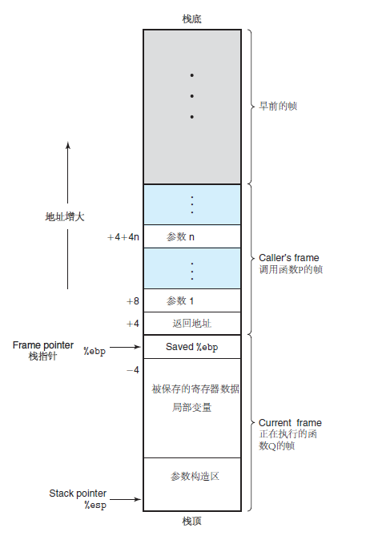

大致是这么个情况，细讲什么的再说。

### 3.7.2 Transferring Control 转移控制

将控制器从P转移到Q简单，只是把程序计数器PC设置为Q的代码起始位置，不过从Q返回的时候，处理器必须记录好P的执行的代码位置。

call指令：

> call	Label			过程调用//直接调用
>
> call	\*Operand	过程调用//间接调用
>
> ret							从过程调用中返回

看下示意图就明白了：

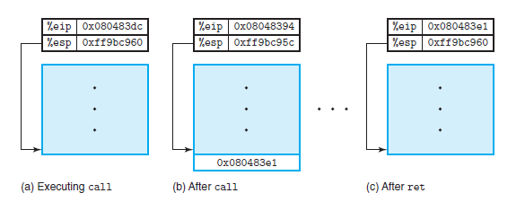

**研究细讲前前要理解以下几点：**

esp是栈指针：存放的数据是调用函数的接下来的地址；（申请栈）

eip是当前执行的程序地址（64位）

**（32位机器，一位地址存的数据大小是16位，然后pc指针所指地址的增减是按指令字节长度来变化的）**

call一下后：eip变成Q的起始地址；esp减少4（X86-32: 1个栈保存的是8位数据也就是1字节）申请空间放P的下一地址（+5）。关于为什么是+5，原因是callq这个指令占了5个字节。

书本P167 有案例分析，可以细读。

### 3.7.3 Register Usage Conventions 寄存器用于传输（参数构造部分）

两点：

寄存器最多传递6个整型参数（例如整数和指针），超出部分要用到栈。

寄存器是64位的，但是也可以传递32、16、8位的数据。

| 操作数大小 | 1    | 2    | 3    | 4    | 5    | 6    |
| :--------: | ---- | ---- | ---- | ---- | ---- | ---- |
|   64//r    | %rdi | %rsi | %rdx | %rcx | %r8  | %r9  |
|   32//e    | %edi | %esi | %edx | %ecx | %r8d | %e9d |
|     16     | %di  | %si  | %dx  | %cx  | %r8w | %r9w |
|    8//l    | %dil | %sil | %dl  | %cl  | %r8b | %r9b |

大体就是：64位的r， 32位的e，正常16的i和x，最小8位的l。

特殊的寄存器有特殊用处，不可以乱用的。

比如 X系列的是数据寄存器，段寄存器、控制寄存器等等。

**但是函数传递参数用的6个寄存器就是上诉的6个！！！**

举个栗子：

```c
//di\si\d\c\r8\r9
void fun(long long a1, long long* a1p,
         int a2,int*a2p,
        short a3, short a3p,
        char a4, char* a4p){
    *a1p+=a1;
    *a2p+=a2;
    *a3p+=a3;
    *a4p+=a4;
}
/////////////////////////////
/*
a1 in %rdi	(64bits)
a1p in %rsi (64bits)
a2 in %edx (32bits)	//e(32)   dx
a2p in %rcx(64bits)	//r(64)	  cx
a3 in %r8w (16bits) //r8(16)  w(short是2字节 w)
a3p in %r9	（64bits)//r9(64)

a4 at %rsp+8 //栈空间的向上8个栈地址，一个栈地址存一个字节.a4 存的是1字节
a4p at %rsp+16//栈空间向上16个栈地址
【tip】：
	[%rsp+0 --- %rsp+7] 存放调用时候的目程序下一地址（calladdress+5）
	[%rsp+8 --- %rsp+15] 存放传递的第7个参数，无论传递的是多少位，这里按64位传入，运算时候再按要求运算即可。
*/
proc:
 moveq 16(%rsp),	%rax //fetch a4p
 addq	%rdi, (%rsi)	//*a1p+=a1;64bits
 addl	%edx, (%rcx)	//*a2p+=a2;32bits
 addw	%r8w, (%r9)		//*a3p+=a3;16bits;地址64位存在%r9,按w大小操作，并放在%r9
 
 movl	8(%rsp),%edx	//fetch a4;先按l(32位，4字节)大小读取a4的数据
 addb	%dl, (%rax)		//*a4p+=a4;操作的时候按照char的1字节来操作。edx里只用dl的1字节8位。
```

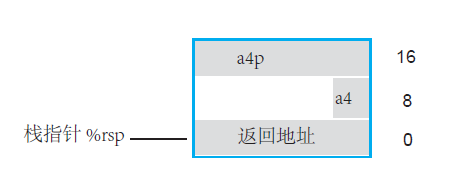

### 3.7.4 Procedure Example 过程案例（书本是栈上的局部存储）

从中文书本可以看出，这一节主要是讲 栈上**局部变量**的存储问题。

正常情况下，函数内的局部变量可用寄存器来存，但若出现一些特定情况时，需要把这些局部变量存到栈上，局部变量的存放要早于参数构造的存放。特定情况包含如下：一，寄存器不足够存放所有本地数据。二，对一个局部变量使用地址运算符&，此时是需要得到变量的地址的，那么显然变量就不能存在寄存器中，只能放栈上。三，当局部变量是数组或结构时。

**特定情况包含如下：**

> 一，寄存器不足够存放所有本地数据。
>
> 二，对一个局部变量使用地址运算符&，此时是需要得到变量的地址的，那么显然变量就不能存在寄存器中，只能放栈上。
>
> 三，当局部变量是数组或结构时。

先看纸质书本的案例:

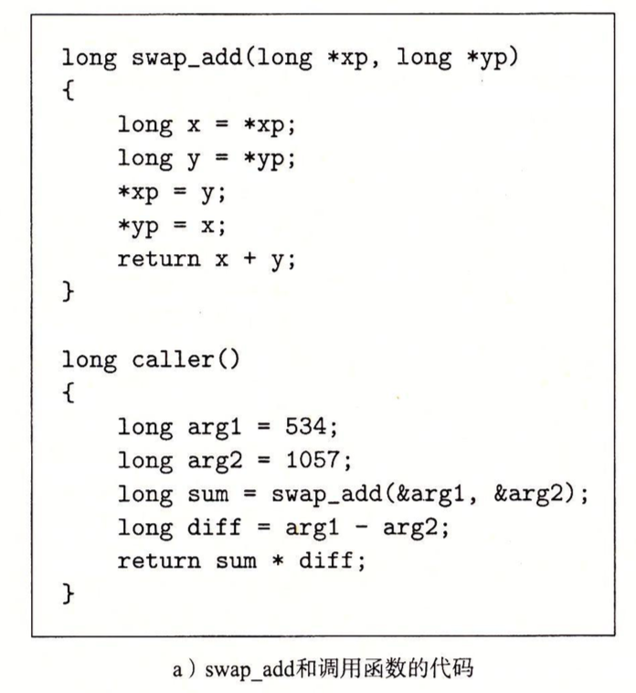

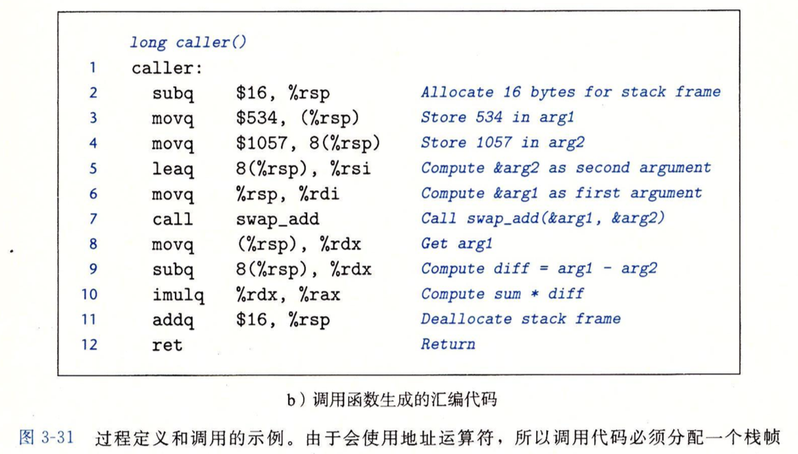

纸质书本案例主要是说明局部变量需要申请栈空间时候的情况, 

首先看有没有**局部变量的压栈**需求，发现caller中有两个局部变量arg1和arg2，它们在传递时需要取地址，说明它们必须存在栈上，**那么先存哪个？从右侧的汇编代码可以看到，局部变量也是按倒序来存的**，%rsp先减16腾出16字节的空间，arg2(1057)存在高地址，arg1(534)存在低地址.

**传递参数时**，arg1的地址被放在%rdi中，arg2的地址被放在%rsi中，刚好印证图3-28对应的寄存器调用顺序。

另外，从11行代码可以看到，**函数返回值**是放在寄存器**%rax**中来返回的。

---

**疑问!!!**!!!

之前说的把当前的**存储返回地址**的操作(push)在哪?

其实都隐藏在call swap_add这条指令里，编译器碰到这条指令会自动把它后面一条指令的地址压入栈中(***注意，call自动调用的压栈是push指令，而push指令会自动减小%rsp，因此图b中只用了subq $16 %rsp，无需特意为返回地址留出空间***)，并把程序计数器下一条指令设置为swap_add函数的起始指令。这也就是为什么图3-29对应的汇编代码，取a4和a4p要从8(%rsp)和16(%rsp)取，因为返回地址被存在了栈顶。

---

PDF的例子可能更细致,不过是X86-32的例子:

```c
int swap_add(int *xp, int *yp)
{
    int x = *xp;
    int y = *yp;
    *xp = y;
    *yp = x;
    return x + y;
}
int caller()
{
    int arg1 = 534;
    int arg2 = 1057;
    int sum = swap_add(&arg1, &arg2);
    int diff = arg1 - arg2;
    return sum * diff;
}
```


```assembly
;32位系统1个栈地址存储的数据大小也是1字节
caller:
    pushl 	%ebp 				;Save old %ebp
    movl 	%esp, %ebp 			;Set %ebp as frame pointer
    
    subl 	$24, %esp 			;Allocate 24 bytes on stack
    movl 	$534, -4(%ebp) 		;Set arg1 to 534
    movl 	$1057, -8(%ebp) 	;Set arg2 to 1057
    leal 	-8(%ebp), %eax 		;Compute &arg2
    movl 	%eax, 4(%esp) 		;Store on stack
    leal 	-4(%ebp), %eax 		;Compute &arg1
    movl 	%eax, (%esp) 		;Store on stack
    call 	swap_add 			;Call the swap_add function
```

看这里是先保存ebp?然后把esp->ebp,也就是不直接用esp,而是把esp存到ebp寄存器来用?

然后这里是栈空间是申请了24字节,但是其实局部变量只有8字节,多出来的怎么回事?pdf说:

> Of the 24 bytes allocated for the stack frame, 
>
> 8 are used for the local variables, //8字节用于局部变量
>
> 8 are used for passing parameters to swap_add,//8字节用于传递参数
>
> 8 are not used for anything.//8字节没用???
>
> 为什么会多申请8字节?
>
> 书上解释说,X86为了字节对齐,包括4字节的保存的%ebp和4字节的返回地址;所以caller总共需要32字节的空间.所以存储ebp需要4字节\两个临时变量需要4+4字节\两个传递变量需要4+4字节\返回地址需要4字节;为了对齐16字节,所以需要空余8字节.
>
>  那么 push 用了4, 返回地址用了4,这个是指令自己会申请的,那么剩下的24就需要编译器去申请咯(这些是我自己的理解,不知对否)
>
> 
>
> 然后关于传递的参数,32位系统是用栈空间传递,而64位系统是用寄存器传递?看网上有人说是因为优化后的才会用寄存器.

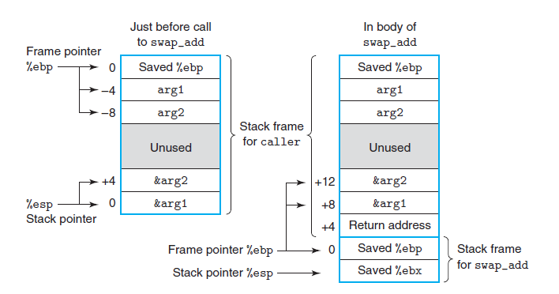

继续,编译后的 swap_add有三部分:

```assembly
;1 set up  栈空间被初始化
;被调前,P函数会把下一地址存入栈中
;对应的上面那个栈空间的图的右边部分下面的存储ebp和esp;[保护现场]
swap_add:
    pushl %ebp 				Save old %ebp
    movl %esp, %ebp 		Set %ebp as frame pointer
    pushl %ebx 				Save %ebx;为什么存ebx?因为swap_add需要%ebx当零时变量
    
;2 程序主体,此时的esp是新的,ebp是新的!!!
    movl 8(%ebp), %edx 		Get xp
    movl 12(%ebp), %ecx 	Get yp
    movl (%edx), %ebx 		Get x
    movl (%ecx), %eax 		Get y;%ax反正是要当作返回值的,所以可以用了当中间的零时寄存器
    movl %eax, (%edx) 		Store y at xp
    movl %ebx, (%ecx)		Store x at yp
    addl %ebx, %eax			Return value = x+y
    
    
;3返回前是要返回现场的,弹出栈中存的数据到%ebx和%ebp
    popl %ebx 				Restore %ebx
    popl %ebp 				Restore %ebp
    ret 					Return
  
  
;;;;;;;;;;;;;;;;;;;;;;;;;;;;;;;;;;;;;;;;;;;;;;;;;;;;;;;;;
;接下来是swap_add 执行完后返回caller函数后的操作了.ebp回到以前的状态了.对应左边的图了
    movl -4(%ebp), %edx
    subl -8(%ebp), %edx		;算出 diff = arg1 - arg2;
    imull %edx, %eax		;sum * diff;
    leave
    ret
```

---

从相同例子看32位编译器和64位编译器的差别:

优化前后: 

* 传递参数要不要stack
* 保护现场有没有用到
* 栈顶和栈底指针都用

---

另外书上还要个例子讲传递的参数大小不一咋么办?

*结论: *

*参数构造时候的压栈(传递的参数)是不会按照不同大小分配的,都是按照8字节对齐的.前面多参数例子可以看出.*

*然后局部变量就可以按照需求大小来分配了,但是也要8个字节8个字节来填选.*

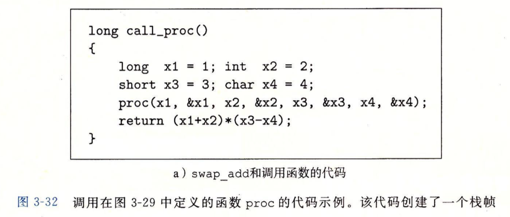


### 3.7.5  寄存器中的局部存储空间(保护寄存器)

其实这一部分可以归于 局部变量存储中,前面的pdf例子其实也将了,就是保护现场的那些操作.

前面讲了,满足那三个条件的临时变量是要放在栈上的,但是如果有临时变量不满足那三个条件,那就不能放在栈上来用,那就需要寄存器了!

就是说P调用Q,Q中有局部变量**不满足需要放在栈上的条件**,那么用哪个寄存器来存呢?之前讲了6个寄存器是用来传递参数的,即使传参没用完也不能用那6个有特殊使命(传参)的寄存器; **按照惯例我们会用%rbx %rbp 和 %r12~%r15来保存不满足条件的局部变量的.** 但是用了这些个寄存器后不就把以前的值冲掉了,这不好,所以需要保护现场.


例子: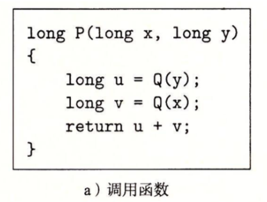

u v临时变量: 对应三个用栈条件:

1 寄存器不够了? 否	2 临时变量用到了&取址? 否	3 是数组或结构体? 否

那么u和v就要用 寄存器来当临时变量,那么就要保护现场!

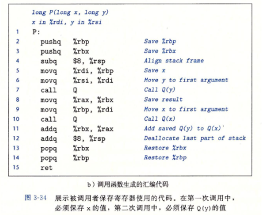

---

递归本质一样,看下书本例题就好了

小结 

所有总结只要看图3-25就行了，只要记住，栈帧压栈的顺序是先看有没有需要保存的被调用者寄存器，有的话压栈，随后看有没有多余的不满足条件的局部变量，有的话压栈，随后看有没有满足条件的局部变量，有的话压栈，随后看有没有多余的需要构造的参数，有的话压栈，随后用call来调用函数并保存返回地址，函数返回后继续运行，运行到最后时，若之前有需要保存的被调用者寄存器，则把值从栈中弹回到对应的寄存器。

然后编译器有优化的问题.


## 3.8 Array Allocation and Access 数组分配和访问

### 3.8.1 Basic Principles 基本原则

这部分比较好理解：

T  A[N];	几个关键的东西： 1、数组起始地址$X_A$; 2、数组原始的大小L； 3、数组访问的位置i

举例：int E[i]的值取出来；首先要知道：E的首地址（假设存储在%rdx）、元素大小L=4、位置i的值（假设存储在%rcx）

**E[i] = $Addr_E+L_E*i$;**

**所以：movl (%rdx,%rcx,i),%eax**	就会把E[i]的值存到寄存器%eax中。

### 3.8.2 Pointer Arithmetic 指针运算

这里的指针运算是ptr+i这种，比如 int \* pr = XXX; 现在指针pr = 0x0010; 那么pr+1 后变成 0x0014;

所以：T* pr的运算：**pr+i = $pr + i*L_T$;**

拓展下前面的例子（E in %edx; i in %ecx):

```c
//表达式	  类型	值				汇编代码
E 			int * 	xE 				movl %edx,%eax
E[0] 		int 	M[xE] 			movl (%edx),%eax
E[i] 		int 	M[xE + 4i] 		movl (%edx,%ecx,4),%eax
&E[2] 		int * 	xE + 8 			leal 8(%edx),%eax 
E+i-1 		int * 	xE + 4i − 4 	leal -4(%edx,%ecx,4),%eax
*(E+i-3) 	int * 	M[xE + 4i − 12] movl -12(%edx,%ecx,4),%eax
&E[i]-E 	int 	i 				movl %ecx,%eax
```

**上面最后那个例子注意：**

* **同一数据结构的两个指针之差是偏移量i；而不是地址偏移i\*L**

### 3.8.3 Nested Arrays 嵌套数组

T D\[R]\[C]; 这是一嵌套数组的声明。

内存地址是： &D\[i]\[j] = $X_D+L(C*i+j)$ ;

看个纸质书本的例子：

> int A数组是5 X 3的规模；计算A\[i]\[j]; (A在%rdi; i 在%rsi; j 在%rdx;)
>
> $X_D+4(3*i+j)$
>
> ```assembly
> leaq	(%rsi,%rsi,2),%rax	;计算出3i
> leaq	(%rdi,%rax,4),%rax	;计算出X_D+ 4*3*i;从左到右？
> movl	(%rax,%rdx,4),%eax	;把M[X+4(3i+j)]的值放入寄存器%eax
> ```

### 3.8.4 Fixed-Size Arrays 定长数组（优化）

**这里就一句话：C语言编译器能够优化定长多维数组上的操作代码。**

看下例子就好了：

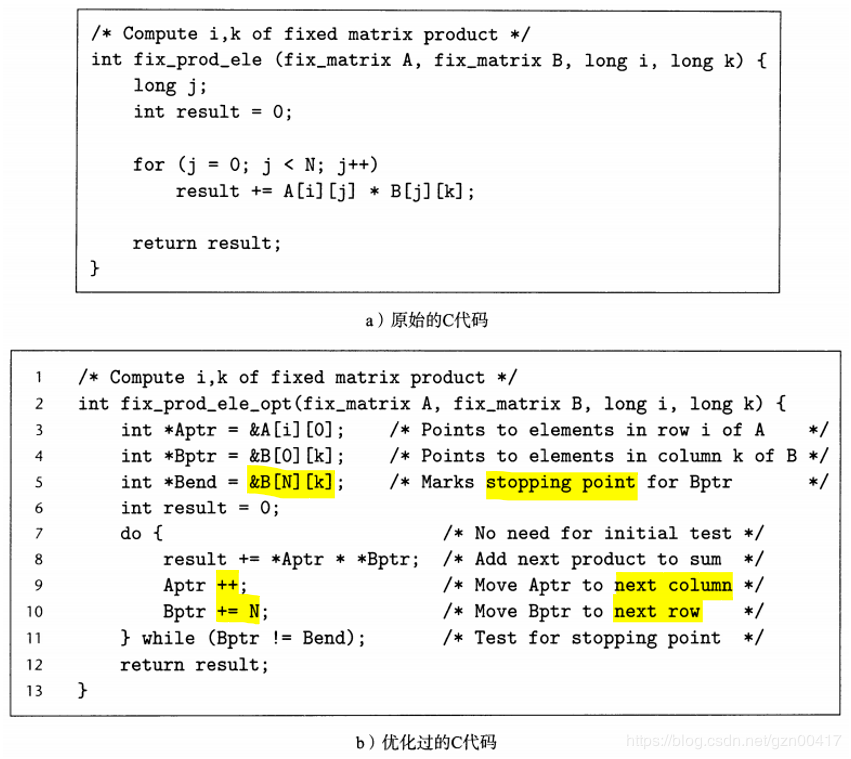

主要看优化B数组的寻址，+=N这部分。


### 3.8.5 Variable-Size Arrays 可变数组

这里的可变不是像vector那种变长，而是数组大小并不是一开始就确定。

历史上C只支持编译时就能确定大小的数组，后来C99标准允许数组的纬度是表达式，在数组分配时候才计算出来。A\[expr1][expr2].

```c
//n必须在参数A前面
int var_ele(int n, int A[n][n], int i, int j) {
	return A[i][j];
}
```

```assembly
;n in %rdi
;A in %rsi
;i in %rdx
;j in %rcx
var_ele:
	imulq	%rdx,%rdi				;计算n*i
	leaq	(%rsi,%rdi,4),%rax		;计算 X_A + 4(n*i)
	movl	(%rax,%rcx,4),%eax		;读取M[X_A + 4(n*i)+4j]
```

其实类似于前面的定长数组；有两点不同：

* 由于增加了参数n，寄存器的使用发生变化
* 用了乘法来计算n*i ,而不是leaq指令

> 动态版本必须用乘法指令对i进行伸缩n倍；由于乘法效率低，但是没得办法。

关于优化和定长一样，编译器能够按照步长来加减，而避免直接用乘法。


## 3.9 Heterogeneous Data Structures 异构数据结构

### 3.9.1 Structures 结构体

结构体存储数据和数组一样放在内存中而已，而编译器才是维护结构体信息的关键，提示着每个字段的字节偏移。

例子：

```c
struct rec {
    int i;
    int j;
    int a[3];
    int *p;
};
```

这个结构体的内存分布如图：

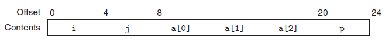

现在假设要知道r->a[i];(r in %rdi; i in %rsi)

leaq 8(%rdi,%rsi,4), %rax		//(r+8)+i\*L = (r + 8)+ 4\*i

关于数据对齐的问题后两节讲。

### 3.9.2 Unions 联合体

联合体和结构体的区别是知道的，主要是为了节省内存，比如说：一个树，每个叶子节点都有两个double类型的数据值，还有两个孩子节点的指针；但是只有叶子节点有数据，中间节点没用数据。

```c
struct NODE_S {
    struct NODE_S *left;
    struct NODE_S *right;
    double data[2];
};
```

如果按照结构体方式定义声明节点，那么每个节点需要内存32字节。

```c
union NODE_U {
    struct {
        union NODE_U *left;
        union NODE_U *right;
    } internal;
    double data[2];
};
```

但是如果按联合体形式定义声明节点，那么每个节点只需要16字节；也就节省了一般内存。

主要是两个指针数据和double数据是”冲突“的，中间节点只有指针没有用double数据，叶子节点不用指针指向其他节点只用double数组存储数据。

但是这种方式不能确定内部的是叶子节点还是中间节点。（缺点）

再改进：

> 添加一个标签字段：

```c
typedef enum { N_LEAF, N_INTERNAL } nodetype_t;
struct NODE_T {
    nodetype_t type;
    union {
        struct {
            struct NODE_T *left;
            struct NODE_T *right;
        } internal;
        double data[2];
    } info;
};
```

只不过一个节点变成16+8=24字节；（书上说type是4字节，余下的4字节是对齐满足8字节）

联合还是用的少，了解即可

### 3.9.3 Data Alignment 数据对齐

目的是为了简化处理器和内存系统间接口的硬件设置。

那么按多长对齐呢？

.align 8 就是按8字节对齐。

对齐的问题要注意在内存中解码的时候注意下。


## 3.10 Putting It Together: Understanding Pointers 在机器级程序中将控制和数据结合起来

**总述：前面学习了机器代码如何实现 程序的控制、如何实现不同的数据结构；接下来将学习：数据和控制的交互、研究缓冲区溢出、处理栈空间的变化情况。**

### 3.10.1 理解指针

几个原则：

* 每个指针都对应一个类型
* 每个指针都有一个值
* 指针用&运算符创建
* *操作符用于间接引用指针
* 数组与指针密切联系
* 将指针强转只能改变类型而不能改变值
* 指针也可以指向函数

指针细讲可以再找专讲的书籍看

### 3.10.2 （3.11）Life in the Real World: Using the gdb Debugger 应用：使用GDB调试器

关于GDB调试器的使用，可以看看实验楼和网上的一些资料等。

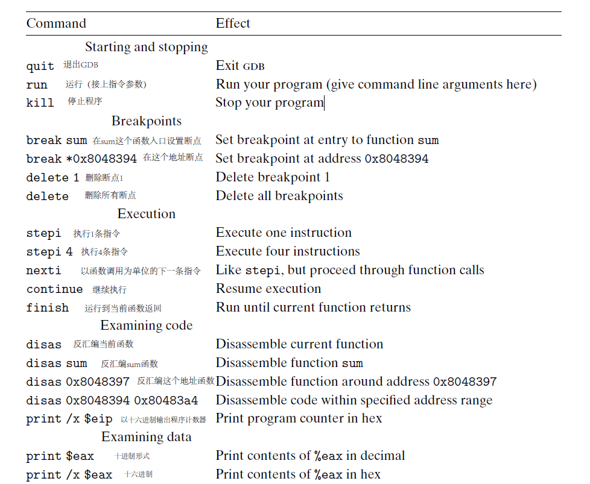

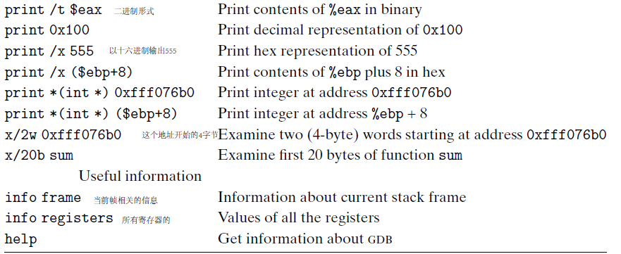


## 3.10.3（3.12） Out-of-Bounds Memory References and Buffer Overflow 内存越界引用和缓冲区溢出

C语言对数组引用不进行任何边界检查，而且局部变量和状态信息都在栈中，这就很危险了。

看看例子：

```c
/* Sample implementation of library function gets() */
char *gets(char *s)
{
    int c;
    char *dest = s;
    int gotchar = 0; /* Has at least one character been read? */
    while ((c = getchar()) != ’\n’ && c != EOF) {
        *dest++ = c; /* No bounds checking! */
        gotchar = 1;
	}
    *dest++ = ’\0’; /* Terminate string */
    if (c == EOF && !gotchar)
    	return NULL; /* End of file or error */
    return s;
}
//gets函数可以在s开始的地址传入getchar()得到的字符;数量一直到\n或者 EOF

```

```c
void echo()
{
    char buf[8]; /* Way too small! */
    gets(buf);
    puts(buf);
}
```

```assembly
echo:
	subq	$24,%rsp	;开24字节的栈空间；实践buf是8字节
	movq	%rsp,%dri	;栈地址也就是buf地址传给gets函数
	call 	gets		;调用gets()
	movq	%rsp,%rdi
	call	puts
	addq	$24,%rsp
```

在看个图来明白下：


如果在buf里面写7（加上'\0'就是8）字节，那没问题；如果写了23字节，也还好，就是填满那些未使用的栈；如果写的是24-31字节，那就是冲掉了返回地址；再多就把caller中保存的状态冲掉了。

**小结：函数自己的临时变量申请栈是有限的，当心gets(),strcpy(),strcat()等等这些不管输入字节数量的非安全函数！！！！**

看看题目理解下溢出的时候栈是怎么变化的就好了，利用这样的情况可以写蠕虫。

### 3.10.4 Thwarting Buffer Overflow Attacks 对抗缓冲区溢出攻击

* 栈随机化
* 栈破坏检测
* 限制可执行代码区域

这里看看书本就好了，真要搞安全那是一个大方向了

### 3.10.5支持变长帧

有些函数里面需要的帧长不确定，比如用到alloca函数，咋么办？

用到栈指针%rbp，作为栈的基底；pdf上32位系统的例子在申请栈时候都是用到了%rbp；但是书本64位的前面都是直接用%rsp，**现在只有在栈帧长可变情况下才用%rbp**


## 3.13 x86-64: Extending IA32 to 64 Bits （略）

## 3.14 Machine-Level Representations of Floating-Point Programs 机器级浮点数表示

看书吧，本质一样，就是寄存器操作符有所变化。

## 3.15 Summary 

* 了解了机器级编程
* 了解了编译器及其优化能力，以及机器、数据类型指令集
* 了解了程序如何将数据存储在不同的内存区域


# 4 Processor Architecture（略）

# 5Optimizing Program Performance