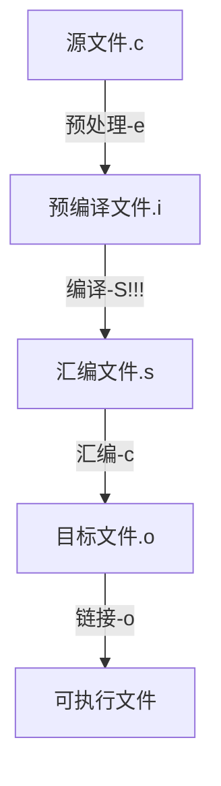

* 学习编译过程
* gcc的常规使用
* gdb的常规使用

---

# GCC 基础

gcc是交叉编译器，适合不同平台的嵌入式开发。

## 编译基本流程图

```shell
gcc -o hello hello.c
```



## GCC支持的后缀名

| 后缀名      | 对应的语言                   |
| ----------- | ---------------------------- |
| .c          | C原始程序                    |
| .C/.cc/.cxx | C++原始程序                  |
| .m          | objective-C原始程序          |
| .i          | 已经预处理的C程序            |
| .ii         | 已经预处理的C++程序          |
| .s/.S       | 汇编语言原始程序             |
| .h          | 头文件                       |
| .o          | 目标文件                     |
| .a/.so      | 编译后的库文件/静态库&动态库 |

## GCC参数

> 通用参数
>
> C语言参数
>
> C++参数
>
> Object C参数
>
> 语言无关的参数
>
> 警告参数
>
> 调试参数
>
> 优化参数

不是全部都要掌握，掌握常见的即可

---

编译过程参数

| -c(compile)    | 只编译不连接，生成目标文件.o |
| -------------- | ---------------------------- |
| -S(assamble)   | 只编译不汇编，生成汇编代码.s |
| -E(expansion)  | 只预编译                     |
| -g(gdb)        | 包含调试信息                 |
| -o file        | 指定目标输出文件             |
| -Idir(include) | 搜索头文件路径（链接库时）   |

库选项

.a [libname.a]	//静态库

.so[libname.so.[主版本号.次版本号.发行号]]	//动态链接，默认是动态的

| -static | 静态编译                                                   |
| ------- | ---------------------------------------------------------- |
| -shared | 生成动态库文件；进行动态编译                               |
| -L dir  | 库文件搜索中添加路径                                       |
| -fPIC   | 生成使用相对位置无关的目标代码（Position Independent Code) |

---

* 编译和调用 静态库
```c
//编译一个静态链接库
//countlib.c
#include<stdio.h>
usigned long count(usigned int a, unsigned int b){
    return a*b;
}

//1 生成目标文件
gcc -c countlib.c //countlib.o
//2 归档打包
ar crv countlib.a countlib.o	//生成 countlib.a

```

```c
//用到上诉的静态库函数
#include<stdio.h>
#include<stdlib.h>
int main(){
    usigned int x,y;
    scanf("%u",&x);
    scanf("%u",&y);
    printf("res is :%u\n",count(x,y));
    return 0;
}

//gcc -o count count.c -L ./countlib.a
```

---

* 编译和调用动态库

```c
//生成
gcc -fPIC -c countlib.c	//countlib.o

gcc -shared countlib.o -o countlib.so	//生成.so文件
///////////////////////////////////
//调用
gcc count.c -o count2 -L./countlib.so
//几个问题，视频里这里编译没问题，运行不行，把countlib.so 拷贝到/usr/lib后就可以了；评论说要以libfilename形式命名才行。
```

---

* 警告选项

| -w        | 关闭所有警告          |
| --------- | --------------------- |
| -Wall     | 发出gcc所有有用的警告 |
| -pedantic | 发出ansic的所有警告   |

---

* 优化选项

| -Olevel | 优化等级，一般只在最终时候用，数字越高优化等级越高 |
| :-----: | :------------------------------------------------: |
|   ---   |                        ---                         |

---

视频这部分是讲怎么配置gcc环境。

编译原码

可以深入学习编译原理的学习，尝试写一个编译器