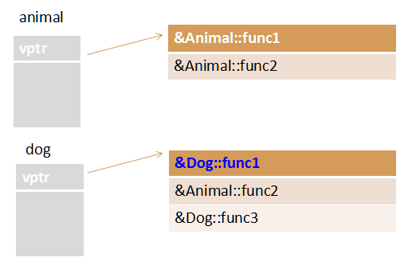

C++复习笔记---基于黑马C++对应的xmind

## 1 C++对c的拓展

* ### 命名空间

  * 只能全局范围内定义

    ```c++
    //错误代码！！！
    void test(){
    	namespace A{
    		int a = 10;
    	}
    	namespace B{
    		int a = 20;
    	}
    	cout << "A::a : " << A::a << endl;
    	cout << "B::a : " << B::a << endl;
    }
    ```

    

  * 命名空间可以嵌套命名空间

    ```C++
    namespace A{
    	int a = 10;
    	namespace B{
    		int a = 20;
    	}
    }
    void test(){
    	cout << "A::a : " << A::a << endl;
    	cout << "A::B::a : " << A::B::a << endl;
    }
    ```

    

  * 声明定义可分离

    ```C++
    #pragma once
    namespace MySpace{
    	void func1();
    	void func2(int param);
    }
    ```

    ```C++
    void MySpace::func1(){
    	cout << "MySpace::func1" << endl;
    }
    void MySpace::func2(int param){
    	cout << "MySpace::func2 : " << param << endl;
    }
    ```

## 2 引用（c++）

### **基本语法**

> Type & ref = val;
>
> int &r = a;

### **注意事项**

>	&在此不是求地址运算，而是起标识作用。
>	必须在**声明引用变量时进行初始化**。
>	引用初始化之后不能改变。
>	不能有NULL引用。必须确保引用是和一块合法的存储单元关联。
>	可以建立对数组的引用。

### **函数的引用**

> 返回值处引用：函数作为左值、不要返回局部变量的引用

> 参数处引用：引用传递（值传递、指针传递、引用传递）

### **指针引用**

> 改变一个指针的指向，而非改变其指向的内容
>
> 例子：
>
> 利用指针的指针开辟空间
>
> ```c++
> struct Person
> {
> 	int m_Age;
> };
> // **p 具体的Person对象  *p 对象的指针   p 指针的指针
> void allocatMemory(Person ** p) 
> {
> 	*p = (Person *)malloc(sizeof(Person));
> 	(*p)->m_Age = 100;
> }
> void test01()
> {
> 	Person * p = NULL;
> 	allocatMemory(&p);//Person* *pp = &p
> 	cout <<  "p的年龄： " <<p->m_Age << endl;
> }
> ```
>
> 利用指针的引用开辟空间（更直观）
>
> ```c++
> //利用指针引用开辟空间
> void allocatMemoryByRef(Person* &p)
> {
> 	p = (Person*)malloc(sizeof(Person));
> 	p->m_Age = 1000;
> }
> void test02()
> {
> 	Person * p = NULL;
> 	allocatMemoryByRef(p);
> 	cout << "p的年龄：" << p->m_Age << endl;
> }
> ```

### **引用的本质**

> 本质是在c++内部实现一个指针常量
>
> ```c++
> int& aRef = a; //自动转换为 
> int* const aRef = &a;//这也能说明引用为什么必须初始化
> aRef = 20; //内部发现aRef是引用，自动帮我们转换为: *aRef = 20;
> ```

### **常量引用**

> const Type &  ref  =  val;
>
> 字面量不能赋给引用，但是可以赋给const引用

```c++
//const修饰的引用，不能修改。但是既然是编译器分配了一个空间，其实就可以通过指针去修改
const int &ref = 10;//tmp
int *p =(int*)&ref;
*p=100;//这样就可以修改了
```

> 使用场景
>
> * 常量引用主要用在函数的形参，尤其是类的拷贝/复制构造函数。因为复制类成本大，但是又不去修改的时候
>
> 将函数的形参定义为常量引用的好处:
>
> * 引用不产生新的变量，减少形参与实参传递时的开销。
>
> * 由于引用可能导致实参随形参改变而改变，将其定义为常量引用可以消除这种副作用。

## 3 内联函数

### 为什么要内联

>宏定义有缺陷
>
>```c++
>问题一：
>#define ADD(x,y) x+y
>inline int Add(int x,int y){
>	return x + y;
>}
>void test(){
>	int ret1 = ADD(10, 20) * 10; //希望的结果是300
>	int ret2 = Add(10, 20) * 10; //希望结果也是300
>	cout << "ret1:" << ret1 << endl; //210
>	cout << "ret2:" << ret2 << endl; //300
>}
>问题二：
>#define COMPARE(x,y) ((x) < (y) ? (x) : (y))
>int Compare(int x,int y){
>	return x < y ? x : y;
>}
>void test02(){
>	int a = 1;
>	int b = 3;
>	//cout << "COMPARE(++a, b):" << COMPARE(++a, b) << endl; // 3
>	cout << "Compare(int x,int y):" << Compare(++a, b) << endl; //2
>}
>问题三:
>预定义宏函数没有作用域概念，无法作为一个类的成员函数，也就是说预定义宏没有办法表示类的范围。
>```

### 内联函数基本形式

> inline int func(int a) { return ++;}
>
> ```c++
> 但是在类内部定义内联函数时并不是必须的。任何在类内部定义的函数自动成为内联函数。
> class Person{
> public:
> 	Person(){ cout << "构造函数!" << endl; }
> 	void PrintPerson(){ cout << "输出Person!" << endl; }
> ```
>
> C++内联编译会有一些限制
>
> 	不能存在任何形式的循环语句
> 	不能存在过多的条件判断语句
> 	函数体不能过于庞大
> 	不能对函数进行取址操作

## 4 函数的默认参数

### 形式

```c++
void TestFunc01(int a = 10, int b = 20){...}
```

### 注意点:

> ​	1. **形参b设置默认参数值，那么后面位置的形参c也需要设置默认参数**
>
> ```c++
> void TestFunc02(int a,int b = 10,int c = 10){}
> ```
>
> 2. **如果函数声明和函数定义分开，函数声明设置了默认参数，函数定义不能再设置默认参数（二选一）**
>
> ```C++
> void TestFunc03(int a = 0,int b = 0);
> 
> void TestFunc03(int a, int b){}
> ```

## 5 函数重载

### 函数重载概述

> 能使名字方便使用，是任何程序设计语言的一个重要特征！

### 函数重载基本语法

> 重载条件
> 		和参数相关，和返回类型无关
> 		同一个作用域
> 		参数个数不同
> 		参数类型不同（底层const也可以作为依据）
>
> ```cpp
> void fun(int a)
> void fun(const int a);
> //实际上没有区别，因为函数调用的时候，存在形实结合的过程，所以不管有没有const都不会改变实参的值。所以编译报错
> 
> 
> void fun(char *a)
> void fun(const char *a)  //编译通过
>     
> void fun(char *a)
> void fun(char * const a)//编译不通过
> /*第一个例子中，我们说，fun(int i)和fun(const int i)是一样的，是因为函数调用中存在实参和形参的结合。加入我们用的实参是int a，那么这两个函数都不会改变a的值，这两个函数对于a来说是没有任何区别的，所以不能通过编译，提示重定义。
> 
> 好了，那 fun(char *a)和fun(const char *a)是一样的吗？答案是：不一样。因为char *a 中a指向的是一个字符串变量，而const char *a指向的是一个字符串常量，所以当参数为字符串常量时，调用第二个函数，而当函数是字符串变量时，调用第一个函数。
> 
> 但是char *a和char * const a，这两个都是指向字符串变量，不同的是char *a是指针变量 而char *const a是指针常量，这就和int i和const int i的关系一样了，所以也会提示重定义。
> 
> 最后说一下，对于引用，比如int &i 和const int & i 也是可以重载的，原因是第一个i引用的是一个变量，而第二个i引用的是一个常量，两者是不一样的，类似于上面的指向变量的指针的指向常量的指针。*/
>     
> char* a 是指针 指向char类型变量
> const char * a 是常量指针（指向常量的指针） 指向char类型常量
> char* const a 是指针常量  指针是常量 指向的是char类型变量
> 
> ```
>
> 
>
> ​		参数顺序不同（不同类型的顺序）
>
> ```c++
> namespace A{
> 	void MyFunc(){ cout << "无参数!" << endl; }
> 	void MyFunc(int a){ cout << "a: " << a << endl; }
> 	void MyFunc(string b){ cout << "b: " << b << endl; }
> 	void MyFunc(int a, string b){ cout << "a: " << a << " b:" << b << endl;}
> void MyFunc(string b, int a){cout << "a: " << a << " b:" << b << endl;}
> }
> //2.返回值不作为函数重载依据
> namespace B{
> 	void MyFunc(string b, int a){}
> 	//int MyFunc(string b, int a){} //无法重载仅按返回值区分的函数
> }
> ```

### 注意事项

> 函数重载和默认参数一起使用，需要额外注意二义性问题的产生。
> 	**为什么函数返回值不作为重载条件呢？**
>
> >   当编译器能从上下文中确定唯一的函数的时，如int ret = func(),这个当然是没有问题的。然而，我们在编写程序过程中可以忽略他的返回值。那么这个时候,一个函数为:
> >
> >  void func(int x);
> > 另一个为:
> > int func(int x);
> >  当我们直接调用func(10),这个时候编译器就不确定调用那个函数。所以在c++中禁止使用返回值作为重载的条件。
>
> **函数重载实现原理**
> 	编译器怎么做的例子;不要以为你写的函数名不会变.
>
> > void func(){}
> > void func(int x){}
> > void func(int x,char y){}
> >    以上三个函数在linux下生成的编译之后的函数名为:
> > _Z4funcv //v 代表void,无参数
> > _Z4funci //i 代表参数为int类型
> > _Z4funcic //i 代表第一个参数为int类型，第二个参数为char类型

## 6 extern C 浅析（注意不是extern）

### 为什么要这个特征

> c函数: void MyFunc(){} ,被编译成函数: MyFunc
> c++函数: void MyFunc(){},被编译成函数: _Z6Myfuncv
>
> 通过这个测试，由于c++中需要支持函数重载，所以c和c++中对同一个函数经过编译后生成的函数名是不相同的，这就导致了一个问题，**如果在c++中调用一个使用c语言编写模块中的某个函数，那么c++是根据c++的名称修饰方式来查找并链接这个函数，那么就会发生链接错误，**以上例，c++中调用MyFunc函数，在链接阶段会去找Z6Myfuncv，结果是没有找到的，因为这个MyFunc函数是c语言编写的，生成的符号是MyFunc。
>
> 那么如果我想在c++调用c的函数怎么办？
>
> > extern "C"的主要作用就是为了实现c++代码能够调用其他c语言代码。
> > 加上extern "C"后，这部分代码编译器按c语言的方式进行编译和链接，而不是按c++的方式。
>
> ```c++
> //C++中想调用C语言方法
> extern "C" void show(); //show方法 按照C语言方式做连接（适合一个函数）
> //解决的问题就是 在C++中调用C语言的函数
> 
> //多个函数怎么处理？去c的头文件文件里预处理
> //.h
> #ifndef MYMODULE_H
> #define MYMODULE_H
> #include<stdio.h>
> #if __cplusplus/////////////
> extern "C"{/////////////////
> #endif//////////////////////
> 	void func1();
> 	int func2(int a,int b);
> #if __cplusplus//////////////
> }////////////////////////////
> #endif///////////////////////
> #endif
> 
> ```

## 7 类的封装

### C与C++中struct的区别

> C中struct只有变量；
>
> C++中既有变量，又有函数


### C与C++封装的区别

> c语言中，**行为和属性是分开的**，并且类型检测没有严格执行
>
> ```cpp
> typedef struct _Person{
> 	char name[64];
> 	int age;
> }Person;
> typedef struct _Aninal{
> 	char name[64];
> 	int age;
> 	int type; //动物种类
> }Ainmal;
> ......
> ```
>
> C++封装
> 	把变量（属性）和函数（操作）合成一个整体，封装在一个类中
> 	对变量和函数进行访问控制
> 访问权限
> 	1.在类的内部(作用域范围内)，没有访问权限之分，所有成员可以相互访问
> 	2.在类的外部(作用域范围外)，访问权限才有意义：public，private，protected
> 	3.**在类的外部，只有public修饰的成员才能被访问，在没有涉及继承与派生时，private和protected是同等级的，外部不允许访问**

## 8 ==对象的初始化和清理（构造和析构）==

### 构造和析构的概念

> **构造概念**
> 	构造函数主要作用在于创建对象时为对象的成员属性赋值，构造函数由编译器自动调用，无须手动调用。
> **构造语法**
> 	构造函数函数名和类名相同，没有返回值，不能有void，但可以有参数。
> 	ClassName(){}
> **析构概念**
> 	析构函数主要用于对象销毁前系统自动调用，执行一些清理工作。
> **析构语法**
> 	析构函数函数名是在类名前面加”~”组成,没有返回值，不能有void,不能有参数，不能重载。
> 	~ClassName(){}
> 	注意，生命周期结束的时候才析构
>
> ```cpp
> void test01()
> {
> 	Person p1(1); //默认调用了构造和析构，是系统提供的两个空实现的函数
> }
> int main(){
> 	test01();
> 	
> 	
> 	system("pause");
> 	return EXIT_SUCCESS;
> }
> --------------------------------------
> int main(){
> 	test01();//这个会经历全构造和析构
> 	Person p2(1)//这个由于pause存在，不会马上析构掉
> 	
> 	system("pause");
> 	return EXIT_SUCCESS;
> }
> ```

### 构造函数的分类和调用

> 分类无所谓了，主要是**普通构造函数**和**拷贝构造函数**两类分法
>
> 几种调用：
>
> ```cpp
> class Person{
> public:
> 	Person(){
> 		cout << "no param constructor!" << endl;
> 		mAge = 0;
> 	}
> 	//有参构造函数
> 	Person(int age){
> 		cout << "1 param constructor!" << endl;
> 		mAge = age;
> 	}
> 	//拷贝构造函数(复制构造函数) 使用另一个对象初始化本对象
> 	Person(const Person& person){
> 		cout << "copy constructor!" << endl;
> 		mAge = person.mAge;
> 	}
> 	//打印年龄
> 	void PrintPerson(){
> 		cout << "Age:" << mAge << endl;
> 	}
> private:
> 	int mAge;
> };
> ```
>
> //1. 无参构造调用方式
>
> ```cpp
> void test01(){
> 	
> 	//调用无参构造函数
> 	Person person1; 
> 	person1.PrintPerson();
> 	//无参构造函数错误调用方式
> 	//Person person2();//编译器会把这行当成函数的声明
> 	//person2.PrintPerson();
> }
> ```
>
> 
>
> //2. 调用有参构造函数
>
> ```cpp
> //2. 调用有参构造函数
> void test02(){
> 	
> 	//第一种 括号法，最常用
> 	Person person01(100);
> 	person01.PrintPerson();
> 	//调用拷贝构造函数
> 	Person person02(person01);
> 	person02.PrintPerson();
> 	//第二种 匿名对象(显示调用构造函数)
> 	Person(200); //匿名对象，没有名字的对象
> 
> 	Person person03 = Person(300);
> 	person03.PrintPerson();
> 
> 	//注意: 使用匿名对象初始化判断调用哪一个构造函数，要看匿名对象的参数类型
> 	Person person06(Person(400)); //等价于 Person person06 = Person(400);
> 	person06.PrintPerson();
> 
> 	//第三种 =号法 隐式转换
> 	Person person04 = 100; //Person person04 =  Person(100)
> 	person04.PrintPerson();
> 
> 	//调用拷贝构造
> 	Person person05 = person04; //Person person05 =  Person(person04)
> 	person05.PrintPerson();
> }
> ```
>
> 再说下匿名构造函数
>
> > 匿名对象调用在运行完这行就马上释放，这就立马显示析构信息
> > //Person p3; //默认构造函数 不要加()   
> >
> > Person p3(); //编译器认为这行是函数的声明
> > //Person(100); //叫匿名对象 ,匿名对象特点，如果编译器发现了对象是匿名的，那么在这行代码结束后就释放这个对象
> > 	
> >
> > //不能用拷贝构造函数 初始化匿名对象
> >     //Person(p5);这是错误的
> > 	Person p6 = Person(p5); //如果写成左值，编译器认为你写成 Person p5; 对象的声明，如果写成右值，那么可以

### 拷贝构造函数的调用时机

> 1、用已经创建好的对象来初始化新的对象
>
> ```cpp
> //1. 旧对象初始化新对象
> void test01(){
> 	Person p(10);
> 	Person p1(p);
> 	Person p2 = Person(p);
> 	Person p3 = p; // 相当于Person p2 = Person(p);
> }
> ```
>
> 2、以值传递的方式给函数参数传值
>
> ```cpp
> //2. 传递的参数是普通对象，函数参数也是普通对象，传递将会调用拷贝构造
> void doBussiness(Person p1){}
> void test02(){
> 	Person p；//这里会触发默认构造函数
> 	p.m_Age=10；
> 	doBussiness(p);//因为参数传递的是值，也就是Person p1 = p;这也就会触发拷贝构造
> }
> ```
>
> 3、以值的方式返回局部对象
>
> ```cpp
> Person MyBusiness(){
> 	Person p(10);
> 	cout << "局部p:" << (int*)&p << endl;
> 	return p;
> }
> //
> void test03(){
> 	//vs release、qt下没有调用拷贝构造函数
> 	//vs debug下调用一次拷贝构造函数
> 	Person p1 = MyBusiness();//相当于Person p1 = p;
> 	cout << "局部p:" << (int*)&p << endl;
> }
> ```
>
> release优化(了解即可)
>
> ```cpp
> /*[Test03结果说明:]
>    编译器存在一种对返回值的优化技术,RVO(Return Value Optimization).在vs debug模式下并没有进行这种优化，所以函数MyBusiness中创建p对象，调用了一次构造函数，当编译器发现你要返回这个局部的对象时，编译器通过调用拷贝构造生成一个临时Person对象返回，然后调用p的析构函数。
>    我们从常理来分析的话，这个匿名对象和这个局部的p对象是相同的两个对象，那么如果能直接返回p对象，就会省去一个拷贝构造和一个析构函数的开销，在程序中一个对象的拷贝也是非常耗时的，如果减少这种拷贝和析构的次数，那么从另一个角度来说，也是编译器对程序执行效率上进行了优化。
>    所以在这里，编译器偷偷帮我们做了一层优化：
>    当我们这样去调用: Person p = MyBusiness();
>    编译器偷偷将我们的代码更改为:*/
>  void MyBussiness(Person& _result){
>        _result.X:X(); //调用Person默认拷贝构造函数
>        //.....对_result进行处理
>        return;
>    }
> int main(){
>    Person p; //这里只分配空间，不初始化
>    MyBussiness(p);
> }
> ```
>
> 

### 构造函数调用规则

> 默认情况下，c++编译器至少为我们写的类增加3个函数
> 		1．默认构造函数(无参，函数体为空)
> 		2．默认析构函数(无参，函数体为空)
> 		3．默认拷贝构造函数，对类中非静态成员属性简单值拷贝
> 	
>
> **如果用户定义拷贝构造函数，c++不会再提供任何默认构造函数**
> **如果用户定义了普通构造(非拷贝)，c++不在提供默认无参构造，但是会提供默认拷贝构造**

### ==深拷贝和浅拷贝==

> 浅拷贝(系统默认的拷贝构造是简单的值拷贝）
>
> * 同一类型的对象之间可以赋值，使得两个对象的成员变量的值相同，两个对象仍然是独立的两个对象，这种情况被称为浅拷贝.
>
> * 一**般情况下，浅拷贝没有任何副作用，==但是当类中有指针，并且指针指向【动态分配的内存空间】==，析构函数做了动态内存释放的处理，会导致内存问题。（会释放同一空间两次）**
>   代码案例
>
>   ```cpp
>   public:
>   	Person()
>   	{}
>   	//初始化属性
>   	Person(char * name,int age)
>   	{
>   		m_Name = (char*)malloc(strlen(name) + 1);
>   		strcpy(m_Name, name);
>   		m_age = age;
>   	}
>   	//拷贝构造 系统会提供默认拷贝构造，而且是简单的值拷贝
>   	//自己提供拷贝构造，原因简单的浅拷贝会释放堆区空间两次，导致挂掉
>   	//深拷贝
>   	Person(const Person&p)
>   	{
>   		m_age = p.m_age;
>   		m_Name = (char*)malloc(strlen(p.m_Name) + 1);//在堆区开辟的空间
>   		strcpy(m_Name, p.m_Name);
>   	}
>   	~Person()
>   	{
>   		cout << "析构函数调用" << endl;
>   		if (m_Name!=NULL)
>   		{
>   			free(m_Name);
>   			m_Name = NULL;
>   		}
>   	}
>   	//姓名
>   	char * m_Name;
>   	//年龄
>   	int m_age;
>   };
>   void test01()
>   {
>   	Person p1("敌法",10);
>   	Person p2(p1); //调用拷贝构造
>   	//如果没有自己设置深拷贝构造，默认的拷贝构造只是简单的值拷贝，析构的时候会出错！！！！！
>   	//原因是p2中的char* name只是复制p1中的指针，也就是说，p1，p2都是指向同一个堆区的名字内存
>   ```
>
>   **==而深拷贝是重新开辟了空间的拷贝！！！==**
>
> 深拷贝
> 	拷贝的时候重新开辟内存去存-》自己去提供拷贝构造

### 初始化列表

> 传统的初始化（有参构造）
>
> ```cpp
> class Person{
> public:
> 	//传统方式初始化，构造函数传参数方式
> 	Person(int a,int b,int c){
> 		mA = a;
> 		mB = b;
> 		mC = c;
> 	}
> }
> ```
>
> 初始化列表方式（只在构造函数中使用）
>
> ```cpp
> Person(int a, int b, int c):mA(a),mB(b),mC(c){}
> ```

### 类对象作为类成员

> 注意调用构造函数和析构函数的顺序
>
> //类对象作为类成员时候，**构造顺序先将==类对象==一一构造**，然后构造自己， 析构的顺序是相反的

### explicit关键字的使用

禁止通过构造函数进行的隐式转换。声明为explicit的构造函数不能在隐式转换中使用

注意

> ​		explicit用于修 饰构造函数,防止隐式转化。
> ​		是针对**单参数的**构造函数(或者除了第一个参数外其余参数都有默认值的多参构造)而言。

```cpp
class MyString{
public:
	explicit MyString(int n){
		cout << "MyString(int n)!" << endl;
	}
	MyString(const char* str){
		cout << "MyString(const char* str)" << endl;
	}
};
int main(){
	//给字符串赋值？还是初始化？
	//MyString str1 = 1; //不允许隐式类型转换，否则就变成MyString str1 = MyString(1);当然我们如果重载了=又不一样了
	MyString str2(10);
	//寓意非常明确，给字符串赋值
	MyString str3 = "abcd";
	MyString str4("abcd");
	return EXIT_SUCCESS;
}
```

## 9 动态对象创建（new运算符）

### malloc的问题

> 1)程序员必须确定对象的长度。
>
> ```cpp
> pName = (char*)malloc(strlen("john")+1);
> ```
>
> 2)malloc返回一个void*指针，c++不允许将void*赋值给其他任何指针，必须强转。
>
> 3)malloc可能申请内存失败，所以必须判断返回值来确保内存分配成功。
>
> ```cpp
> Person* person = (Person*)malloc(sizeof(Person));
> 	if(person == NULL){return 0;}
> ```
>
> 4)用户在使用对象之前必须记住对他初始化，构造函数不能显示调用初始化(构造函数是由编译器调用)，用户有可能忘记调用初始化函数。

### new运算符概念

> Person* person = new Person;
> 		相当于内存在堆区，就不会释放了
>
> * Persoon p1;//栈区
> * Person p2 = new Person;//堆区	
>
> 所以new出来的对象返回该类型的指针
> 	**new是一个运算符，malloc是一个函数**


### delete运算符的概念

> delete只适用于由new创建的对象。
>
> * Person* person2 = new Person("John",33);
>
> * delete person2;
>
> delete void*可能会出错
>
> > 如果对一个void*指针执行delete操作，这将可能成为一个程序错误，除非指针指向的内容是非常简单的，因为它将不执行析构函数.


### 运用new创建数组的注意事项

* 基本类型数组:

```cpp
//创建字符数组
char* pStr = new char[100];
//创建整型数组
int* pArr1 = new int[100]; 
//创建整型数组并初始化
int* pArr2 = new int[10]{ 1, 2, 3, 4, 5, 6, 7, 8, 9, 10 };
//释放数组内存
delete[] pStr;
delete[] pArr1;
delete[] pArr2;
```

* 类对象数组

> 当创建一个对象数组的时候，必须对数组中的每一个对象调用构造函数，
>
> 除了在栈上可以聚合初始化，必须提供一个默认的构造函数。因为自己写了带参数构造函数，编译器就不会自动生成默认构造函数；
>
> 而开辟这种类数组又需要默认构造函数。所以要自己去写默认构造函数

### **==堆上和栈上开辟的数组不同之处==**

```cpp
//通过new开辟数组 一定会调用默认构造函数,所以一定要提供默认构造
Person * pArray = new Person[10];
Person pArray2[2] = { Person(1), Person(2) }; //在栈上开辟数组，可以指定有参构造
```

### delete 使用new创建的数组的时候注意

```cpp
	Person * pArray = new Person[10];
	delete [] pArray;
```

## 10 [栈，堆，全局区，常量区，代码区的区别]

>1)、**栈区**（stack）— 由编译器自动分配释放 ，存放函数的参数值，局部变量的值等。其操作方式类似于数据结构中的栈。
>
>2)、**堆区**（heap） — 一般由程序员分配释放， 若程序员不释放，程序结束时可能由OS回收 。（ios中alloc都是存放在堆中）
>
>3)、**全局区**（静态区）（static）—，全局变量和静态变量的存储是放在一块的，初始化的全局变量和静态变量在一块区域， 未初始化的全局变量和未初始化的静态变量在相邻的另一块区域。 - 程序结束后有系统释放。注意：全局区又可分为未初始化全局区：.bss段和初始化全局区：data段。
>
>4)、常量区—常量字符串就是放在这里的。 程序结束后由系统释放
>
>5)、代码区—存放函数体的二进制代码。

## 11 静态成员变量

### 定义（static)

> 不管这个类创建了多少个对象，静态成员只有一个拷贝，这个拷贝被所有属于这个类的对象共享。
>
> 静态变量，是在**编译阶段就分配空间**，对象还没有创建时，就已经分配空间。

### 注意

> 静态成员变量必须在==**类中声明**，在**类外定义。**==
>
> ```cpp
> class Person{
> public:
> 	//类的静态成员属性
> 	static int sNum;
> private:
> 	static int sOther;
> };
> //类外初始化，初始化时不加static；通过类名去访问静态成员变量
> int Person::sNum = 0;
> int Person::sOther = 0;
> ```
>
> 静态数据成员不属于某个对象，在为对象分配空间中不包括静态成员所占空间。
>
> 静态数据成员可以通过类名或者对象名来引用。
>
> 不能用参数初始化表，对静态成员变量进行初始化。

### 访问形式

> 通过类名访问
>
> ```cpp
> Person::sNum = 100;
> cout << "Person::sNum:" << Person::sNum << endl;
> ```
>
> 通过对象访问
>
> ```cpp
> Person p1, p2;
> p1.sNum = 200;
> cout << "p1.sNum:" << p1.sNum << endl;
> cout << "p2.sNum:" << p2.sNum << endl;
> ```

### const静态成员属性

> 如果一个类的成员，既要实现共享，又要实现不可改变，那就用 static const 修饰。
>
> 定义静态const数据成员时，最好在类内部初始化。
>
> ```cpp
> class Person{
> public:
> 	//static const int mShare = 10;
> 	const static int mShare = 10; //只读区，不可修改
> };
> ```

## 12 静态成员函数

> **静态成员函数的意义**，不在于信息共享，数据沟通，而在于**管理静态数据成员，完成对静态数据成员的封装。**

### 注意点和案例

> 注意点
> 		静态成员函数只能访问静态变量，不能访问普通成员变量
> 		静态成员函数的使用和静态成员变量一样
> 		静态成员函数也有访问权限
> 		普通成员函数可访问静态成员变量、也可以访问非静态成员变量
> 案例
>
> ```cpp
> class Person{
> public:
> 	//普通成员函数可以访问static和non-static成员属性
> 	void changeParam1(int param){
> 		mParam = param;
> 		sNum = param;
> 	}
> 	//静态成员函数只能访问static成员属性
> 	static void changeParam2(int param){
> 		//mParam = param; //无法访问
> 		sNum = param;
> 	}
> private:
> 	static void changeParam3(int param){
> 		//mParam = param; //无法访问
> 		sNum = param;
> 	}
> public:
> 	int mParam;
> 	static int sNum;
> };
> //静态成员属性类外初始化
> int Person::sNum = 0;
> int main(){
> 	//1. 类名直接调用
> 	Person::changeParam2(100);
> 	//2. 通过对象调用
> 	Person p;
> 	p.changeParam2(200);
> 	//3. 静态成员函数也有访问权限
> 	//Person::changeParam3(100); //类外无法访问私有静态成员函数
> 	//Person p1;
> 	//p1.changeParam3(200);
> 	return EXIT_SUCCESS;
> }
> ```

### 普通成员函数和静态成员函数的区别

> 普通成员函数和静态成员函数的区别是:普通成员函数在参数传递时编译器会隐藏地传递一个this指针.通过this指针来确定调用类产生的哪个对象;
>
> 但是**静态成员函数没有this指针**,不知道应该访问哪个对象中的数据,所以在程序中不可以用静态成员函数访问类中的普通变量.

### **静态成员案例结论**

​	结论一：不能通过类名来调用类的非静态成员函数

```cpp
//例子一：通过类名调用静态成员函数和非静态成员函数
class Point{
public:
    void init()
    {}

    static void output()
    {}
};
void main()
{
    Point::init();
    Point::output();
}
------------------------------------------------
编译出错：错误 1 error C2352: “Point::init”: 非静态成员函数的非法调用
```

​	结论二：类的对象可以使用静态成员函数和非静态成员函数。

```cpp
//例子二：通过类的对象调用静态成员函数和非静态成员函数
class Point{
public:
    void init()
    {
    }
    static void output()
    {}
};
void main()
{
    Point pt;
    pt.init();
    pt.output();
}
编译通过
```

​	结论三：静态成员函数中不能使用非静态成员。

```cpp
//例子三：在类的静态成员函数中使用类的非静态成员
#include <iostream>
using namespace std;
class Point{
public:
    void init()
    {
    }
    static void output()
    {
        cout << "m_x=" << m_x << endl;
    }
private:
    int m_x;
};
void main()
{
    Point pt;
    pt.output();
}
--------------------------------
编译出错：IntelliSense: 非静态成员引用必须与特定对象相对
　　因为静态成员函数属于整个类，在类实例化对象之前就已经分配空间了，而类的非静态成员必须在类实例化对象后才有内存空间，所以这个调用就会出错，就好比没有声明一个变量却提前使用它一样。
```

​	结论四：类的非静态成员可以调用静态成员函数，但反之不能。

```cpp
//例子四：在类的非静态成员函数中使用类的静态成员
#include <iostream>
using namespace std;
class Point{
public:
    void init()
    {
        output();
    }
    static void output()
    {
    }
private:
    int m_x;
};
void main()
{
    Point pt;
    pt.init();
}
---------------------------
编译通过
```


​	结论五：类的静态成员变量必须先初始化（在类外）再使用。

```cpp
#include <iostream>
using namespace std;
class Point{
public:
    Point()
    {
        m_nPointCount++;
    }
    ~Point()
    {
        m_nPointCount++;
    }
    static void output()
    {
        cout << "m_nPointCount=" << m_nPointCount << endl;
    }
private:
    static  int m_nPointCount;
};
//类外初始化静态成员变量时，不用带static关键字
int Point::m_nPointCount = 0;//如果没这句，下面的pt.output()就不能通过编译
void main()
{
    Point pt;
    pt.output();
}
```

### 单例模式案例（难点）

构造函数、拷贝构造函数私有化+静态类成员+public提供get接口

```cpp
#define _CRT_SECURE_NO_WARNINGS
#include<iostream>
using namespace std;
//创建主席类
//需求 单例模式  为了创建类中的对象，并且保证只有一个对象实例
class ChairMan
{
	//1构造函数 进行私有化
private:
	ChairMan()
	{
		//cout << "创建国家主席" << endl;
	}
	//拷贝构造 私有化
	ChairMan(const ChairMan&c)
	{}
public:
	//提供 get方法 访问 主席,不能去set
	static ChairMan* getInstance()
	{
		return singleMan;
	}
	//防止手欠的人搞一个Charman::singleMan=NULL;
private:
	static ChairMan * singleMan;
};
ChairMan * ChairMan::singleMan = new ChairMan;//静态成员变量类内声明，类外写上作用域定义。
void test01()
{
	/*ChairMan c1;
	ChairMan * c2 = new ChairMan;
	ChairMan * c3 = new ChairMan;*/
	/*ChairMan * cm = ChairMan::singleMan;
	ChairMan * cm2 = ChairMan::singleMan;
*/
	//ChairMan::singleMan = NULL;//第一次手欠，解决就是singleMan私有化然后提供get接口
	ChairMan * cm1 = ChairMan::getInstance();
	ChairMan * cm2 = ChairMan::getInstance();
	if (cm1 == cm2)
	{
		cout << "cm1 与 cm2相同" << endl;
	}
	else
	{
		cout << "cm1 与 cm2不相同" << endl;
	}
	//第二个手欠，这样通过拷贝构造函数又创建了一个Charman
	//解决方法：拷贝构造函数私有化
	/*ChairMan * cm3 = new ChairMan(*cm2);
	if (cm3 == cm2)
	{
	cout << "cm3 与 cm2相同" << endl;
	}
	else
	{
	cout << "cm3 与 cm2不相同" << endl;
	}*/
}
int main(){
	//cout << "main调用" << endl; 主席创建先于main调用
	test01();
	system("pause");
	return EXIT_SUCCESS;
}
```

```cpp
#define _CRT_SECURE_NO_WARNINGS
#include<iostream>
#include <string>
using namespace std;
class Printer
{
private:
	Printer(){ m_Count = 0; };
	Printer(const Printer& p);
public:
	static Printer* getInstance()
	{
		return singlePrinter;
	}
	void printText(string text)
	{
		cout << text << endl;
		m_Count++;
		cout << "打印机使用了次数为： " << m_Count << endl;
	}
private:
	static Printer* singlePrinter;
	int m_Count;
};
Printer* Printer::singlePrinter = new Printer;
void test01()
{
	//拿到打印机
	Printer * printer =  Printer::getInstance();
	printer->printText("离职报告");
	printer->printText("入职报告");
	printer->printText("加薪申请");
	printer->printText("升级申请");
	printer->printText("退休申请");
}
int main(){
	test01();
	system("pause");
	return EXIT_SUCCESS;
}
```

## 13 C++对象模型（了解对象内部的细节）

### 成员变量和函数的储存

> 看上去成员函数和成员变量在一起，实际上是分开存储的
>
> c++中的【非静态数据成员】直接内含在类对象中，就像c struct一样。
>
> 成员函数(member function)虽然内含在class声明之内，却不出现在对象中。
>
> 每一个【非内联成员函数】(non-inline member function)只会诞生一份函数实例.

### 实例

```cpp
#define _CRT_SECURE_NO_WARNINGS
#include<iostream>
using namespace std;
class Person
{
public:
	int m_A; //非静态成员变量，属于对象身上
	void func( ) {}; //非静态成员函数 不属于对象身上
	static int m_B; //静态成员变量 ，不属于对象身上
	static void  func2(){}; //静态成员函数 ，不属于对象身上
	double m_C; // 12 错误  16正确！！！字节对齐！！！！！int4对齐为8，前面加上#pragma pack(1);不对齐
};
//结论 ： 非静态成员变量 ，才属于对象身上 
void test01()
{
	// 6 、 0 、 4 、 1
	cout << "sizo of (Person) = " << sizeof(Person) << endl;
	//空类的大小为 1  每个实例的对象 都有独一无二的地址，char维护这个地址
	// Person p[10]  p[0] p[1]
}
void test02()
{
	//this指针指向被调用的成员函数所属的对象
	Person p1;
	p1.func(); //编译器会偷偷 加入一个 this指针  Person * this
	Person p2;
	p2.func();
}
int main(){
	test01();
	system("pause");
	return EXIT_SUCCESS;
}
```

### this指针

> 来区分类对象调用类方法
>
> This指针指向被调用的成员函数所属的对象。
>
> 静态成员函数内部没有this指针，静态成员函数不能操作非静态成员变量。
>
> **==c++编译器对普通成员函数的内部处理==**
>
> ```cpp
> #include <iostream>
> using namespace std;
> class Test {
> public:
> 	Test (int a) {
> 		m_a = a;
> 	}
> 	int getA() {
> 		return m_a;
> 	}
> 	static void print() {
> 		cout << "this is class test" << endl;
> 	}
> private:
> 	int m_a;
> };
> int main() {
> 	Test a(10);
> 	a.getA();
> 	Test::print();
> }
> ---------------------------------------------------
> #include <iostream>
> using namespace std;
> struct Test {
> 	int m_a;
> };
> void Test_initialize(Test* pthis, int i) {
> 	pthis->m_a = i;
> }
> int Test_getA(Test* pthis) {
> 	return pthis->m_a;
> }
> void Test_print() {
> 	cout << "this is class test" << endl;
> }
> int main() {
> 	Test a;
> 	Test_initialize(&a, 10);//有参构造函数
> 	Test_getA(&a);//对应a.getA();
> 	Test_print();//对应Test::print();
> }
> ```
>
> This指针的使用
> 		当形参和成员变量同名时，可用this指针来区分
> 		**在类的非静态成员函数中返回对象本身，可使用return *this**
>
> 空指针访问成员函数
> 		案例
> 注意事项
> 		如果成员函数没有用到this，那么空指针可以直接访问
> 		如果成员函数用的this指针，就要注意，可以加if判断，如果this为NULL就return

### const修饰成员函数

> **常成员函数**
> 		保证我这个成员函数不修改成员变量
>
> **常对象**
> 		常对象只能调用const的成员函数，不能调用普通成员函数（编译器检测）
> 		常对象可访问 const 或非 const 数据成员，不能修改，除非成员用mutable修饰
>
> ```cpp
> void ChangePerson() const{
> 		//mAge = 100;
> 		mID = 100;
> 	}
> ...
> private:
> 	int mAge;
> 	mutable int mID;//特殊需求:常函数里也能修改
> ```
>
> 

## 14 友元

### 友元函数

* 友元语法
  		friend关键字只出现在声明处
    		其他类、类成员函数、全局函数都可声明为友元
    		友元函数不是类的成员，不带this指针
    		友元函数可访问对象任意成员属性，包括私有属性
* 全局函数做友元
  		全局函数写到类中并且前面加上friend

```cpp
class Building{
......
	//全局函数做友元函数
	friend void CleanBedRoom(Building& building);
    //友元函数可以声明在public里面，也可以写在外面，表示这个函数不属于这个类。
......
}
int main(){
	Building building;
	MyFriend myfriend;
	CleanBedRoom(building);
...}
```

* 类做友元
  		例子

```cpp
class Building;
class goodGay
{
public:
	goodGay();
	void visit();
private:
	Building * building;
};

class Building
{
	//让好基友类 作为 Building的好朋友
	friend class goodGay;
public:
	Building();
public:
	string m_SittingRoom; //客厅
private:
	string m_BedRoom; //卧室
};

goodGay::goodGay()
{
	building = new Building;
}
void goodGay::visit()
{
	cout << "好基友正在访问： " << this->building->m_SittingRoom << endl;
	cout << "好基友正在访问： " << this->building->m_BedRoom << endl;
}
```


* 成员函数做友元
  		朋友类的特定函数才能访问自己成员参数

```cpp
//其他类的成员函数做自己的友元函数
	friend void MyFriend::LookAtBedRoom(Building& building);
	friend void MyFriend::PlayInBedRoom(Building& building);
```


* 注意
  		1．友元关系不能被继承。
    		2．友元关系是单向的，类A是类B的朋友，但类B不一定是类A的朋友。
    		3．友元关系不具有传递性。类B是类A的朋友，类C是类B的朋友，但类C不一定是类A的朋友。

## 15 符号重载

### 符号重载的概念

> 本质上也是一种函数的调用
>
> 参数中参数个数取决于两个因素
> 	运算符是一元(一个参数)的还是二元(两个参数)；
> 	运算符被定义为全局函数(对于一元是一个参数，
>
> 对于二元是两个参数)还是成员函数(对于一元没有参数，对于二元是一个参数-此时该类的对象用作左耳参数)

### +运算符重载

> 成员函数来重载
>
> ```cpp
> class Person
> {
> public:
> 	Person() {};
> 	Person(int a, int b) :m_A(a), m_B(b)
> 	{}
> 	//+号运算符重载 成员函数 二元
> 	Person operator+ ( Person & p)
> 	{
> 	Person tmp;
> 	tmp.m_A = this->m_A + p.m_A;
> 	tmp.m_B = this->m_B + p.m_B;
> 	return tmp;
> 	}
> 	int m_A;
> 	int m_B;
> };
> ```
>
> 全局函数来重载
>
> > Person p3 = p1 + p2; // p1 + p2  从什么表达式转变的？ p1.operator+(p2)  operator+(p1,p2)
>
> ```cpp
> //利用全局函数 进行+号运算符的重载，这个函数不是类里面的成员函数而是全局函数
> Person operator+ (Person &p1, Person& p2) //二元  p1 + p2   
> {
> 	Person tmp;
> 	tmp.m_A = p1.m_A + p2.m_A;
> 	tmp.m_B = p1.m_B + p2.m_B;
> 	return tmp;
> }
> ```
>
> 再重载
>
> > Person p4 = p1 + 10; //重载的版本
>
> ```cpp
> Person operator+ (Person &p1, int a) //二元
> {
> 	Person tmp;
> 	tmp.m_A = p1.m_A + a;
> 	tmp.m_B = p1.m_B + a;
> 	return tmp;
> }
> ```

### <<运算符重载

> 演变过程
>
> * 重载左移<<运算符只能写全局函数
>
> ```cpp
> class Person{
>  void operator<<(){}
> }
> Person p1;
> p1<<...
> 而我们需求的
> cout<<p1
> 所以不能写在成员函数形式
> 因为如果写在类中，调用要写出p1<<
> ```
>
> * 参数怎么放
>
> ```cpp
> void operator<<()    //cout<<p1  第一个参数cout,第二个参数 p1//类型分别是 ostream ， Person
> 
> void operator<<(ostrean & cout, Person &p1){cout<<p1.m1<<p1.m2;}
> /*
> 这个可以实现cout<<p1;但是换行就不行了，cout<<p1<<endl;endl出错，因为返回的是void，也就是 void<<endl; 我们需要的是cout<<endl;而cout是ostream类型的
> */
> 
> //这时候应该返回一个ostream，接着cout返回。
> ostream& operator<<(ostream &cout, Person & p1)  //第一个参数 cout  第二个参数  p1 
> {
> 	cout << "m_A = " << p1.m_A << " m_B = " << p1.m_B;//这里的cout<<p1.m_A是输出基本类型
> 
> 	return cout;
> }
> 
> ostream &cout中&是为了保证全局只有一个cout
> ```
>
> * 属性是private咋么办，友元
>
> ```cpp
> class Person
> {
> 	friend ostream& operator<<(ostream &cout, Person & p1);
> ...
> }
> ```

### ++ --运算符重载

> 重载的++和--运算符有点让人不知所措，因为我们总是希望能根据它们出现在所作用对象的前面还是后面来调用不同的函数。解决办法很简单，例如当编译器看到++a(前置++)，它就调用operator++(a),当编译器看到a++（后置++），它就会去调用operator++(a,int).

```cpp
class MyInteger
{
	friend ostream& operator<<(ostream& cout, MyInteger & myInt);
public:
	MyInteger()
	{
		m_Num = 0;
	};
	//前置++重载
	MyInteger& operator++()//
	{
		this->m_Num++;
		return *this;
	}

	//后置++ 重载
	MyInteger operator++(int)
	{
		//先保存目前数据
		MyInteger tmp = *this;
		m_Num++;
		return tmp;
	}
	int m_Num;
};
```

### =重载

* 如果没重载=，默认的=运算符的浅拷贝，简单的值传递

```cpp
Person2& operator= ( const Person2 & p)
	{
		//判断如果原来已经堆区有内容，先释放
		if (this->pName != NULL)
		{
			delete[] this->pName;
			this->pName = NULL;
		}

		this->pName = new char[strlen(p.pName) + 1];
		strcpy(this->pName, p.pName);
		return *this;
	}
返回*this ，类型Person2 & 为了实现联系赋值，a=b=c;
```

### 关系运算符重载==

```cpp
	bool operator==( Person & p)
	{
		if (this->m_Name == p.m_Name && this->m_Age == p.m_Age)
		{
			return true;
		}
		return false;
	}
	bool operator!=( Person & p)
	{
		if (this->m_Name == p.m_Name && this->m_Age == p.m_Age)
		{
			return false;
		}
		return true;
	}
```

### 符号重载总结（一元成员二元非成员）

> =, [], () 和 -> 操作符只能通过成员函数进行重载 
> << 和 >>只能通过全局函数配合友元函数进行重载 
> 不要重载 && 和 || 操作符，因为无法实现短路规则

## 16 智能指针

### 应用原因

> person p1 = new person();
> 在堆上开辟了一个空间，然后忘记delete，这样不好
> 应该开发一套系统维护堆上的指针，并能在合适的时候delete

### 实现方式

```cpp
class smartPointer
{
public:
	//智能指针构造就是将自己的指针指向传进来的指针
	smartPointer(Person * person)
	{
		this->person = person;
	}

	//析构的时候如果指针不为空，也就是被托管的指针没有被释放就释放它，并清空
	~smartPointer()
	{
		cout << "智能指针析构了" << endl;
		if (this->person !=NULL)
		{
			delete this->person;
			this->person = NULL;
		}
	}

//智能指针的成员变量就是一个类指针
private:
	Person * person;
};
void test01()
{
	//Person p1(10); //自动析构
	//这是一般情况，自己去申请个堆空间，自己维护删除
	//Person * p1 = new Person(10);
	//p1->showAge();
//	delete p1;
//利用智能指针类来维护堆空间的指针
	smartPointer sp(new Person(10)); //sp开辟到了栈上，自动释放
	//sp->showAge();但是智能指针不能调用->去调用指针所指向空间的函数，咋么办？
	//(*sp).showAge();同理
//重载操作符啊
}
```

```cpp
//重载->和*
#define _CRT_SECURE_NO_WARNINGS
#include<iostream>
using namespace std;
class Person
{
public:
	Person(int age)
	{
		this->m_Age = age;
	}

	void showAge()
	{
		cout << "年龄为：" << this->m_Age << endl;
	}
	~Person()
	{
		cout << "Person的析构调用" << endl;
	}

	int m_Age;
};
//智能指针
//用来托管自定义类型的对象，让对象进行自动的释放
class smartPointer
{
public:
	smartPointer(Person * person)
	{
		this->person = person;
	}
	//重载->让智能指针对象 想Person *p一样去使用
	Person * operator->()//先写 void operator ->();之后再考虑void改成什么
	{
		return this->person;//this就是类本身的指针，sp->返回的是Person* 这样一个指针，假设是p1，要访问p1里的函数应该还要p1->show（）
	}

	//重载 * 
	Person& operator*()
	{
		
		return *this->person;
	}
	~smartPointer()
	{
		cout << "智能指针析构了" << endl;
		if (this->person !=NULL)
		{
			delete this->person;
			this->person = NULL;
		}
	}
private:
	Person * person;
};
void test01()
{
	//Person p1(10); //自动析构
	//Person * p1 = new Person(10);
	//p1->showAge();
//	delete p1;
	smartPointer sp(new Person(10)); //sp开辟到了栈上，自动释放
	sp->showAge(); // sp->->showAge(); 编译器优化了 写法
	(*sp).showAge();
}
int main(){
	test01();
	system("pause");
	return EXIT_SUCCESS;
}
```

## 17继承


### 继承的概念

> c++最重要的特征是代码重用，通过继承机制可以利用已有的数据类型来定义新的数据类型，新的类不仅拥有旧类的成员，还拥有新定义的成员。

### 继承方式

> 派生 

```c++
Class 派生类名 :  继承方式 基类名{
         //派生类新增的数据成员和成员函数
}
```

> 三种继承方式
> 			public ：    公有继承
> 			private ：   私有继承
> 			protected ： 保护继承
> 一句话：基类私有不能访问，pubilc不改性质，其他两个改性质（基类的public和protected都变成对应的性质）

```cpp
class Base1
{
public:
	int m_A;
protected:
	int m_B;
private:
	int m_C;
};
///////////////////公有继承/////////////////////
class Son1 : public Base1
{
public:
	void func()
	{
		//cout << m_C << endl; //基类中私有的属性 不可继承
		cout << m_A << endl; //基类中公有的属性 可继承，还是public
		cout << m_B << endl;//基类中保护的属性 可继承，还是protected 类外访问不到
	}
};
void myFunc()
{
	Son1 s1;
	s1.m_A;
	//s1.m_B;protected，外部不能访问
}
/////////////////保护继承/////////////////////
class Base2
{
public:
	int m_A;
protected:
	int m_B;
private:
	int m_C;
};
class Son2 :protected Base2
{
public:
	void func()
	{
		//cout << m_C << endl; //基类中私有的属性 不可继承
		cout << m_A << endl;//基类中公有的属性 可继承，还是protected
		cout << m_B << endl;//基类中保护的属性 可继承，还是protected
	}
};
void myFunc2()
{
	Son2 s;
	//s.m_A; 不能访问，因为基类的public被继承为protected
}
/////////////////////私有继承///////////////////////////
class Base3
{
public:
	int m_A;
protected:
	int m_B;
private:
	int m_C;
};
class Son3 :private Base3
{
public:
	void func()
	{
		//cout << m_C << endl; //基类中私有的属性 不可继承
		cout << m_A << endl; //基类中公有的属性 可继承，还是private
		cout << m_B << endl;//基类中保护的属性 可继承，还是private
	}
};
class GrandSon3 :public Son3
{
public:
	void myFunc()
	{
		//cout << m_A << endl; //孙子类中 访问不到 m_A，因为在Son3中m_A已经是私有属性了
	}
};
```

> 子类继承父类把父类的所有元素都继承了，私有的也继承了，不能访问是编译器隐藏了

### **==继承的构造和析构顺序小结==**

> 子类对象在创建时会首先调用父类的构造函数 （说明子类不会继承父类的构造函数和析构函数，**只会继承 成员属性和成员函数**
>
> 父类构造函数执行完毕后，才会调用子类的构造函数
>
> **当父类构造函数有参数时，需要在子类初始化列表(参数列表)中显示调用父类构造函数**
>
> ```cpp
> class Base2
> {
> public:
> 	Base2(int a)
> 	{
> 		this->m_A = a;
> 		cout << "有参构造函数调用" << endl;
> 	}
> 	int m_A;
> };
> ---------------------------------------------------------
> class Son2:public Base2
> {
> public:
> 	Son2(int a ) : Base2(a)//利用初始化列表方式 显示调用 有参构造
> 	{
> 	}
> };
> -------------------------------------------------------
> void test02()
> {
> 	Son2 s2(1000);
> }
> ```
>
> 析构函数调用顺序和构造函数相反

### 非自动继承的函数

> 不是所有的函数都能自动从基类继承到派生类中。构造函数和析构函数用来处理对象的创建和析构操作，构造和析构函数只知道对它们的特定层次的对象做什么，也就是说构造函数和析构函数不能被继承，必须为每一个特定的派生类分别创建。
> 另外operator=也不能被继承，因为它完成类似构造函数的行为。也就是说尽管我们知道如何由=右边的对象如何初始化=左边的对象的所有成员，但是这个并不意味着对其派生类依然有效。
> 在继承的过程中，如果没有创建这些函数，编译器会自动生成它们。

### 继承中同名成员处理

> 几个原则
> 			当子类成员和父类成员同名时，子类依然从父类继承同名成员
> 			如果子类有成员和父类同名，子类访问其成员默认访问子类的成员(本作用域，就近原则)
> 			 s1.m_A
> 			s1.fun();
> 			在子类通过作用域::进行同名成员区分(在派生类中使用基类的同名成员，显示使用类名限定符)
> 			s1.Base::m_A
> 			s1.Base::fun(10);
> 	案例
>
> ```cpp
> class Base{
> public:
> 	void func1(){
> 		cout << "Base::void func1()" << endl;
> 	};
> 	void func1(int param){
> 		cout << "Base::void func1(int param)" << endl;
> 	}
> 	void myfunc(){
> 		cout << "Base::void myfunc()" << endl;
> 	}
> };
> class Derived1 : public Base{
> public:
> 	void myfunc(){
> 		cout << "Derived1::void myfunc()" << endl;
> 	}
> };
> class Derived2 : public Base{
> public:
> 	//改变成员函数的参数列表
> 	void func1(int param1, int param2){
> 		cout << "Derived2::void func1(int param1,int param2)" << endl;
> 	};
> };
> class Derived3 : public Base{
> public:
> 	//改变成员函数的返回值
> 	int func1(int param){
> 		cout << "Derived3::int func1(int param)" << endl;
> 		return 0;
> 	}
> };
> int main(){
> 	Derived1 derived1;
> 	derived1.func1();
> 	derived1.func1(20);
> 	derived1.myfunc();
> 	cout << "-------------" << endl;
> 	Derived2 derived2;
> 	//derived2.func1();  //func1被隐藏
> 	//derived2.func1(20); //func2被隐藏
> 	derived2.func1(10,20); //重新定义（不是重载）func1之后，基类的函数被隐藏
> 	derived2.myfunc();
> 	cout << "-------------" << endl;
> 	Derived3 derived3;
> 	//derived3.func1();  没有重新定义的重载版本被隐藏
> 	derived3.func1(20);
> 	derived3.myfunc();
> 	return EXIT_SUCCESS;
> }
> --------------------------------------------------
> 	Derive1 重定义了Base类的myfunc函数，derive1可访问func1及其重载版本的函数。
> 	Derive2通过改变函数参数列表的方式重新定义了基类的func1函数，则从基类中继承来的其他重载版本被隐藏，不可访问
> 	Derive3通过改变函数返回类型的方式重新定义了基类的func1函数，则从基类继承来的没有重新定义的重载版本的函数将被隐藏。
> ```

### 继承中静态成员的处理

> * 静态成员属性 子类可以继承下来
>   	cout << Son::m_A << endl;
>
> * 访问父类的m_A
>   	cout << Base::m_A << endl;
>
> * 访问子类的静态成员函数
>   	Son::func();
>
> * 访问 父类中同名的函数
>   	Son::Base::func(10);
>
> * 静态成员函数不能是虚函数（virtual function）
>
> * 静态成员函数和非静态成员函数的共同点:
>
>   > 1.他们都可以被继承到派生类中。
>   > 2.如果重新定义一个静态成员函数，所有在基类中的其他同名函数会被隐藏。
>   > 3.如果我们改变基类中一个函数的特征，所有使用该函数名的基类版本都会被隐藏。
>
>
>   隐藏基类成员函数或者成员属性的例子
>
>   ```cpp
>   class Base{
>   public:
>   	static int getNum(){ return sNum; }
>   	static int getNum(int param){
>   		return sNum + param;
>   	}
>   public:
>   	static int sNum;
>   };
>   int Base::sNum = 10;
>   -------------------------------------------------
>   class Derived : public Base{
>   public:
>   	static int sNum; //基类静态成员属性将被隐藏
>   #if 0
>   	//重定义一个函数，基类中重载的函数被隐藏
>   	static int getNum(int param1, int param2){
>   		return sNum + param1 + param2;
>   	}
>   #else
>   	//改变基类函数的某个特征，返回值或者参数个数，将会隐藏基类重载的函数
>   	static void getNum(int param1, int param2){
>   		cout <<  sNum + param1 + param2 << endl;
>   	}
>   #endif
>   };
>   int Derived::sNum = 20;
>   ```

### 多继承的概念

> 语法
> 		class Derived : public Base1, public Base2{};
> 问题
>
> * 但是由于多继承是非常受争议的，从多个类继承可能会导致函数、变量等同名导致较多的歧义。
>
> * 出现二义性就利用作用域 
>
>   ```cpp
>   	//cout << derived.mParam << endl;二义性
>   	cout << "derived.Base1::mParam:" << derived.Base1::mParam << endl;
>   	cout << "derived.Base2::mParam:" << derived.Base2::mParam << endl;
>   ```

### 菱形继承的问题（虚继承）

引例--虚基类

```cpp
class Animal
{
public:
	int m_Age;
};
//虚基类 Sheep
class Sheep :virtual public Animal
{
};
//虚基类 Tuo
class Tuo :virtual public Animal
{
};
class SheepTuo :public Sheep, public Tuo
{
};
```

形式

```cpp
class Sheep :virtual public Animal{}

class Tuo :virtual public Animal{}
```

定义

> 两个派生类继承同一个基类而又有某个类同时继承者两个派生类，这种继承被称为菱形继承，或者钻石型继承。

带来的问题

> 1.羊继承了动物的数据和函数，鸵同样继承了动物的数据和函数，当草泥马调用函数或者数据时，就会产生二义性。
> 2.草泥马继承自动物的函数和数据继承了两份，其实我们应该清楚，这份数据我们只需要一份就可以。
>
> 解决方案
> 		//菱形继承的解决方案 利用虚继承
> 		//操作的是共享的一份数据

虚继承

> 虚继承只能解决具备公共祖先的多继承所带来的二义性问题，不能解决没有公共祖先的多继承的.

## 18 多态

###  静态联编和动态联编

> 静态多态和动态多态的区别就是函数地址是早绑定(静态联编)还是晚绑定(动态联编)。如果函数的调用，在编译阶段就可以确定函数的调用地址，并产生代码，就是静态多态(编译时多态)，就是说地址是早绑定的。而如果函数的调用地址不能编译不能在编译期间确定，而需要在运行时才能决定，这这就属于晚绑定(动态多态,运行时多态)。

### 多态实现的原理

* 静态编译的例子（virtual）

  ```cpp
  class Animal
  {
  public:
  	virtual void speak()			//意思是在运行时生效
  	{
  		cout << "动物在说话" << endl;
  	}
  
  	virtual void eat()
  	{
  		cout << "动物在吃饭" << endl;
  	}
  
  };
  
  class Cat :public Animal
  {
  public:
  	void speak()
  	{
  		cout << "小猫在说话" << endl;
  	}
  
  	virtual void eat()
  	{
  		cout << "小猫在吃鱼" << endl;
  	}
  };
  
  //调用doSpeak ，speak函数的地址早就绑定好了，早绑定，静态联编，编译阶段就确定好了地址
  //如果想调用猫的speak，不能提前绑定好函数的地址了，所以需要在运行时候再去确定函数地址
  //动态联编，写法 doSpeak方法改为虚函数,在父类上声明虚函数，发生了多态
  // 父类的引用或者指针 指向 子类对象
  void doSpeak(Animal & animal) //Animal & animal = cat
  {
  	animal.speak();
  }
  ```

### 向上类型转换及问题

​	//父类指针指向子类对象 多态

> Animal * animal = new Cat;
> 问题抛出例子，没有虚函数
> 	把函数体与函数调用相联系称为绑定(捆绑，binding)
>
> ```cpp
> class Animal{
> public:
> 	void speak(){
> 		cout << "动物在唱歌..." << endl;
> 	}
> };
> 
> class Dog : public Animal{
> public:
> 	void speak(){
> 		cout << "小狗在唱歌..." << endl;
> 	}
> };
> 
> void DoBussiness(Animal& animal){
> 	animal.speak();
> }
> 
> void test(){
> 	Dog dog;
> 	DoBussiness(dog);//传入dog，发生的是Animal & animal = dog；
> }
> ---------------------------------------------------
> 运行结果: 动物在唱歌
> 问题抛出: 我们给DoBussiness传入的对象是dog，而不是animal对象，输出的结果应该是Dog::speak。
> 
> 
> 上面的问题就是由于早绑定引起的，因为编译器在只有Animal地址时并不知道要调用的正确函数。编译是根据指向对象的指针或引用的类型来选择函数调用。这个时候由于DoBussiness的参数类型是Animal&,编译器确定了应该调用的speak是Animal::speak的，而不是真正传入的对象Dog::speak。
> ```

### 解决方法就是迟绑定（动态绑定）

> * 重写
>   		对于特定的函数进行动态绑定，c++要求在基类中声明这个函数的时候使用virtual关键字
>
> * 虚函数的注意点
>
>   > 	为创建一个需要动态绑定的虚成员函数，可以简单在这个函数声明前面加上virtual关键字，定义时候不需要.
>   > 	如果一个函数在基类中被声明为virtual，那么在所有派生类中它都是virtual的.
>   > 	在派生类中virtual函数的重定义称为重写(override).
>   > 	Virtual关键字只能修饰成员函数.
>   > 	构造函数不能为虚函数

### 编译器是如何实现动态绑定的(虚函数表)

> 处理虚函数--创建虚函数指针vfptr和虚函数表vftable
>
> > 编译器发现我们的类中有虚函数的时候，编译器会创建一张虚函数表，把虚函数的函数入口地址放到虚函数表中，并且在类中秘密增加一个指针，这个指针就是vpointer(缩写vptr)，这个指针是指向对象的虚函数表。在多态调用的时候，根据vptr指针，找到虚函数表来实现动态绑定。
> >
> > 

### **==过程是==**

```cpp
2.1	当父类中有了虚函数后，内部结构就发生了改变
2.2	内部多了一个 vfprt
	2.2.1	virtual  function pointer 虚函数表指针
	2.2.2	指向 vftable  虚函数表
2.3	父类中结构  vfptr     &Animal::speak
2.4	子类中 进行继承 会继承 vfptr  vftable
2.5	构造函数中 会将虚函数表指针 指向自己的虚函数表
2.6	如果发生了重写，会替换掉虚函数表中的原有的speak，改为 &Cat::speak
----------------------------------------
过程分析:
     Animal* animal = new Dog;
     animal->fun1();
     当程序执行到这里，会去animal指向的空间中寻找vptr指针，通过vptr指针找到func1函数，此时由于子类并没有重写也就是覆盖基类的func1函数，所以调用func1时，仍然调用的是基类的func1.
执行结果: 我是基类的func1
测试结论: 无重写基类的虚函数，无意义
如果子类有重写：
//animal->speak();
	// *(int*)*(int*)animal 函数地址，而这个函数地址因为cat重写了虚函数，vtable里面指向的函数地址就是Cat::speak()
	((void(*)()) (*(int*)*(int*)animal))();
	//  *((int*)*(int*)animal+1)猫吃鱼的地址
	((void(*)()) (*((int*)*(int*)animal + 1)))();
```

### 多态的成立条件：

> 有继承
>
> 子类重写父类虚函数函数
> 		a) 返回值，函数名字，函数参数，必须和父类完全一致(析构函数除外)
> 		b) 子类中virtual关键字可写可不写，建议写
>
> 类型兼容，父类指针，父类引用 指向 子类对象

### 抽象基类和纯虚函数

> * 有时候基类自己不做操作，完全抽象，内部的虚函数可以设为纯虚函数
>
>   >//纯虚函数
>   >//如果父类中有了 纯虚函数  子类继承父类，就必须要实现 纯虚函数
>   >//如果父类中 有了 纯虚函数 ，这个父类 就无法实例化对象了
>   >//这个类有了纯虚函数，通常又称为 抽象类
>   >virtual int getResult()  = 0;
>   >
>   >--------------------------------------------------------
>   >在设计时，常常希望基类仅仅作为其派生类的一个接口。这就是说，仅想对基类进行向上类型转换，使用它的接口，而不希望用户实际的创建一个基类的对象。同时创建一个纯虚函数允许接口中放置成员原函数，而不一定要提供一段可能对这个函数毫无意义的代码
>
> * 说明
>   			纯虚函数使用关键字virtual，**并在其后面加上=0**。如果试图去实例化一个抽象类，编译器则会阻止这种操作。
>   			当继承一个抽象类的时候，必须实现所有的纯虚函数，否则由抽象类派生的类也是一个抽象类。
>   			Virtual void fun() = 0;告诉编译器在vtable中为函数保留一个位置，但在这个特定位置不放地址。

### 案例

```cpp
//抽象制作饮品
class AbstractDrinking{
public:
	//烧水
	virtual void Boil() = 0;
	//冲泡
	virtual void Brew() = 0;
	//倒入杯中
	virtual void PourInCup() = 0;
	//加入辅料
	virtual void PutSomething() = 0;
	//规定流程
	void MakeDrink(){
		Boil();
		Brew();
		PourInCup();
		PutSomething();
	}
};
//制作咖啡
class Coffee : public AbstractDrinking{
public:
	//烧水
	virtual void Boil(){
		cout << "煮农夫山泉!" << endl;
	}
	//冲泡
	virtual void Brew(){
		cout << "冲泡咖啡!" << endl;
	}
	//倒入杯中
	virtual void PourInCup(){
		cout << "将咖啡倒入杯中!" << endl;
	}
	//加入辅料
	virtual void PutSomething(){
		cout << "加入牛奶!" << endl;
	}
};
//制作茶水
class Tea : public AbstractDrinking{
public:
	//烧水
	virtual void Boil(){
		cout << "煮自来水!" << endl;
	}
	//冲泡
	virtual void Brew(){
		cout << "冲泡茶叶!" << endl;
	}
	//倒入杯中
	virtual void PourInCup(){
		cout << "将茶水倒入杯中!" << endl;
	}
	//加入辅料
	virtual void PutSomething(){
		cout << "加入食盐!" << endl;
	}
};
//业务函数
void DoBussiness(AbstractDrinking* drink){
	drink->MakeDrink();
	delete drink;
}
void test(){
	DoBussiness(new Coffee);
	cout << "--------------" << endl;
	DoBussiness(new Tea);
}
```

### 类型转换概念及安全问题

> 基类转为派生类（向下类型转换）不安全，因为派生类寻址范围大，但是基类空间少
>
> 子类转父类(向上类型转换)安全
>
> *  Cat *cat =new Cat; 
> * Animal* ani = (Animal\*)cat
>
> 但是如果发生多态，总是安全的
>
> * Animal*  animal = new Cat;//发生多态
> * Cat* cat = (Cat*) animal;

## 19重载、重写、重定义

### 重载，同一作用域的同名函数

> 1.同一个作用域
> 2.参数个数，参数顺序，参数类型不同
> 3.和函数返回值，没有关系
> 4.const也可以作为重载条件  //do(const Teacher& t){}  do(Teacher& t)

### 重定义（隐藏）

> 1.有继承
> 2.子类（派生类）重新定义父类（基类）的同名成员（非virtual函数）

### 重写（覆盖）

> 1.有继承
> 2.子类（派生类）重写父类（基类）的virtual函数
> 3.函数返回值，函数名字，函数参数，必须和基类中的虚函数一致

### 例子

```cpp
class A{
public:
	//同一作用域下，func1函数重载
	void func1(){}
	void func1(int a){}
	void func1(int a,int b){}
	void func2(){}
	virtual void func3(){}
};
class B : public A{
public:
	//重定义基类的func2,隐藏了基类的func2方法
	void func2(){}
	//重写基类的func3函数，也可以覆盖基类func3
	virtual void func3(){}
};
```

## 20 指针

### 指向类成员的指针

* 定义格式

  > <数据类型> <类名>::\*<指针名>
  > 例如: int A::*pPram;//针对类，不针对对象
  > 				A *p;*

* *赋值/初始化

  > <数据类型> <类名>::\*<指针名> = &<类名>::<非静态数据成员>例如: int A::\*pParam = &A::param;//针对类，不针对对象
  > 				A *p =&A;*

* *解引用

  > <类对象名>.*<非静态数据成员指针>
  >
  > <类对象指针>->*<非静态数据成员指针>
  >
  >  例如: A a; 
  >
  > ```C++
  >     a.*pParam; //对象a的pParam指针
  >     a->*pParam;
  > ```

* 案例

  ```cpp
  class A{
  public:
  	A(int param){
  		mParam = param;
  	}
  public:
  	int mParam;
  };
  void test(){
  	A a1(100);
  	A* a2 = new A(200);
  	int* p1 = &a1.mParam;
  	int A::*p2 = &A::mParam;
  	cout << "*p1:" << *p1 << endl;
  	cout << "a1.*p2:" << a1.*p2 << endl;
  	cout << "a2->*p2:" << a2->*p2 << endl;
  }
  ```

### 指向成员函数的指针

* 定义格式

  > <返回类型> (<类名>::*<指针名>)（<参数列表>）
  > 			   例如: void (A::*pFunc)(int,int);
  > 				void (*pfun)();*

* *赋值/初始化

  > <返回类型>（<类名>::*<指针名>）（<参数列表>）
  >
  > ​						  = &<类名>::<非静态数据函数>
  > 例如: void (A::pFunc)(int,int) = &A::func;

* 解引用

  > （<类对象名>.*<非静态成员函数>）（<参数列表>）
  >
  > （<类对象指针>->*<非静态成员函数>）（<参数列表>）
  >
  >    例如: A a; 
  >
  > ```
  >     (a.*pFunc)(10,20); 
  > 
  >     (a->*pFunc)(10,20);
  > ```

* 案例

  ```cpp
  class A{
  public:
  	int func(int a,int b){
  		return a + b;
  	}
  };
  void test(){
  	A a1;
  	A* a2 = new A;
  	//初始化成员函数指针
  	int(A::*pFunc)(int, int) = &A::func;
  	//指针解引用
  	cout << "(a1.*pFunc)(10,20):" << (a1.*pFunc)(10, 20) << endl;
  	cout << "(a2->*pFunc)(10,20):" << (a2->*pFunc)(10, 20) << endl;
  }
  ```

  

### 指向静态成员的指针

* 指向类静态数据成员的指针

  > 指向静态数据成员的指针的定义和使用与普通指针相同，在定义时无须和类相关联，在使用时也无须和具体的对象相关联。

* 指向类静态成员函数的指针

  > 指向静态成员函数的指针和普通指针相同，在定义时无须和类相关联，在使用时也无须和具体的对象相关联·

* 例子

  ```cpp
  class A{
  public:
  	static void dis(){
  		cout << data << endl;
  	}
  	static int data;
  };
  int A::data = 100;
  void test(){
  	int *p = &A::data;
  	cout << *p << endl;
  	void(*pfunc)() = &A::dis;
  	pfunc();
  }
  ```

  

## 21 C++类型转换

* 静态转换(static_cast)

  > 进行上行转换（把派生类的指针或引用转换成基类表示）是安全的；
  > 进行下行转换（把基类指针或引用转换成派生类表示）时，由于没有动态类型检查，所以是不安全的。

* 动态转换(dynamic_cast)//严格化

  > dynamic_cast主要用于类层次间的上行转换和下行转换；
  > 在类层次间进行上行转换时，dynamic_cast和static_cast的效果是一样的；
  > 在进行下行转换时，dynamic_cast具有类型检查的功能，

* static_cast更安全；

  > 多态由于其性质（空间大小都是子类大小）上转下或者下转上都可以

* 常量转换(const_cast)

  > 常量指针被转化成非常量指针，并且仍然指向原来的对象；
  > 常量引用被转换成非常量引用，并且仍然指向原来的对象；
  > 注意:不能直接对非指针和非引用的变量使用const_cast操作符去直接移除它的const.

* 重新解释转换(reinterpret_cast)

* 例子

  ```cpp
  //////////////////////////
  class Animal{};
  class Dog : public Animal{};
  class Other{};
  //基础数据类型转换
  void test01(){
  	char a = 'a';
  	double b = static_cast<double>(a);
  }
  //继承关系指针互相转换
  void test02(){
  	//继承关系指针转换
  	Animal* animal01 = NULL;
  	Dog* dog01 = NULL;
  	//子类指针转成父类指针,安全
  	Animal* animal02 = static_cast<Animal*>(dog01);
  	//父类指针转成子类指针，不安全
  	Dog* dog02 = static_cast<Dog*>(animal01);
  }
  //继承关系引用相互转换
  void test03(){
  	Animal ani_ref;
  	Dog dog_ref;
  	//继承关系指针转换
  	Animal& animal01 = ani_ref;
  	Dog& dog01 = dog_ref;
  	//子类指针转成父类指针,安全
  	Animal& animal02 = static_cast<Animal&>(dog01);
  	//父类指针转成子类指针，不安全
  	Dog& dog02 = static_cast<Dog&>(animal01);
  }
  
  //无继承关系指针转换，失败
  void test04(){
  	
  	Animal* animal01 = NULL;
  	Other* other01 = NULL;
  	//转换失败
  	//Animal* animal02 = static_cast<Animal*>(other01);
  }
  ////////////////////////////////
  class Animal {
  public:
  	virtual void ShowName() = 0;
  };
  class Dog : public Animal{
  	virtual void ShowName(){
  		cout << "I am a dog!" << endl;
  	}
  };
  class Other {
  public:
  	void PrintSomething(){
  		cout << "我是其他类!" << endl;
  	}
  };
  //普通类型转换
  void test01(){
  	//不支持基础数据类型
  	int a = 10;
  	//double a = dynamic_cast<double>(a);
  }
  //继承关系指针
  void test02(){
  	Animal* animal01 = NULL;
  	Dog* dog01 = new Dog;
  	//子类指针转换成父类指针 可以
  	Animal* animal02 = dynamic_cast<Animal*>(dog01);
  	animal02->ShowName();
  	//父类指针转换成子类指针 不可以
  	//Dog* dog02 = dynamic_cast<Dog*>(animal01);
  }
  //继承关系引用
  void test03(){
  	Dog dog_ref;
  	Dog& dog01 = dog_ref;
  	//子类引用转换成父类引用 可以
  	Animal& animal02 = dynamic_cast<Animal&>(dog01);
  	animal02.ShowName();
  }
  //无继承关系指针转换-不可以
  void test04(){
  	
  	Animal* animal01 = NULL;
  	Other* other = NULL;
  	//不可以
  	//Animal* animal02 = dynamic_cast<Animal*>(other);
  }
  //////////////////////////////////////////
  //常量指针转换成非常量指针
  void test01(){
  	
  	const int* p = NULL;
  	int* np = const_cast<int*>(p);
  	int* pp = NULL;
  	const int* npp = const_cast<const int*>(pp);
  	const int a = 10;  //不能对非指针或非引用进行转换
  	//int b = const_cast<int>(a); }
  //常量引用转换成非常量引用
  void test02(){
  int num = 10;
  	int & refNum = num;
  	const int& refNum2 = const_cast<const int&>(refNum);
  	
  }
  
  ```

  ## 22 输出输入格式化+STL再议