# 计算机网络基础

# 一、总述

## 1.1 一些性能与指标概念

**速率**
	连接在计算机网络上的主机在数字信道上传输数据位数的速率

​	单位：kb/s	Mb/s	Gb/s	 Tb/s ;速率是按10^3升的；

​	存储容量 是 KB MB GB TB 按2^10
**带宽**
​	原来模拟信号是最高频率最低频率的差

​	计算机网络中带宽用来表示网络通信线路传送数据的能力；

​	网络设备所支持的最高速度；单位 bit/s
**吞吐量**
​	单位时间内通过某个网络（或信道、接口）的数据量；单位 b/s kb/s Mb/s
​		
**时延**
​	数据（报文、比特流）从网络一端传到另一端所需的时间，也叫延迟、；单位s

​	发送时延、传播时延、排队时延、处理时延
​		
**时延带宽积**
​	传播时延*带宽// bit = s * b/s

​	以bit为单位的链路长度//某段链路现在有多少bit
​		
**往返时延RTT**
​	从发送方发送数据开始，到发送方接受到接收方的确认

​	RTT越大，在收到确认之前，可发送是数据越多
​	包括
​		往返传播时延=传播时延*2
​		末端处理时间（常假设0）
**利用率**
​	信道利用率
​		有数据通过的时间/总的使用时间
​	网络利用率
​		信道利用率加权平均值
​	时延与利用率关系

## 1.2 计算机网络分层

## 2.1七层OSI参考模型

**来源与目的：**

> 为了解决计算机网络复杂的大问题=》 提出分层结构，不同公司有各自的结构
> 支持异构网络系统的互联互通
> 国际标准化组织ISO提出OSI参考模型；理论很成功，市场很失败

**七层模型图示：**


### 1.2.2 ISO/OSI参考模型解释通信过程


### ==1.2.3 七层模型详解==

**应用层**
	定义：所有能和用户交互产生流量的程序
	典型的应用层服务：
		文件传输 FTP
		电子邮件 SMTP
		万维网 HTTP
		......
**表示层**
	用于处理在两个通信系统中交换信息的表示方式（语法和语义）
	功能一：数据格式变换（翻译官）
		比如传输来的bit流 ...011000...  =>转换为一个图片或音频
	功能二：数据加密解密
	功能三：数据压缩和恢复
**会话层**
	向表示层实体/用户进程提供建立连接并在连接上有序地传输数据
	功能一：建立、管理、终止会话
	功能二：使用校验点可使会话在通信失效时候从校验点（同步点）继续恢复通信，实现数据同步
	主要协议：ADSP,ASP (不是重点）
	
**传输层**
	负责主机中两个进程的通信，即端到端的通信。 传输单位是报文段或用户数据段
	功能
		可靠传输、不可靠传输
		差错控制
		流量控制
		复用分用

	主要协议
		TCP、UDP
**网络层(路由器）**
	主要任务是把分组从源端传到目的端，为分组交换网上的不同主机提供通信服务；单位是数据报
	功能
		路由选择//最佳路径
		流量控制//控制发送端发送数据的速度
		差错控制
		拥塞控制
	主要协议
		IP,IPX,ICMP......
**数据链路层（交换机、网桥）**
	主要任务是把网络层传下来的数据报组装成帧
	功能
		成帧（定义帧的开始和结束）
		差错控制 （帧错+位错）
		流量控制
		访问（接入）控制 //控制对信道的访问

	主要协议
		SDLC,HDLC,PPP,STP
**物理层（集线器、中继器**）
	主要任务是在物理媒体上实现比特流的透明传送
	功能
		定义接口特性
		定义==传输模式==：单工、半双工、双工
		定义传输速率
		比特同步
		比特编码
	主要协议
		Rj45,802.3

### 1.2.4 TCP/IP参考模型（4层）


### 1.2.5 五层参考模型

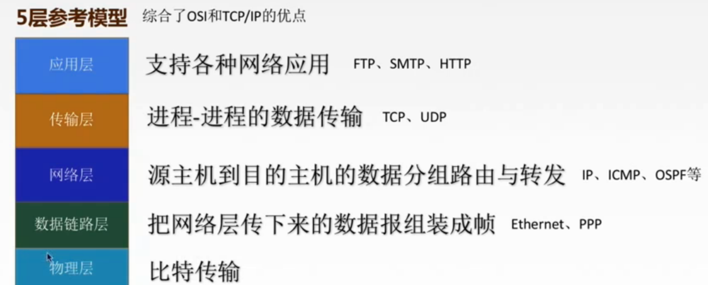

---


# 二、物理层

## 2.1通信基础

### 2.1.1物理层基本概念

物理层解决的是如何在各种计算机的传输媒体上【**传输数据比特流**】，而不是指具体的传输媒体。==主要任务是在物理媒体上实现比特流的透明传送==

### 2.1.2物理层主要任务

确定与传输媒体【接口】有关的一些特性=》定义标准
		机械特性：定义物理连接的特性，规定物理连接时所采用的规格、接口形状、引脚数量等情况
		电气特性：规定传输二进制位时，线路上的电压范围、阻抗匹配、传输速率、距离限制等
		功能特性：指明某条线上出现的某一电平什么意义，接口部分信号线的用途
		规程特性：（过程特性）定义各条物理线路的工作规格和时序关系

### 2.1.3数据通信基础知识

* **典型的数据通信模型：**


* **数据通信相关术语**

  > 数据：传送信息实体，通常是有意义的符号序列
  > 信号：数据的电气、电磁表现，是数据在传输过程中的存在形式
  >
  > 	数字信号：代表消息的参数取值是离散的	
  > 	模拟信号：代表消息的参数取值是连续的
  >
  > 信源：产生和发送数据的源头
  > 信宿：接收数据的终点
  > 信道：信号传输媒介。（方向性）通常一条通信线路是包含发送信道和接收信道

* **三种通信方式**

  > 单工通信	一条信道
  > 半双工通信	两条信道
  > 全双工通信	两条信道

* **两种数据传输方式**

  > 串行传输
  >
  > 并行传输

* **码元**

  > 一个固定时长的信号波形
  >
  > 

* **速率、波特、带宽**
  	速率也叫数据率，指数据的传输速率，表示单位时间内传输的数据量

    		>码元传输速率------每秒传输多少码元
   
   信息传输速率------每秒传输多少比特
 		>//一个码元可以携带多个bit！！！

  ​	带宽表示单位时间内从网络某一点到另一点所能通过的【最高数据率】，常用来表示网络的通信线路所能传送数据的能力

### ==2.1.4编码和调制==

**信道上传送的信号**

	>基带信号

​		将数字信号1和0直接用两种不同的电压表示，再送到数字信道上去传输【基带传输】

> 宽带信号

​		将基带信号进行调制后形成的频分复用模拟信号，再传送到模拟信道上去传输【宽带传输】

**怎么去传**

>数字数据
>	通过数字发送器=》数字信号【编码】
>	通过调制器=》模拟信号【调制】
>模拟数据
>	通过PCM编码器=》数字信号【编码】
>	通过放大器调制器=》模拟信号【调制】

* **数字信号 编码为 数字信号**

  >***二进制数据      非归零编码     归零编码       曼彻斯特编码      差分曼彻斯特编码 	反向不归零编码***   
  >
  >

* **数字数据调制为模拟信号**

  >ASK（调幅）、FSK（调频）、PSK（调相）
  >	

* **模拟数据编码为数字信号**

  >**PCM编码；对音频的脉码调制**
  >	抽样
  >		对模拟信号进行周期性扫描，把时间上连续的信号变成时间上的离散信号；保证满足香农定理
  >	量化
  >		把抽样取得的电平幅值按照一定的分级标度转化为对应的数字值
  >	编码
  >		把量化的结果转化为对应的二进制编码

* **模拟数据调制为模拟信号**

  > 为了实现传输的有效性，可能需要比较高的频率。高频不易受损

## 2.2两个公式

### 2.2.1奈氏公式

在理想低通条件下（无噪声、带宽受限），为了避免码间串扰，极限==码元传输速率==为2W Baud，W是信道带宽单位HZ


### 2.2.2香农定理

在带宽受限且有噪声的信道中，为了不产生误差，信息的====数据传送速率有上限值


## 2.3传输介质

### 2.3.1定义

数据传输系统发送设备和接收设备之间的物理通路


> ​	**==传输媒体并不是物理层！！！==**
>
> 

### 2.3.2分类

#### **导向性传输介质**

>电磁波被导向沿着固体媒介（铜线、光纤）传播
>
>>**双绞线**
>>
>>
>>**同轴电缆**
>>
>>
>>
>>**光纤**
>>
>>
>>
>>> ```
>>> 特点
>>> 	传输损耗小、中继距离长，对远距离传输特别经济
>>> 	抗雷电和电磁干扰能力强
>>> 	无串音干扰，保密性好
>>> 	体积小、重量轻
>>> ```
>
>

#### **非导向性传输介质**

* 无线电波

  ​	向所有方向传播
  ​	较强穿透能力、可远距离传播，适用于通信领域

* 微波

  ​	固定方向传播
  ​	通信频率较高、频段范围宽，数据率高
  ​		地面微波接力通信
  ​		卫星通信
  ​			优点：通信容量大、距离远、覆盖广、广播通信和多址通信
  ​			缺点：传播时延长、受气候影响大、成本高

* 红外线、激光

  ​	固定方向传播
  ​	把要传输的信号分别转换为各自的信号格式即红外信号和激光信号

## 2.4物理层设备

2.4.1中继器

>对信号进行再生和还原，对衰减的信号进行放大，保证与原数据相同以延长网络的长度
>再生数字信号
>中继器两端的网络部分是网段，而不是子网；适用于完全相同的两类网络的连接；而且两个网段的速率相同
>中继器不看数据有无错误，仅仅作用与信号的电气部分
>两端的协议要一致
>
>

2.4.2集线器（多口中继器hub）

>放大信号；转发到其他所有处于工作状态的端口
>
>集线器不能分割冲突域
>	连在集线器上的工作主机平分带宽

# 三、数据链路层

## 3.1数据链路层的基本概念

* **节点**：主机、路由器
* **链路**：网络中两个节点之间的【物理通道】，链路的传输介质主要有双绞线、光纤、微波；分为有线链路和无线链路
* **数据链路**：网络中两个节点之间的【逻辑通道】，把实现控制数据传输协议的硬件和软件加到链路上就构成数据链路
* **帧**：链路层的协议数据单元，封装网络层数据报

## 3.2数据链路层功能概述

数据链路层在物理层提供的服务的基础上向网络层提供服务，其最基本的服务是将源自网络层来的数据可靠地传输到相邻的目标机网络层。其主要的作用是加强物理层传输原始比特率的功能，将物理层提供的可能出错的物理链接改造成==逻辑上无差错的数据链路==，使之对网络层表现为一条无差错的链路

>功能一：
>	为网络层提供服务。无确认无连续服务，有确认无连接服务，有确认面向连接服务
>功能二：
>	链路管理，即连接的建立、维持、释放（用于面向连接的服务）
>功能三：
>	组帧
>功能四：
>	流量控制，限制发送方
>功能五：
>	差错控制（帧错、位错）

## 3.3封装成帧和透明传输

### 3.3.1封装成帧

就是在一段数据首尾添加 帧定界符和其他信息 构成帧


### 3.3.2透明传输

不管所传递的数据是什么，都能够在链路上传输；如果所传数据恰好与某控制信息完全一样就必须采取措施。

### 3.3.3组帧四法

#### **字符计数法**           

> 
>
> 帧首使用一个计数字段来表明帧内字符数
> 缺点：一错全错

#### **字符（字节）填充法**

> 
>
> 

#### **==零比特填充法==**

> 

#### ==**违规编码法**==

> 
>

## 3.4流量控制和可靠传输

### 3.4.1==链路层的流量控制==

> 起因：较高的发送速度和较低的接受能力不匹配会造成传输出错，因此流量控制也是数据链路层的一项主重要工作

链路层和传输层的差别：

>数据链路层的流量控制是点对点的，而传输层的流量控制是端对端的
>控制手段不同
>	数据链路层是接收方收不下就不回复确认
>	传输层是接收端给发送端一个窗口公告

#### ==**控制流量的方法！！！**==

##### a.停止-等待协议

* **为什么要有 停止-等待协议？**
  		除了比特出差错，底层通信还会出现丢包问题。为了实现流量控制

* **研究停止等待协议的前提**
  		虽然现在常用全双工通信，但是为了讨论问题方便，仅考虑一方发送数据，一方接收数据
    		因为是在讨论可靠传输的原理，所以并不考虑数据在哪一层传输的
    		停止等待协议就是每发完一个分组就停止发送，等待对方确认，在收到确认后再发下一组

* **停止等待协议的应用情况** 
  		无差错情况
    		有差错情况			

    > >数据帧丢失或者检测到帧出错
    >
    >
	> >ACK丢失
    > >
    >
    >
	> >ACK迟到
    > >
    >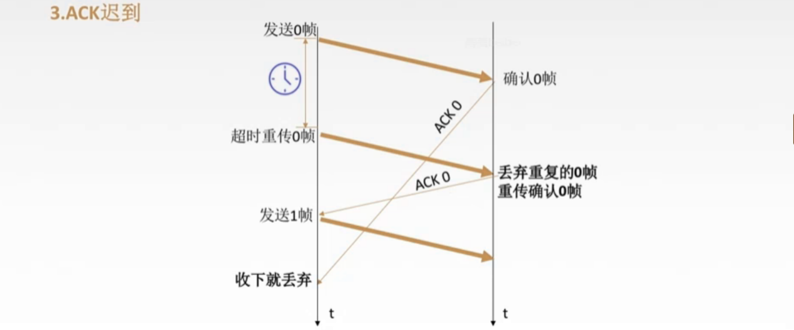
    >
	>优点简单，缺点信道利用率低
    >
    >
    >
    >RTT：传播时延；
    >Ta:接收应答时延

##### b.滑动窗口协议--后退N帧GBN

图解：

> 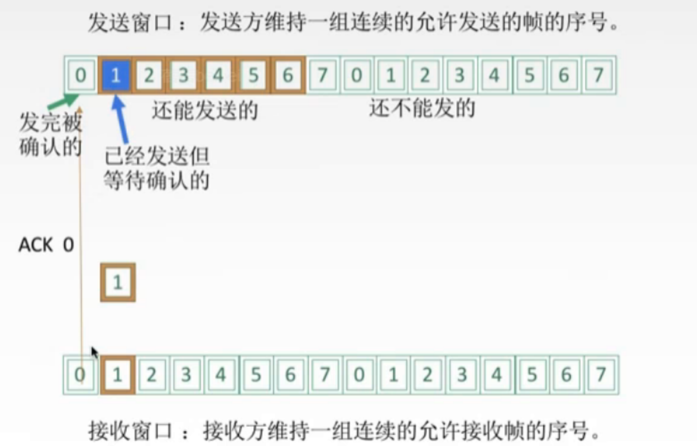

**发送方必须响应的三件事**

 * 上层的调用

   >上层发送数据时候发送方先检查窗口是否已满，未满就发送一个帧，满了就反馈上层等会再发；实际上发送方也可以缓冲这些数据的。

* 收到一个ACK
		
	
	> 对n号帧采取==【累计确认】的方式，表明接收方已经收到n号帧和它之前的全部帧==
	
* 超时事件
		如果c出现超时，发送方会重传所有已发送但是未确认的帧

**GBN接收方要做的事**

> 如果正确收到n号帧，且按序，那么接收方为n帧发送一个ACK，并将该帧中的数据部分交付给上层
> 其余情况都丢弃帧，并为最近按序接收的帧重新发送ACK。接收方无需缓冲任何失序帧，只要维护 expectedseqnum（下一个按序接收的帧序号）

**运行中的GBN图解**

> 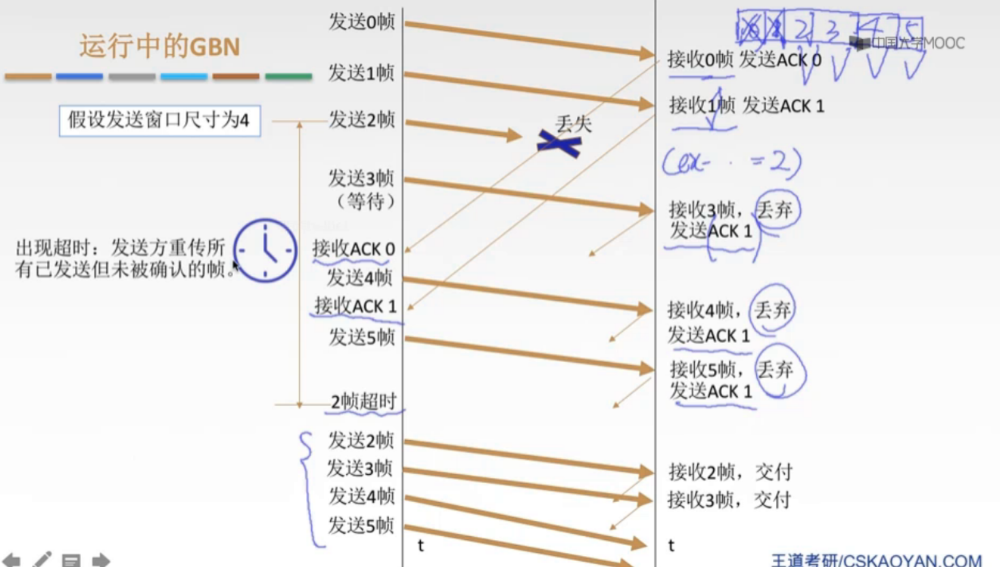


滑动窗口长度：n个比特对帧编码，则发送窗口范围是[1，2^n-1]

优劣：因连续发送数据帧提高了信道利用率；但是重传时候必须把已经正确传送的帧重传，使传送效率降低

##### c.滑动窗口协议--选择重传SR

图解：

> 

**发送方要响应的三件事**

* 上层的调用

  > 收到上层数据后，发送方检查下一个可用于该帧的序号，如果序号位于发送窗口内则发送数据帧；否则响GBN一样，要么将数据缓存要么返回上层之后再传

* 收到一个ACK

  > 收到ACK若该帧序号在窗口内，则发送方将那个被确认的帧标记为已接受。如果该帧号是窗口的左界（最左边的序号），则窗口向右移动到最小序号的未确认帧处。窗口移动了且有序号在窗口内未发送就发送这些帧。		

* 超时事件

  	>每个帧都有自己的定时器，一个超时事件发生后只重传一个帧

**接收方要做的事**
	来者不拒（窗口内的帧）

	>SR接收方将确认一个正确接收的帧而【不管其是否按序】。失序的帧将被缓存，并返回给发生方一个该帧的确认帧【收谁确认谁】，直到所有的帧都被收到为止，这时候才将一批帧交付上层，然后向前移动滑动窗口。		

**运行中的SR**

> ​	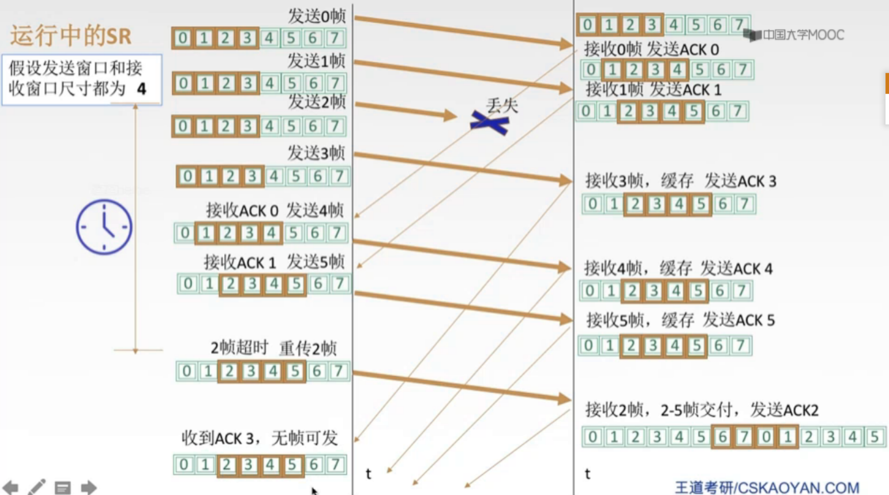

窗口长度
	Wtmax=Wrmax=2^(n-1)

### 3.4.2滑动窗口解决

* 流量控制（收不下就不给确认，想发也发不了）

> 控制发送速率，使接收方有足够的缓冲空间来接收每一个帧

* 可靠传输（发送方自动重传）

> 发送端发啥，接收端收啥


## 3.5差错控制

### 3.5.1概述

* 概括来说，传输中的差错都是由于噪声引起的

* 全局性

  > 由于线路本身的电气特性产生的随机噪声，是信道固有的；
  > 解决方法：提高信噪比

* 局部性

  > 外界特定的短暂原因造成的冲击噪声，是产生差错的主要原因；
  > 解决方法：通常利用编码技术来解决

* 差错

  > 位错
  > 		比特位出错，1变0或0变1
  > 帧错
  > 		丢失\重复\失序

### 3.5.2如何检错

> 如果发现错误晚就浪费很多资源

**错误控制（比特错）**

* **检错编码**

  + **奇偶校验码**

    >
    >
    >只能检测出奇数个比特错误，检测能力位50%

  + **==冗余码CRC==**

    >
    >
    >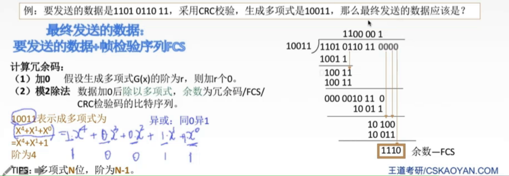

* **纠错编码**

  海明码(有需要再看细节)


## 3.6介质访问控制

### 3.6.1定义

> 是解决当[局域网](https://baike.baidu.com/item/局域网/98626)中共用信道的使用产生竞争时，如何分配信道的使用权问题。将使用介质的每个设备与来自同一信道上的其他设备的通信隔离开，把时域和频域资源合理分配给网络上的设备

### 3.6.2数据传播使用的两种链路

>点对点链路:
>
>*  PPP协议、常用于广域网
>
>广播式链路：
>
>* 所有主机共享通信介质
>* 应用：早期的总线以太网、无线局域网，常见于局域网
>* 典型拓扑结构：总线型、星型（逻辑总线型）

### 3.6.2多路复用图解

​	

### 3.6.3**==介质访问控制==**

#### **静态划分信道--信道划分介质访问控制**

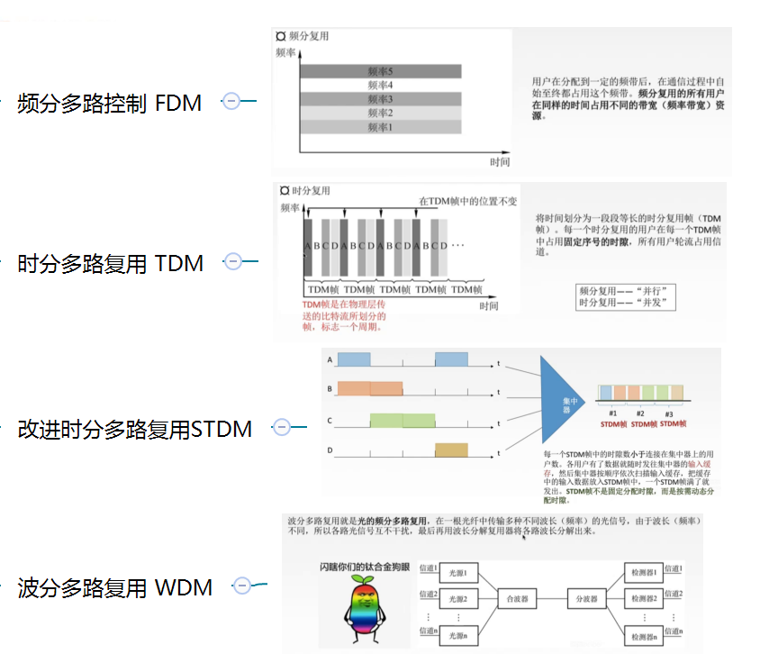


#### **==动态划分信道==**

* **随机访问介质访问控制（随机MAC协议）**

> 所有用户可随机发送消息且占用全部带宽

##### 	**a ) ALOHA协议（不听就说，不重要)**

> 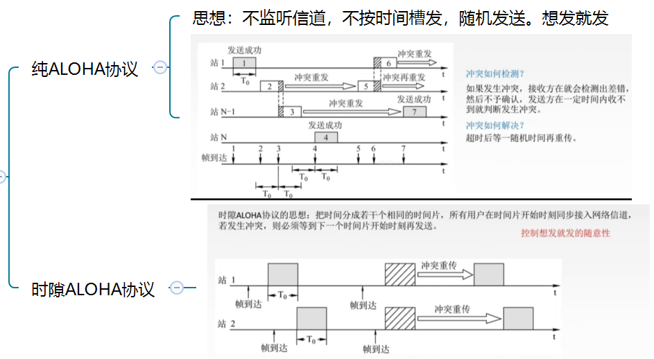


##### **b) CSMA协议**

​	C S:		载波监听,检测总线上的电压摆动值，过大说明有至少两个站在发送数据
​	MA：	多点接入，表示许多计算机以多点接入的方式连接在一根总线上

​	协议思想：发送帧之前，监听信道

>**监听结果**
>	信道空闲：发送完整帧
>	信道忙：推迟发送
>**三个协议：**
>	**1-坚持CSMA**
>
>>信道空闲就之间传输，不必等待；忙则一直坚持监听信道直到空闲就马上传输，如果冲突等待一个随机的时间再去监听
>
>**非坚持CSMA**
>
>>监听到信号忙就等待一个随机时间之后再监听
>
>**p-坚持CSMA**
>
>>对于监听信道空闲的处理不同；如果是空闲就以p概率直接传输，不必等待；概率1-p等待到下一个时间槽再传输
>>优点：既能像非坚持那样减少冲突，又能像1坚持那样减少媒体空闲时间；
>>但是：发送冲突后还是坚持把数据帧发送完，造成浪费。
>
>三者对比
>
>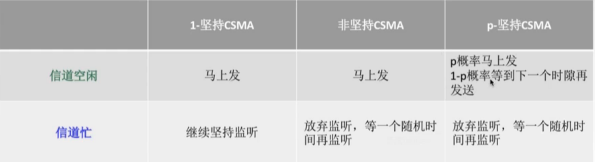		

##### c )CSMA/CD协议

载波监听多点接入/碰撞检测 

>CS:	每一个站在发送数据之前和发送时候都要检测一下总线上是否有其他计算机网络在发数据
>
>MA：多点接入，表示多个计算机以多点接入的方式连接在一个总线上（总线型网络）
>
>CD:	碰撞检测，“边发送边监听”，适配器边发送数据边检测信道上信号电压的变化情况，以便判断自己在发送数据时候其他计算机是否也在发送数据（半双工网络）
>疑问：**先听后发为什么还会发送冲突**？
>		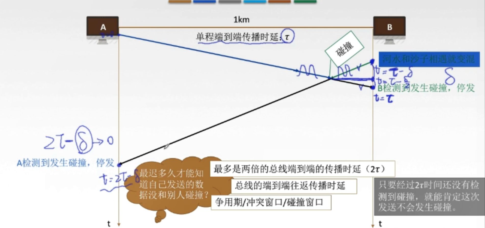

如何缺点碰撞后的重传机制
	

[截断二进制指数规避算法]: https://baike.baidu.com/item/%E6%88%AA%E6%96%AD%E4%BA%8C%E8%BF%9B%E5%88%B6%E6%8C%87%E6%95%B0%E9%80%80%E9%81%BF%E7%AE%97%E6%B3%95/16745902?fr=aladdin

**d) CSMA/CA协议**

含义：

>CA：碰撞避免
>CA适用于无线局域网，而CD适用于总线型以太网

为什么要有CA

>无线局域网
>		无法做到360°全面的检测
>		存在隐蔽站问题: 当A和C都检测不到信号，认为信道空闲时，同时向终端B发送数据帧就会导致冲突

工作原理：

[CSMA/CA]: https://baike.baidu.com/item/CSMA%2FCA/10898090


* 轮询访问介质访问控制

> 令牌传递协议
> 	令牌：一个特殊格式的MAC控制帧，不含任何信息；并不是无线时间使用令牌
> 	问题：令牌开销；等待延时；单点故障
> 	用于令牌环网（物理星型拓扑，逻辑环形），用于负载较重，通信量较大的网络中

> 轮询协议
>
> ​	即要不产生冲突，又要发送时占全部带宽

​	


## 3.7局域网 LAN Local Area Network

### 3.7.1特点

>特 点 1 ： 覆 盖 的 地 理 范 围 较 小 ， 只 在 一 个 相 对 独 立 的 局 部 范 围 内 联· 
>特 点 2 ： 用专门铺设的传输介质（双绞线\同轴电缆）联网，数据传输速率高（10Mb/s 、10Gb/s ） 。 
>特 点 3 ： 通 信 延 迟 时 间 短 ， 误 码 率 低 ， 可 靠 性 较 高 。 
>特 点 4 ： 各 站 为 平 等 关 系 ， 共 享 传 输 信 道 。 
>特 点 5 ： 多 采 用 分 布 式 控 制 和 广 播 式 通 信 ， 能 进 行 广 播 和 组 播 。

### 3.7.2.决定局域网的主要要素

**环形拓扑**

* 星型拓扑

  > 中 心 节 点 是 控 制 中 心 ， 任 意 两 个 节 点 间 的 通 信 最 多 只 需 两 步 ， 传 输 速 度 快 ， 并 且 网 络 构 形 简 单 、 建 网 容 易 、 便 于 控 制 和 管 理 。 但 这 种 网 络 系 统 ， 网 络 可 靠 性 低 ， 网 络 共 享 能 力 差 ， 有 单 点 故 障 问 题 。

* 总线型拓扑

  > 网 络 可 靠 性 高 、 网 络 节 点 间 响 应 速 度 快 、 共 享 资 源 能 力 强 、 设 备 投 入 量 少 、 成 本 低 、 安 装 使 用 方 便 ， 当 某 个 工 作 站 节 点 出 现 故 障 时 ， 对 整 个 网 络 系 统 影 响 小

* 环形拓扑

  > 系 统 中 通 信 设 备 和 线 路 比 较 节 省 。 有 单 点 故 障 问 题 ； 山 于 环 路 是 封 闭 的 ， 所 以 不 便 于 扩 充 ， 系 统 响 应 延 时 长 ， 且 信 息 传 输 效 率 相 对 较 低 。 

* 树型拓扑

  > 易 于 拓 展 ， 易 于 隔 离 故 障 ， 也 容 易 有 单 点 故 障 

  

**传输介质**

	> 有线局域网
	> 无线局域网


**介质访问控制方法**

> CSMA/CD
> 		常用于【总线型局域网】，也用于树型网络
> 令牌总线
> 		常用于【总线型局域网】，也用于树型网络
> 令牌环
> 		用于环形局域网，如令牌环网

### 3.7.3局域网分类

>以太网	IEEE 802.3标准
>令牌环网
>FDDI网
>ATM网
>无线局域网	采用IEEE 802.11标准

### 3.7.4 MAC子层和LLC子层

LLC

>LLC 负 责 识 别 网 络 层 协 议 ， 然 后 对 它 们 进 行 封 装 。 LLC 报 头 告 诉 数 据 链 路 层 一 旦 帧 被 接 收 到 时 ， 应 当 对 数 据 包 做 何 处 理 。 为 网 络 层 提 供 服 务 ： 无 确 认 无 连 接 、 面 向 连 接 、 带 确 认 无 连 接 、 高 速 传 送 。 

MAC

>MAC 子 层 的 主 要 功 能 包 括 数 据 帧 的 封 装 / 卸 装 ， 帧 的 寻 址 和 识 别 ， 帧 的 接 收 与 发 送 ， 链 路 的 管 理 ， 帧 的 差 错 控 制 等 。 MAC 子 层 的 存 在 屏 蔽 了 不 同 物 理 链 路 种 类 的 差 异 性 。 

### 3.7.5以太网

* **概述**
  	定义：
    		基带总线局域网规范；是当今局域网采用的最通用的通信协议标准。 以太网使用的是 CSMA/CD技术
    	统治地位
    		造价低廉
    		是应用最广泛的局域网技术
    		比令牌环网、ATM网便宜简单
    		满足网络速率要求 10Mb/s~10Gb/s
    	两个标准
    		DIX Ethernet V2：第一个局域网产品（以太网）规约
    		IEEE 802.3:IEEE802委员会802.3工作组制定的第一个IEEE的以太网标准（帧格式有一点点改动）

* **无连接、不可靠的服务**
  	无连接：
    		发送方和接收方之间无 握手过程
    	不可靠：
    		不对发送方的数据帧编号，接收方不向发送方进行确认，差错帧直接丢弃，差错纠正由高层负责
    	只能实现无差错接收，不实现可靠传输

* **10BASE-T以太网**
  	BASE：表示传输的是基带信号；T：表示双绞线=》无屏蔽双绞线传输，10:表示速率是10Mb/s

    	>物理上采用星型拓扑、逻辑上总线型，每段双绞线最长是100m
    	>
    	> 	>采用曼彻斯特编码
   
  采用CSMA/CD介质访问控制
  
* **以太网MAC帧**
  	

  ### 3.7.6 无线局域网IEEE 802.11

  是无线局域网通用的标准
  MAC帧头格式

  	>
  	>
  	>目的地址：接收机器地址；源地址：发送机器地址；发送端：发送基站；接收端：接收基站

  无线局域网分类
  	有固定基础设施无线局域网

  	>无固定基础设施无线局域网的自组织网络

## 3.8广域网

### 3.8.1定义

	>广 域 网 (WAN ， Wide Area Network) ， 通 常 跨 接 很 大 的 物 理 范 围  形 成 国 际 性 的 远 程 网 络 。 
	>通信子网使用【分组交换技术】。将不同区域的局域网联接起来，达到资源共享目的

### 3.8.2协议

#### **ppp协议**

* 说明

	>ppp协议： point to point protocal;是目前最广泛使用的数据链路层协议，用户使用拨号电话接入因特网时一般使用ppp协议；只支持全双工链路

* 要满足的要求

	>简 单 : 对 于 链 路 层 的 帧 ， 无 需 纠 错 ， 无 需 序 号 ， 无 需 流 量 控 制 。 
	封 装 成 帧 :  帧 定 界 符 
	透 明 传 输  : 与 帧 定 界 符 一 样 比 特 组 合 的 数 据 应 该 如 何 处 理 ; 异 步 线 路 用 字 节 填 充 ， 同 步 线 路 用 比 特 填 充 。 
	多 种 网 络 层 协 议  : 封 装 IP 数 据 报 可 以 采 用 多 种 协 议 。 
	多 种 类 型 链 路 :  串 行 / 并 行 ， 同 步 / 异 步 ， 电 / 光 
	差 错 检 测 :  错 就 丢 弃 。 
	检 测 连 接 状 态  : 链 路 是 否 正 常 工 作 。 
	最 大 传 送 单 元  : 数 据 部 分 最 大 长 度 MTU 。 
	网 络 层 地 址 协 商 :  知 道 通 信 双 方 的 网 络 层 地 址 。 

* 无需满足的功能

>纠错
>流量控制
>序号
>不支持多点线路

* 三个组成部分

>一个将IP数据报封装到串行链路（同步/异步 串行）的方法
>链路控制协议LCP：建立并维护数据链路的链接。 身份验证
>网络控制协议NCP：ppp支持多种网络层协议，每个不同的网络协议都要有一个相应的NCP来配置，为网络层协议建立和配置逻辑链接。

* 帧协议

  	>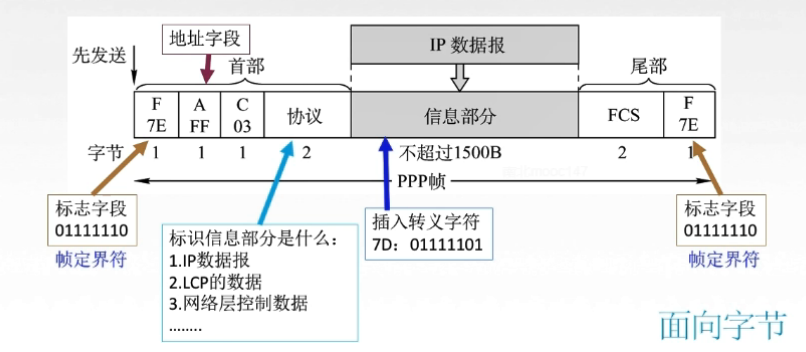


#### **HDLC协议**

* 说明

   >* 高级链路数据控制 High-Level Data Link Control; 在一个同步网上传输数据、面向比特的数据链路层协议。报文数据可透明传输，用于传输的“0比特插入法”易于硬件实现
   >	
   >	>* 采用全双工通信
   > >  	
   > >  	>* 所有帧采用 CRC检验，对信息帧进行顺序编号，可防止漏收或重发，传输可靠性高

* hdlc的站

   >* 主站
   > 	>  		1 ． 主 站 的 主 要 功 能 是 发 送 命 令 （ 包 括 数 据 信 息 ） 帧 、 接 收 响 应 帧 ， 并 负 责 对 整 个 链 路 的 控 制 系 统 的 初 启 、 流 程 的 控 制 、 差 错 检 测 或 恢 复 等 · 
   > 	>  		   	>* 从站
   > 	>  		 	>  		2 ． 从 站 的 主 要 功 能 是 接 收 山 主 站 发 来 的 命 令 帧 ， 向 主 站 发 送 响 应 帧 ， 并 且 配 合 主 站 参 与 差 错 恢 复 等 链 路 控 制 
   > 	>  		 	>  		 	>* 复合站
   > 	>  		 	>  		 	>  	
   > 	>  		 	>  		 	>  	>  		3 ． 复 合 站 的 主 要 功 能 是 既 能 发 送 ， 又 能 接 收 命 令 帧 和 响 应 帧 ， 并 且 负 责 整 个 链 路 的 控 制 。

* 三种数据操作方式

   >正常响应方式
   >	>异步平衡方式
   >	>
   >
   > 	>  	>异步响应方式

* 帧格式

  	>
    	>
    	>

#### 两个协议对比


## 3.9链路层设备

### 集线器

### 网桥（交换机）

网桥：根据MAC帧的目的地址对帧进行转发和过滤。

分类

* 透明网桥

  > 指以太网上的站点并不知道所发送的帧将经过哪几个网桥；即插即用
  > 用转接表自学习，了解各个网段主机的拓扑位置

* 源路由网桥

  > 指发送帧时把详细的最佳路由信息放在帧的首部
  > 方法：源站以广播方式向欲通信的目的站发送一个发现帧

* 以太网交换机(多接口网桥)

  	>直通式交换机

### 冲突域和广播域


# 四、网络层

## 4.1 网络层概述

### 4.1.1任务

​	主要任务是把分组从源端传到目的端，为分组交换网上的不同主机提供通信服务。

### 4.1.2传输单位

数据报；数据报划分成分组

### 4.1.3功能

​	功 能 一 ： 路 由 选 择 与 分 组 转 发 最 佳 路 径 
​	功 能 二 ： 异 构 网 络 互 联 
​	功 能 三 ： 拥 塞 控 制 

		>若 所 有 结 点 都 来 不 及 接 受 分 组 ， 而 要 丢 弃 大 量 分 组 的 话 ， 网 络 就 处 于 拥 塞 状 态 。 因 此 要 采 取 一 定 措 施 ， 缓 解 这 种 拥 塞 。 （开环控制、闭环控制）

## 4.2 数据交换

### 4.2.1为什么要数据交换

​    如何才能使数据通过网络核心【路由器】从源主机到目的主机？
这就需要数据交换
​	如果每个主机都建立链路，这个工程庞大，因此这就发明了交换设备；
但是主机数量再增加，交换设备端口就暴涨，并且长距离也不好处理；
那么这就诞生了交换网络

### 	4.2.2数据交换方式

* **电路交换**

  e.g.: 电话网络

  	>各个阶段：建立连接--通信--释放连接
  	>优点：通信时延小、有序传输、没用冲突、实时性强
  	>缺点：建立连接时间长、线路独占使用效率低、灵活性差、无差错控制能力

* **报文交换**

  报文是什么：源应用发送的信息整体。

  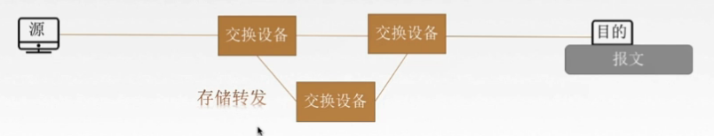

  优点

  >1 ． 无 需 建 立 连 接 
  >2 ． 存 储 转 发 ， 动 态 分 配 线 路 
  >3 ． 线 路 可 靠 性 较 高 线 路 利 用 率 较 高 
  >4． 多 目 标 服 务 

  缺点

  >1 ． 有 存 储 转 发 时 延 
  >2 ． 报 文 大 小 不 定 ， 需 要 网 络 节 点 有 较 大 鍰 存 空 间 

* **分组交换**

  分组

  	>把大的数据块分割成小的数据块

  优点

  > 1 ． 无 需 建 立 连 接 
  > 2 ． 存 储 转 发 ， 动 态 分 配 线 路 
  > 3 ． 线 路 可 靠 性 较 高 鬍 线 路 利 用 率 较 高 
  > 4  .  线 路 利 用 率 较 高 
  > 5 ． 相 对 于 报 文 交 换 ， 存 储 管 理 更 容 易 

  缺点

  > 1 ． 有 存 储 转 发 时 延 
  > 2 ． 需 要 传 输 额 外 的 信 息 量 
  > 3 ． 乱 序 到 目 的 主 机 时 · 要 对 分 组 排 序 重 组 

* **对比**

  >报文交换和分组交换都采用存储转发
  >传送数据量大，且传输时间远大于呼叫时间的时候选择电路交换。电路交换传输时延最小
  >从信道利用率看，报文交换和分组交换优于电路交换，其中分组交换延时更小

  图解

  > 

### 4.2.3路由算法（自己深入了解）

### 4.2.4 IP数据报格式

**图解：**

> 

> 

**协议(对应的编号)**


标识、标志、片偏移之后分片讲解

### 4.2.5 IP数据报分片

* 概念：最大传送单元MTU
  	以太网的MTU是1500字节；那么超范围的IP分组需要分片（有些IP傲娇不分片就返回ICMP报文）


* 标识
  	同一数据报的分片使用同一标识

* 标志
  	只有2位有意义 x  _  _
    		中间位 DF
    			DF=1 禁止分片
    			DF=0 允许分片
    		最低位MF
    			MF=1 后面还有分片
    			MF=0 代表最后一片/没分片

* 片偏移
  	某片在原分组的相对位置；以【8B为单位】！
    		假设是1=》1*8B=8B；说明这个片是原来数据报第8字节位置开始的分片

* 图解

  > 


## 4.3 IPV4地址

### 4.3.1 为什么要IP地址

地址是标识对象所处位置的标识符。传输中的信息带有源地址和目的地址，分别标识通信的**源结点**和**目的结点**，即信源和信宿。目的地址是传输设备为信息进行寻址的依据。

**不同的物理网络技术（底层网络技术）通常具有不同的编址方式，这种差异主要表现：不同的地址结构、不同的地址长度。**

在一个物理网络中，每个结点都至少有一个机器可识别的地址，该地址叫作物理地址。物理地址又称为硬件地址、MAC地址或第二层地址。物理地址有两个特点：==不一致性、不唯一性。==？？？

**不一致性**是指不同的物理网络技术采用不同的编址方式；
**不惟一性**是指不同的物理网络中的结点的物理地址可能重复。
为了保证寻址的正确性，必须确保一个网络中结点地址的惟一性。另外，不同物理网络在地址编址方式上的不统一会给寻址带来极大的不便。在进行网络互联时首先要解决的问题是物理网络地址的统一问题。

因特网是在网络级进行互联的，因此，因特网在网络层（IP层）完成地址的统一工作，将不同物理网络的地址统一到具有全球惟一性的IP地址上，IP层所用到的地址叫作因特网地址，又叫IP地址。

因特网采用一种全局通用的地址格式，为全网的每一个网络和每一台主机都分配一个IP地址，以此屏蔽物理网络地址的差异。

### 4.3.2 分类的IP地址

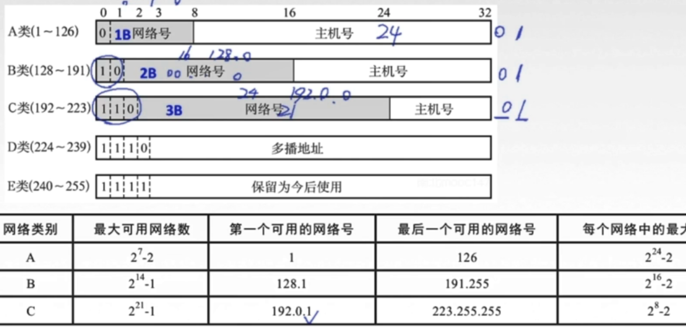

>A类地址
>第一个字节的最高位固定为0，另外7比特可变的网络号可以标识128个网络（0～127），0一般不用，127用作环回地址。所以共有126个可用的A类网络。A类地址的24比特主机号可以标识1677216台主机（2^24 =1677216）。另外，主机号为全0时用于表示网络地址，主机号为全1时用于表示广播地址。这两个主机号不能用来标识主机。所以，每个A类网络最多可以容纳1 677 214台主机。A类地址的第一个字节的取值范围为0～127。

> B类地址
> 第一个字节的最高2比特固定为10，另外14比特可变的网络号可以标识214=16384个网络。16比特主机号可以标识65 536台主机，（216=65536）。由于主机号不能为全0和全1，所以，每个B类网络最多可以容纳65534台主机。B类地址的第一个字节的取值范围为128～191。

> C类地址
> 第一个字节的最高3比特固定为110，另外21比特可变的网络号可以标识221=2097152个网络。8比特主机号可以标识256台主机(28=256)，由于主机号不能为全0和全1。所以，每个C类网络最多可以容纳254台主机。C类地址的第一个字节的取值范围为192～223。

> D类地址
> D类地址用于组播（multicasting），因此，D类地址又称为组播地址。D类地址的范围为224.0.0.0～239.255.255.255，每个地址对应一个组，发往某一组播地址的数据将被该组中的所有成员接收。D类地址不能分配给主机。D类地址的第一个字节的取值范围为224～239。
>
> 有些D类地址已经分配用于特殊用途：
>
> 224.0.0.0 是保留地址、224.0.0.1 是指本子网中的所有系统、224.0.0.2 是指本子网中的所有路由器、224.0.0.9 是指运行RIPv2路由协议的路由器、224.0.0.11是指移动IP中的移动代理。
>
> 另外，还有一些D类地址留给了网络会议：
>
> 224.0.1.11 用于IETF-1-AUDIO、224.0.1.12 用于IETF-1-VIDEO

>E类地址为保留地址，可以用于实验目的。E类地址的范围：240.0.0.0 ～ 255.255.255.254，E类地址的第一个字节的取值范围为240～255。 

**每个网络都要占用两个IP地址，一个用于标识网络，一个用于网络广播。每个网络使用该网络地址块的起始地址作为网络地址，该地址仅作为网络的标识，主要用在网络路由中。网络地址块的结束地址被用作该网络的广播地址。**

在因特网的地址中包含了网络信息。当一个路由器或网关连到多个网络上时，每个网络都会给路由器或网关分配一个IP地址，设备有多少个网络连接，就有多少个IP地址。而且这些IP地址分别属于不同的网络。一台主机也可以连接多个网络，这种主机叫作多宿主主机（Multi-homed Host）。多宿主主机拥有多个IP地址，每个地址对应于一个物理连接。下图是一个多宿主主机的例子：

### 4.3.3特殊的IP地址

在IP地址中有一些并不是来标注主机的，这些地址具有特殊的意义。这些地址包括**网络地址、直接广播地址、受限广播地址、本网络地址、环回地址**等。

* **网络地址**
  因特网上的每个网络都有一个IP地址，其主机号部分为“0”。

> 网络地址的一般表达式为：
>
> {<Network-number>，<Host-number>}={<Network-number>，0}
>
> **==该地址用于标识网络，不能分配给主机，因此不能作为数据的源地址和目的地址==**。
>
> A类网络的网络地址为：Network-number.0.0.0。例如，120.0.0.0；
> B类网络的网络地址为：Network-number.0.0。例如，139.22.0.0；
> C类网络的网络地址为：Network-number.0。例如，203.120.16.0。

* **直接广播地址**

> 直接广播（Direct Broadcast Address）：向某个网络上所有的主机发送报文。TCP/IP规定，主机号各位全部为“1”的IP地址用于广播，叫作广播地址。路由器在目标网络处将IP直接广播地址映射为物理网络的广播地址，以太网的广播地址为6个字节的全“1”二进制位，即：ff:ff:ff:ff:ff:ff 。
>
> 直接广播地址的一般表达式为：
>
> {<Network-number>，<Host-number>}={<Network-number>, -1}
>
> 这里的“-1”表示全“1”。 
>
> 直接广播地址只能作为目的地址。
>
> A类网络的直接广播地址为：Network-number.255.255.255。例如，120.255.255.255；
> B类网络的直接广播地址为：Network-number.255.255。例如，139.22.255.255；
> C类网络的直接广播地址为：Network-number.255。例如，203.120.16.255。

* **受限广播地址**

> 直接广播要求发送方必须知道信宿网络的网络号。但有些主机在启动时，往往并不知道本网络的网络号，这时候如果想要向本网络广播，只能采用受限广播地址（Limited Broadcast Address）。
>
> 受限广播地址是在本网络内部进行广播的一种广播地址。TCP/IP规定，32比特全为“1”的IP地址用于本网络内的广播。
>
> 受限广播地址的一般表达式为：
>
> {<Network-number>，<Host-umber>}={-1, -1}
>
> 其点分十进制表示为：255.255.255.255。
>
> 受限广播地址只能作为目的地址。
>
> 路由器隔离受限广播，不对受限广播分组进行转发。也就是说因特网不支持全网络范围的广播。

* **本网络地址**

> TCP/IP协议规定，网络号各位全部为“0”时表示的是本网络。本网络地址分为两种情况：本网络特定主机地址和本网络本主机地址。
>
> 本网络特定主机地址的一般表达式为：
>
> {<Network-number>,<Host-number>}={0, <Host-number>}
>
> 本网络特定主机地址只能作为源地址。
>
> 本网络本主机地址的一般表达式为：
>
> {<Network-number>，<Host-number>}={0, 0}
>
> 本网络本主机地址的点分十进制表示为：0.0.0.0。
>
> 本网络本主机地址只能作为源地址。
>
> 无盘工作站启动时没有IP地址，此时采用网络号和主机号都为“0”的本网络本主机地址作为源地址。 

* **环回地址**

> 环回地址（Loopback Address）是用于网络软件测试以及本机进程之间通信的特殊地址。 
>
> A类网络地址127.X.X.X被用作环回地址。
>
> 环回地址的一般表达式为：
>
> {<Network-number>,<Host-number>}={127, <any>}
>
> 习惯上采用127.0.0.1作为环回地址，命名为localhost。
>
> 当使用环回地址作为目标地址发送数据时，数据将不会被发送到网络上，而是在数据离开网络层时将其回送给本机的有关进程。

### 4.3.4网络地址转换NAT

说明：

> NAT本质上是一种允许在互联网的不同地方重复使用相同的IP地址集的机制（如上图所示）。建立NAT的主要动机是正在急剧减少的有限IP地址空间。使用NAT最常见的情况是，唯一与Internet连接的站点仅被分配了很少的几个IP地址（甚至只有一个IP地址），但是内部却有多台主机需要同时上网。当所有进出的流量均通过一个单独的NAT设备时，该设备将内部系统的地址空间和全球互联网地址空间分割开，因此所有的内部系统可以使用本地分配的私有IP地址访问互联网。

### 4.3.5 子网和超网

* 超网的概念

>超网(Supernetting)是与子网类似的概念，IP地址根据子网掩码被分为独立的网络地址和主机地址。超网，也称无类别域间路由选择（CIDR），它是集合多个同类互联网地址的一种方法。
>
>与子网划分（把大网络分成若干小网络）相反，它是把一些小网络组合成一个大网络，就是超网

* 合并网段

> 示例：某企业有一个网段，该网段有200台主机，使用192.168.0.0 255.255.255.0网段。

> 后来计算机数量增加到400台，为后来增加的200台主机使用192.168.1.0 255.255.255.0网段，如下图：
>
> 


> 在路由器配置了192.168.0.1的IP地址接口，再添加192.168.1.1地址后，这样192.168.0.0和192.168.1.0这两个网段内的主机就通过路由器转发来实现通信了。
>
> 那么有没有更好的办法，让这两个C类网段的计算机认为在一个网段？
>
> 这就需要将192.168.0.0/24和192.168.1.0/24 两个C类网络合并。
> 
>
> 网段合并：子网掩码向前移动1位，使得网络部分保持前部分相同。
>
> 注：子网掩码往左移1位，能够合并2个连续的网段，但**不是任何连续的网段都能合并**。
>
> 合并网段之后，如下图，这样所有主机相互通信就不再经过路由器转发了。
> 
>
> ①、合并之后网段为：192.168.0.0/23，IP分配如下图：
> ②、合并之后IP地址192.168.0.255/23也是可以给计算机使用的，因为主机部分往左增加了一位0（并不是全1），如下图：
>
> 

子网方向加大掩码长度就是了

### 4.3.6 ==ARP协议==（MAC地址和IP地址的映射）

* 发送数据的过程

>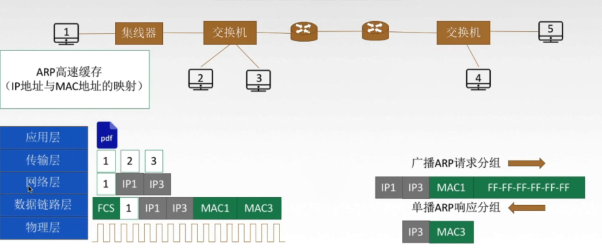
>
>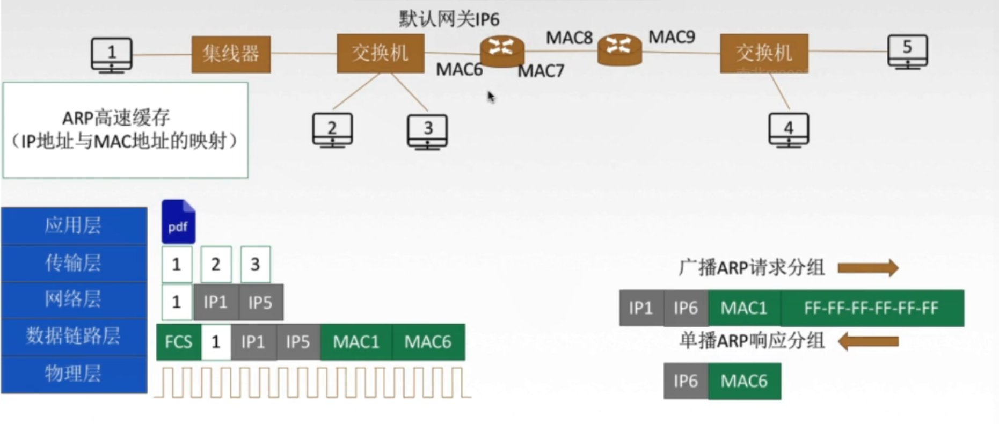

* 产生原因

> 由于在实际网络的链路上传送数据帧的时候最终必须使用MAC地址
> 	ARP协议：完成主机或路由器IP地址到MAC地址的映射（解决吓一跳走哪的问题）

* 使用过程

>检 查 ARP 高 速 缓 存 ， 有 对 应 表 项 则 写 入 MAC 帧 ，
>没 有 则 用 目 的 MAC 地 址 为 FF -FF-FF-FF-FF-FF 的 帧 封 装 并 广 播 ARP 请 求 分 组 ， 同 一 局 域 网 中 所 有 主 机 都 能 收 到 该 请 求 。 目 的 主 机 收 到 请 求 后 就 会 向 源 主 机 单 播 一 个 ARP 响 应 分 组 ， 源 主 机 收 到 后 将 此 映 射 写 入 ARP 缓 存 （ I0-20min 更 新 一 次 ） 。 

* 4种典型情况

>1 主 机 A 发 给 本 网 络 上 的 主 机 B ： 用 ARP 找 到 主 机 B 的 硬 件 地 址 
>2 主 机 A 发 给 另 一 网 络 上 的 主 机 B ： 用 ARP 找 到 本 网 络 上 一 个 路 由 器 （ 网 关 ） 的 硬 件 地 址 
>3 路 由 器 发 给 本 网 络 的 主 机 A ： 用 ARP 找 到 主 机 A 的 硬 件 地 址 
>4 潞 由 器 发 给 另 一 网 络 的 主 机 8 ： 用 ARP 找 到 本 网 络 上 的 一 个 路 由 器 的 硬 件 地 址 

### 4.3.7 ==**主机如何获得IP地址**==

#### 配置种类

>静态配置:
>
>​	IP地址
>​	子网掩码
>​	默认w网关
>
>动态配置：
>
>​	DHCP服务器

#### **DHCP协议**

> **动态主机设置协议**（英语：**Dynamic Host Configuration Protocol，DHCP**）是一个[局域网](https://baike.baidu.com/item/局域网)的[网络协议](https://baike.baidu.com/item/网络协议)，使用[UDP](https://baike.baidu.com/item/UDP)协议工作，主要有两个用途：用于内部网或网络服务供应商自动分配[IP](https://baike.baidu.com/item/IP)地址；给用户用于内部网管理员作为对所有计算机作中央管理的手段。

* 工作流程

  	>* 主机广播DHCP发现报文
   > 	>  		“ 有 没 有 DHCP 服 务 器 呀 ？ ” 试 图 找 到 网 络 中 的 服 务 器 ， 服 务 器 获 得 一 个I P 地 址 · 
   > 	>  		   	>* DHCP服务器广播DHCP提供报文
   > 	>  		 	>  		“ 有 ！ ” “ 有 ！ ” “ 有 ！ ” 服 务 器 拟 分 配 给 主 机 一 个 I p 地 址 及 相 关 配 置 ， 先 到 先 得 。 
   > 	>  		 	>  		 	>* 主机广播DHCP请求报文
   > 	>  		 	>  		 	> 	>  		“ 我 用 你 给 我 的 I p 地 址 啦 ？ ” 主 机 向 服 务 器 请 求 提 供 I p 地 址 。 
   > 	>  		 	>  		 	> 	>  		   	>* DHCP服务器广播DHCP确认报文
  > 	>  		 	>  		 	> 	>
  > 	>  		 	>  		 	> 	>  		  	>  		“ 用 吧 ！ ” 正 式 将 I p 地 址 分 配 给 主 机 。 

#### ICMP协议

* 定义

> ICMP（Internet Control Message Protocol）Internet控制[报文](https://baike.baidu.com/item/报文/3164352)协议。它是[TCP/IP协议簇](https://baike.baidu.com/item/TCP%2FIP协议簇)的一个子协议，用于在IP[主机](https://baike.baidu.com/item/主机/455151)、[路由](https://baike.baidu.com/item/路由)器之间传递控制消息。控制消息是指[网络通](https://baike.baidu.com/item/网络通)不通、[主机](https://baike.baidu.com/item/主机/455151)是否可达、[路由](https://baike.baidu.com/item/路由/363497)是否可用等网络本身的消息。这些控制消息虽然并不传输用户数据，但是对于用户数据的传递起着重要的作用。 [1] 
>
> 从技术角度来说，ICMP就是一个“错误侦测与回报机制”，其目的就是让我们能够检测网路的连线状况﹐也能确保连线的准确性。当路由器在处理一个数据包的过程中发生了意外，可以通过ICMP向数据包的源端报告有关事件。

* 主要功能

> 其功能主要有：侦测远端主机是否存在，建立及维护路由资料，重导资料传送路径（[ICMP重定向](https://baike.baidu.com/item/ICMP重定向)），资料[流量控制](https://baike.baidu.com/item/流量控制)。ICMP在沟通之中，主要是透过不同的[类别](https://baike.baidu.com/item/类别)(Type)与[代码](https://baike.baidu.com/item/代码)(Code) 让机器来识别不同的连线状况。

* 分类

> ​	1 ， **终 点 不 可 达** ： 当 路 由 器 或 主 机 不 能 交 付 数 据 报 时 就 向 源 点 发 送 终 点 不 可 达 报 文 。 【无法交付】
> ​	2 ． **源 点 抑 制（不用了）** ： 当 路 由 器 或 主 机 由 于 拥 塞 而 丢 弃 数 据 报 时 ， 就 向 源 点 发 送 源 点 抑 制 报 文 ， 使 源 点 知 道 应 当 把 数 据 报 的 发 送 速 率 放 慢 。 【拥塞丢弃数据】
> ​	3 ． **时 间 超 过** ： #当 路 由 器 收 到 生 存 时 间 TTL= 0 的 数 据 报 时 ， 除 丢 弃 该 数 据 报 外 ， 还 要 向 源 点 发 送 时 间 超 过 报 文 。#当 终 点 在 预 先 规 定 的 时 间 内 不 能 收 到 一 个 数 据 报 的 全部 数 据 报 片 时 ， 就 把 己 收 到 的 数 据 报 片 都 丢 弃 ， 并 向 源 点 发 送 时 间 超 过 报 文 。 【TTL=0】
> ​	4 ． **参 数 问 题** ： 当 路 由 器 或 目 的 主 机 收 到 的 数 据 报 的 首 部 中 有 的 字 段 的 值 不 正 确 时 ， 就 丢 弃 该 数 据 报 ， 并 向 源 点 发 送 参 数 问 题 报 文 。【 首 部 字 段 有 问 题 】
> ​	5 ． **改 变 路 由 （ 重 定 向 ）** ： 路 由 器 把 改 变 路 由 报 文 发 送 给 主 机 ， 让 主 机 知 道 下 次 应 将 数 据 报 发 送 给 另 外 的 路 由 器 【可 通 过 更 好 的 路 由】 · 

* 其他

>对于“Ping of Death”攻击，可以采取两种方法进行防范：第一种方法是在[路由器](https://baike.baidu.com/item/路由器)上对ICMP[数据包](https://baike.baidu.com/item/数据包)进行[带宽](https://baike.baidu.com/item/带宽)限制，将ICMP占用的带宽控制在一定的范围内，这样即使有ICMP攻击，它所占用的带宽也是非常有限的，对整个网络的影响非常少；第二种方法就是在[主机](https://baike.baidu.com/item/主机)上设置ICMP数据包的处理规则，最好是设定拒绝所有的ICMP数据包。 [7] 
>
>设置ICMP数据包处理规则的方法也有两种，一种是在[操作系统](https://baike.baidu.com/item/操作系统)上设置[包过滤](https://baike.baidu.com/item/包过滤)，另一种是在[主机](https://baike.baidu.com/item/主机)上安装[防火墙](https://baike.baidu.com/item/防火墙)。


## 4.4 IPv6

### 4.4.1起源

> 之前讲过IPv4资源有限，因此创建了CIDR、NAT技术，但是这只是延缓IPv4用完的时间，并没有根本上解决这个问题；这样IPv6诞生了，同时这也能改进首部格式、快速处理转发数据、支持Qos（服务质量）

### 4.4.2与IPv4的区别

>1 . IPv6 将 地 址 从 32 位 （ 48 ） 扩 大 到 128 位 （ 168 ） ， 更 大 的 地 址 空 间 · 
>2  .IPv 6 将 4 的 校 验 和 字 段 彻 底 移 除 ， 以 减 少 每 跳 的 处 理 时 间 · 
>3 . IPv6 将 ' Pv4 的 可 选 字 段 移 出 首 部 ， 变 成 了 扩 展 首 部 ， 成 为 灵 活 的 首 部 格 式 ， 路 由 器 通 常 不 对 扩 展 首 部 进 行 检 查 ， 大 大 提 高 了 路 由 器 的 处 理 效 率 · 
>4 .  IPv 6 支 持 即 插 即 用 ( 即 自 动 配 置 ） ， 不 需 要 DHCP 协 议 。 
>5  . IPv6 首 部 长 度 必 须 是 8B 的 整 数 倍 ，Ipv 4 首 部 是 4B 的 整 数 倍 · 
>6 ．IPv6 只 能 在 主 机 处 分 片 ， IPv4 可 以 在 路 由 器 和 主 机 处 分 片 。 
>7 ． ICMP ： 附 加 报 文 类 型 “ 分 组 过 大 ” 
>8 ． IPv6支 持 资 源 的 预 分 配 ， 支 持 实 时 视 像 等 要 求 ， 保 征 一 定 的 带 宽 和 时 延 的 应 用 · 
>9 ． IPv6 取 消 了 协 议 字 段 ， 改 成 下 一 个 首 部 字 段 · 
>
>10.IPv6 取 消 了 总 长 度 字 段 ， 改 用 有 效 载 荷 长 度 字 段 · 
>11 ． IPv6 取 消 了 服 务 类 型 字 段 · 
### 4.4.3表示形式

* 一般形式

> **冒号十六进制记法**
> 		48F5 ： AA12 ： 0216 ： FEBC:BA5F ： 039A ： BE9A ： 2170 
> **压缩形式**
> 		4BF5：0000：0000：0000：BA5F：039A：000A：2176
> 		4BF5 : 0 : 0 : 0  BA5F : 39A : A : 2176
> 		零压缩：一连串的0可以用：：取代
> 		FF05:0:0:0:0:0:0:B3
> 			FF05::B3

## 4.5 路由算法

### 4.5.1路由算法分类

* 静态路由算法（非自适应路由算法）

  >管理员手动配置路由信息
  >  	>	简便可靠，在负荷稳定、拓扑变化不大的网络中运行效果很好，广泛用于高度安全性的军事网络和较小的商业网络
  >  	>
  >  	>	  	>	缺点：路由更新慢，不适用于大型网络

* 动态路由算法（自适应路由算法）

  >路由器之间彼此交互信息，按照路由算法优化出路由表现。
  >  	>	路由更新块，适用于大型网络，及时响应链路费用和网络拓扑变化。
  >  	>
  >  	>	  	>	算法复杂，增加网络负担。

* 动态路由算法的再分类

  	>全局性：**链路状态路由算法**=》所有的路由器掌握完整的网络拓扑和链路费用信息
  >
  >  	>	分散性：**距离向量路由算法**=》路由器只掌握物理相连的邻居及链路费用

### 4.5.2分层次的路由选择协议

* 为什么要有分层次的路由协议
  	>因特网规模太大
    	许多单位不想让外界直到自己的路由选择协议，但还想连入因特网

* 自治系统AS

  > 自 治 系 统 AS ： 在 单 一 的 技 术 管 理 下 的 一 组 路 由 器 ， 而 这 些 路 由 器 使 用 一 种 内 部 的 路 由 选 择 协 议 和 共 同 的 度 量 以 确 定 分 组 在 该 内 的 路 山 ， 同 时 还 使 用 一 种 之 间 的 路 由 协 议 以 确 定 在 之 间 的 路 由 。 一 个 内 的 所 有 网 络 都 属 于 一 个 行 政 单 位 来 管 辖 ， 一 个 自 治 系 统 的 所 有 路 由 器 在 本 自 治 系 统 内 都 必 须 连 通 。 

* 路由选择协议
  	>内部网关协议IGP
    		一个AS内部使用的 RIP、OSPF
    	外部网关协议EGP
    		AS之间使用的 BGP-4

### 4.5.3RIP协议（距离向量）

* 定义：

   >是一种分布式的基于距离向量的路由选择协议，是因特网的协议标准，最大优点是简单
   >
   >  	>	RIP协议要求网络中每一个路由器都维护从它自己到其他每一个目的网络的唯一最佳距离记录（即一组距离）

* 距离

  	>距 离 ： 通 常 为 “ 跳 数 ” ， 即 从 源 端 口 到 目 的 端 口 所 经 过 的 路 由 器 个 数 ， 经 过 一 个 路 由 器 跳 数 + 1 。 特 别 的 ， 从 一 路 由 器 到 直 接 连 接 的 网 络 距 离 为 1 。 RIP 允 许 一 条 路 由 最 多 只 能 包 含 15 个 路 由 器 ， 因 此 距 离 为 16 表 示 网 络 不 可 达 。 
  >
  >  	>		RIP协议只适用于小互联网

  

* 图例

  >

* 距离向量算法

  > 1、修改相邻路由器发来的RIP报文中所有表项
  >
  > 	>​	对地址X的相邻路由发来的RIP报文，修改次报文所有表项：把下一跳字段地址改为X，并把所有距离字段加一
  > 	>​	
  >
  > 2、对修改后的RIP报文的每一个项目进行处理（更新）
  >
  > 		>R1路由表若没有Net3，则把该项目填入R1路由表
  > 		>		R1路由表有Net3，则查看下一跳路由地址
  > 		>			若下一跳是X,说明现在收到的是最新的信息，把收到的替换掉原来的
  > 		>			若下一跳不是X，就要对比距离，新距离更小才更新
  >
  > 3、180s还没有收到相邻路由器X的更新路由表，则把X记为不可达路由器，即把距离设置为16
  > 	图例
  >
  > > 
  > > 		

### 4.5.4OSPF协议及链路状态算法

* 定义：

  	>开放最短路径优先OSPF协议：“开放”表明OSPF协议不是受某一家厂商控制，而是公开发表的；“最短路径优先”是因为使用了Dijkstra提出的最短路径算法SPF

* OSPF的特点
  	>和谁交换
    		它传给邻居，邻居又传给自己的邻居；泛洪法，广播
    	交换什么
    		发送的信息就是与本路由器相邻的所有路由器的**链路状态**（本路由器和哪些路由器相邻，以及该链路的代价）
    	多久交换
    		链路状态发生变化时候才泛洪发生此信息
    	最后所有路由器都能建立一个链路状态数据库，即全网拓扑图

* 其他特点

  	>1 ． 每 隔 30min ， 要 刷 新 一 次 数 据 库 中 的 链 路 状 态 · 
  >  	>	2 ， 由 于 一 个 路 由 器 的 链 路 状 态 只 涉 及 到 与 相 邻 路 由 器 的 连 通 状 态 ， 因 而 与 整 个互 联 网 的 规 模 并 无 直 接 关 系 。 因 此 当 互 联 网 规 模 很 大 时 ， OSPF 协 议 要 比 距 离 向 量 协 议 RIP 好 得 多 · 
  >  	>
>  	>	  	>	3 ．OSPF 不 存 在 坏 消 息 传 的 慢 的 问 题 ， 它 的 收 敛 速 度 很 快 。 

  具体细节可以参考华为的数据通信笔记

### 4.5.5BGP协议

* 三个问题
  	>和谁交换
    		与其他AS的邻站BGP发言人交换信息
    	交换什么
    		交换的网络可达性的信息，即要到达某个网络所要经过的一系列AS
    	多久交换
    		发生变化时更新有变化的部分

* 图示

  	>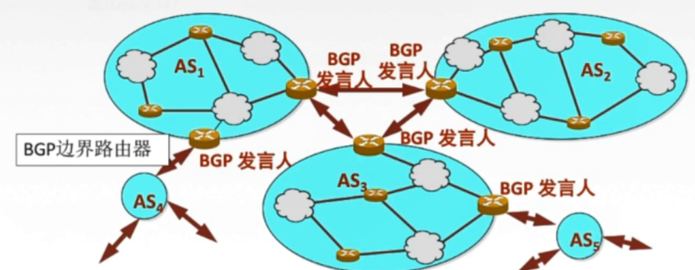

* 特点
  	>BGP 支 持 CDIR ， 因 此 BGP 的 路 由 表 也 就 应 当 包 括 目 的 网 络 前 缀 、 下 一 跳 路 由 器 ， 以 及 到 达 该 目 的 网 络 所 要 经 过 的 各 个 自 治 系 统 序 列 。 
    	在 BGP 刚 刚 运 行 时 ， BGP 的 邻 站 是 交 换 整 个 的 BGP 路 由 表 · 但 以 后 只 需 要 在 发 生 变 化 时 更 新 有 变 化 的 部 分 · 这 样 做 对 节 省 网 络 带 宽 和 减 少 路 由 器 的 处 理 开 销 都 有 好 处 。 

* BGP-4的四种报文
  	>1.OPEN （ 打 开 ） 报 文 ： 用 来 与 相 邻 的 另 一 个 p 发 言 人 建 立 关 系 ， 并 认 证 发 送 方 。 
    	2.UPDATE （ 更 新 ） 报 文 ： 通 告 新 路 径 或 撤 销 原 路 径 。 
    	3.KEEPALIVE （ 保 活 ） 报 文 ： 在 无 UPDATE 时 ， 周 期 性 证 实 邻 站 的 连 通 性 ： 也 作 为 OPEN 的 确 认 · 
    	4 ． NO ， FICA ， ON （ 通 知 ） 报 文 ： 报 告 先 前 报 文 的 差 错 ： 也 被 用 于 关 闭 连 接 。 

### 4.5.6三种协议比较

* RIP 是 一 种 分 布 式 的 基 于 距 离 向 量 的 内 部 网 关 路 由 选 择 协 议 ， 通 过 广 播 UDP 报 文 来 交 换 路 由 信 息 · 
* OSPF 是 一 个 内 部 网 关 协 议 ， 要 交 换 的 信 息 量 较 大 ， 应 使 报 文 的 长 度 尽 量 短 · 所 以 不 使 用 传 输 层 协 议 （ 如 UDP 或 TCP) ， 而 是 直 接 采 用 iP · 
* BGP 是 一 个 外 部 网 关 协 议 ， 在 不 同 的 自 治 系 统 之 间 交 换 路 由 信 息 ， 由 于 网 络 环 境 复 杂 ， 需 要 保 证 可 靠 传 输 ， 所 以 采 用 TCPO 

## 4.6 IP组播

### 4.6.1单播、广播、组播

	>**单播点对点**，用户多时候效率低，占带宽
	>**广播点对多**，有时候利用率也低
	>**组播点对多**，当网络中某些用户需要特定数据时，借助组播路由协议为组播数据包建立组播分发树，被传递的数据到达距离用户端尽可能近的节点才开始复制和分发

### 4.6.2 IP组播地址

* 组 播 地 址 让 源 设 备 能 够 将 分 组 发 送 给 一 组 设 备 。 属 于 多 播 组 的 设 备 将 被 分 配 一 个 组 播 地 址 （ 一 群 共 同 需 求 主 机 的 相 同 标 识 ） · 

* 组 播 地 址 范 围 为 224.0.0.0~239.255.255.255（ D 类 地 址 ） ， 一 个 D 类 地 址 表 示 一 个 组 播 组 。 只 能 用 作 分 组 的 目 标 地 址 。 源 地 址 总 是 为 单 播 地 址 

* 图示

  

### 4.6.3 特点

	>1， 组 播 数 据 报 也 是 “ 尽 最 大 努 力 交 付 ” ， 不 提 供 可 靠 交 付 ， 应 用 于 UDP。
	2 ， 对 组 播 数 据 报 不 产 生 ICMP 差 错 报 文 。 
	3 ， 并 非 所 有 0 类 地 址 都 可 以 作 为 组 播 地 址 。 

### 4.6.4 网际组管理协议IGMP

​	工作流程

* ROUND 1 ： 
  			>某 主 机 要 加 入 组 播 组 时 ， 该 主 机 向 组 播 组 的 组 播 地 址 发 送 一 个 IGMP 报 文 ， 声 明 自 己 要 称 为 该 组 的 成 员 ·
  本 地 组 播 路 由 器 收 到 IGMP 报 文 后 ， 要 利 用 组 播 路 由 选 择 协 议 把 这 组 成 员 关 系 发 给 因 特 网 上 的 其 他 组 播 路 由 器 。 

* ROUND 2 ： 

  			>本 地 组 播 路 由 器 周 期 性 探 询 本 地 局 域 网 上 的 主 机 ， 以 便 知 道 这 些 主 机 是 否 还 是 组 播 组 的 成 员 。 只 要 有 一 个 主 机 对 某 个 组 响 应 ， 那 么 组 播 路 由 器 就 认 为 这 个 组 是 活 跃 的 ： 如 果 经 过 几 次 探 询 后 没 有 一 个 主 机 响 应 ， 组 播 路 由 器 就 认 为 本 网 络 上 的 没 有 此 组 播 组 的 主 机 ， 因 此 就 不 再 把 这 组 的 成 员 关 系 发 给 其 他 的 组 播 路 山 器 。 

### 4.6.5组播路由选择协议

	* 目的：找出以源主机为根节点的组播转发树
	
	* 常用的三种算法（了解）
		>基于链路状态的路由选择
		基于距离-向量的路由选择
		协议无关的组播（稀疏/密集）

## 4.7 移动IP

### 4.7.1 相关术语

* 移动节点
  		具有永久IP地址的移动设备
* 归属代理（本地代理）
  		一个移动节点拥有的“居所”称为归属网络，在归属网络中代表移动节点执行移动管理功能的实体称为归属代理
* 外部代理（外地代理）
  		外部网络中帮助移动节点完成移动管理功能的实体称为外部代理
* 永久地址（归属地址/主地址）
  		移动节点在归属网络中的原始地址
* 转交地址（辅地址）
  		移动节点在外部网络中使用的临时地址

### 4.7.2 通信过程

* 图例

  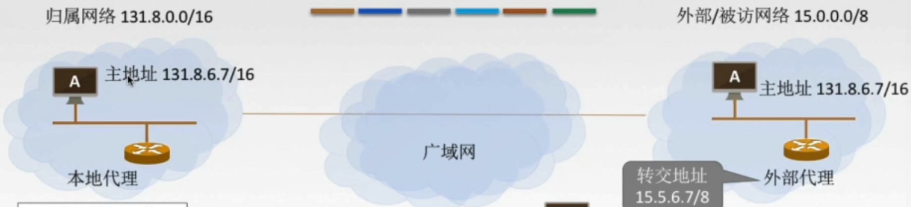

* A刚进入外部网络
  	1 在外部代理登记获得一个转交地址，离开时注销
    	2 外地代理向本地代理登机转交地址

* B发生A发送数据报
  	1 本地代理截获数据报
    	2 本地代理再封装数据报。新的数据报目的地址是转交地址发给外部代理（隧道）
    	3 外部代理拆封数据报并发给A

* A给B发送数据报
  	A用自己的主地址作为数据报源地址，用B的IP地址作为数据报目的地址发送即可

## 4.8 网络层设备

### 4.8.1路由器

* 定义
  	是一种具有多个输入端口和多个输出端口的专用计算机，其任务是转发分组

* 图解
  	

* 端口的处理
  	输入端口收到分组的处理

  > 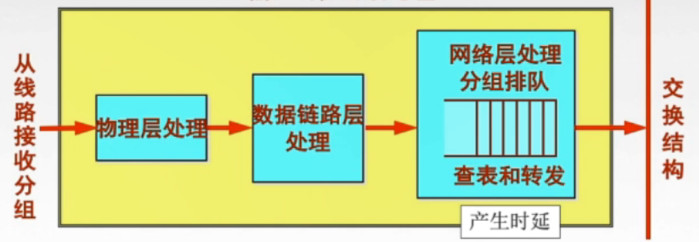

  ​	输出端口将交换结构传送来的分组发送到线路

  > 

  ​	路由器中的输入或输出队列产生溢出是造成分组丢失的重要原因

* 三层设备的区别
  	网络层
    		路由器：可以互联两个不同网络层协议的网段
    	链路层
    		网  桥：可以互联两个物理层和链路层不同的网段
    	物理层
    		集线器：不能互联两个物理层不同的网段

* 路由表和路由转发

  > 路由表是根据路由算法得出的，主要用途是路由选择，总是用软件来实现
  > 	转发表由路由表得来，可以用软件实现，也可以用特殊的硬件实现，转发表必须包含完成转发功能必须的信息，在转发的每一行必须包含从要到达的目的网络到输出端口和某些MAC地址信息的映射

# 五、传输层

## 5.1传输层概述

### 5.1.1功能：

* 提高**进程和进程之间**的逻辑通信
* 复用和分用
* 对收到的报文进行差错检测
* 传输层有两种协议

### 5.1.2协议

​	TCP
​		==**面向连接**==的传输控制协议
​			可靠，面向连接，时延大，适用大文件
​	UDP
​		==**无连接的**==用户数据协议
​			不可靠，无连接，时延小，适用于小文件

### 5.1.3传输层寻址与端口

* 复用：应用层所有应用的进程都可以通过传输层再传输到网络层

* 分用：传输层从网络层收到数据后交付指明的应用程序

* 端口（逻辑端口/软件端口）：是传输层的SAP，标识主机中的应用进程

* 端口号：只有本地意义，在英特网中不同主机之间端口号没意义

* 端口号分类
  		>服务端口号
    			熟知端口号0-1023
    				给TCP/IP最重要的一些应用程序，让所有用户都知道
    			登记端口号1024-49151
    				为没有熟知端口号的应用程序使用的
    	客户端口号
    			49152-65535
    				仅在客户进程运行时才动态选择

* 套接字Socket

  		>唯一标识了网络中的一个主机和它上面的一个进程；（主机IP地址，端口号）

## 5.2 UDP协议

### 5.2.1主要特点

* 无连接的：减少开销和发送数据之前的延时
* 不保证可靠交付：尽最大肯交付但是不保证
* 面向报文：适合一次传输少量数据的网络应用
* 无拥塞控制：适合很多事实应用
* 首都开销小：8B；TCP20B

### 5.2.2首部格式

* 图解

  > 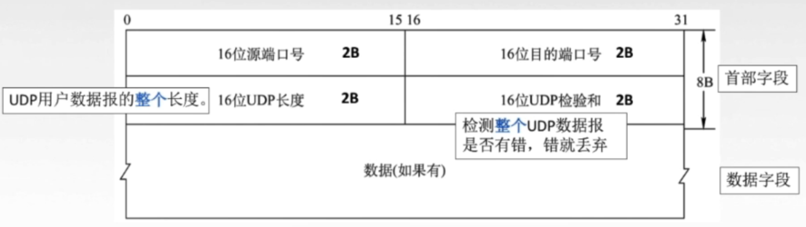
  >
  > 分用时，找不到对应的目的端口号，就丢弃报文

### 5.2.3校验

* 校验过程图解

  > 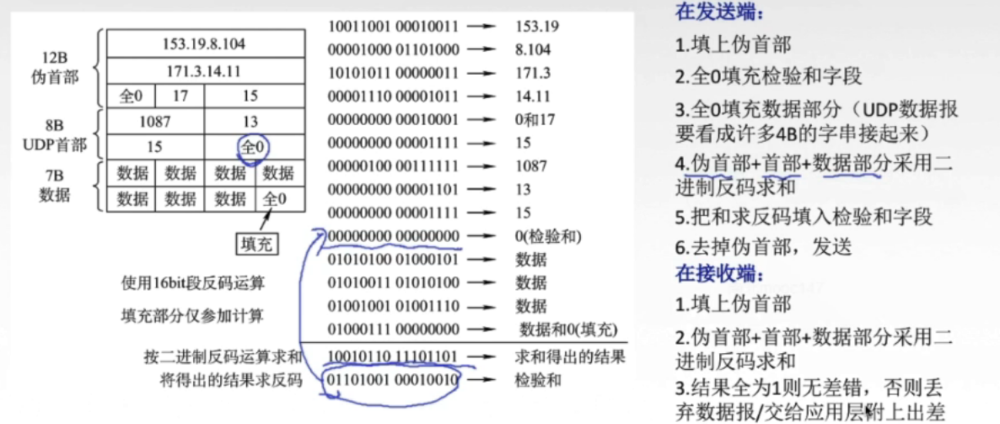

## 5.3 ==TCP协议==

### 5.3.1 三个阶段

* 连接建立
  	采用客户服务器方式C/S;主动建立连接的叫客户，被连接的叫服务器
* 数据传输
* 连接释放

### 5.3.2==建立连接过程（三次握手）==

* 图解

  

* SYN洪泛攻击（了解）
  	>SYN 洪 泛 攻 击 发 生 在 OSI 第 四 层 ， 这 种 方 式 利 用 TCP 协 议 的 特 性 ， 就 是 三 次 握 手 。 攻 击 者 发 送 TCP SYN ， SYN 是 TCP 三 次 握 手 中 的 第 一 个 数 据 包 ， 而 当 服 务 器 返 回 ACK 后 ， 该 攻 击 者 就 不 对 其 进 行 再 确 认 ， 那 这 个 TCP 连 接 就 处 于 挂 起 状 态 ， 也 就 是 所 谓 的 半 连 接 状 态 ， 服 务 器 收 不 到 再 确 认 的 话 ， 还 会 重 复 发 送 ACK 给 攻 击 者 。 这 样 更 加 会 浪 费 服 务 器 的 资 源 。 攻 击 者 就 对 服 务 器 发 送 非 常 大 量 的 这 种 TCP 连 接 ， 由 于 每 一 个 都 没 法 完 成 三 次 握 手 ， 所 以 在 服 务 器 上 ， 这 些 TCP 连 接 会 因 为 挂 起 状 态 而 消 耗 CPU 和 内 存 ， 最 后 服 务 器 可 能 死 机 ， 就 无 法 为 正 常 用 户 提 供 服 务 了 。 
  （解决方法：设置SYN cookie）

### 5.3.3 ==释放连接过程(四次挥手)==

* 图解

  

### 5.3.4 确保可靠传输机制

* 可靠是什么

  > 保证接收方进程从缓存区读出的字节流与发送方的字节流是完全一样的

* 四个机制

  > 校验
  >
  > 		>与UDP校验一样，增加伪首部
  >
  > 序号
  > 		>一个字节占一个序号，【序号字段】是指一个报文的第一个字节的序号
  >
  > 确认
  > 重传
  >
  > > TCP的发送方在规定时间内没有收到确认就要重传已发送的报文段（超时重传）
  > > 		这个时间不好控制，因为有些报文长传输时间长，短的报文时间短；TCP采用自适应算法，动态改变RTTs（加权平均往返时间）
  > > 		有时候等待时间太长=》冗余ACK（冗余确认）：每当比期望序号大的失序报文段到达时，发送一个冗余ACK，指明下一个取代字节的序号
  > > **快速重传机制**
  > >
  > > > 每 当 比 期 望 序 号 大 的 失 序 报 文 段 到 达 时 ， 发 送 一 个 冗 余 A ， 指 明 下 一 个 期 待 字 节 的 序 号 。 
  > > > 			发 送 方 己 发 送 1 ， 2 ， 3 ， 4 ， 5 报 文 段 
  > > > 			接 收 方 收 到 1 ， 返 回 给 1 的 确 认 （ 确 认 号 为 2 的 第 一 个 字 节 ） 
  > > > 			接 收 方 收 到 3 ， 仍 返 回 给 1 的 确 认 （ 确 认 号 为 2 的 第 一 个 字 节 ） 
  > > > 			接 收 方 收 到 4 ， 仍 返 回 给 1 的 确 认 （ 确 认 号 为 2 的 第 一 个 字 节 ） 
  > > > 			接 收 方 收 到 5 ， 仍 返 回 给 1 的 确 认 （ 确 认 号 为 2 的 第 一 个 字 节 ） 
  > > > 			发 送 方 收 到 3 个 对 于 报 文 段 1 的 冗 余 ACK =》认 为 2 报 文 段 丢 失 ， 重 传 2 号 报 文 段 （快速重传）
  > > > 		
  > >
  > > 发送缓存、发送窗口、缓存接收窗口、发送过程中使用的协议如停等协议、GPN协议、SR协议=》类似链路层

* 过程图解

  > 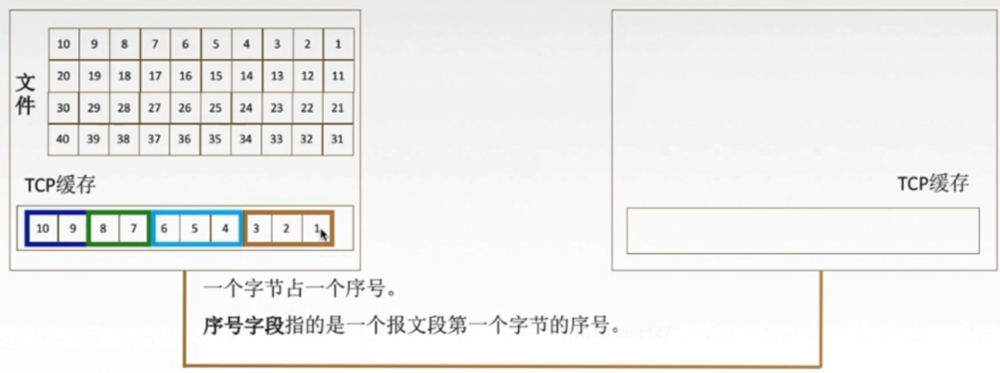
  >
  > 
  >
  > 
  >
  > 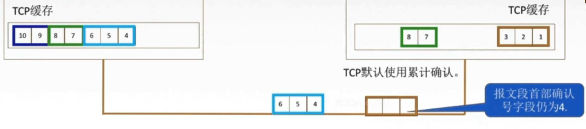
  >
  > 

### 5.3.5 流量控制

* 让发送方慢点，要让接收方来得及接收
  	TCP利用滑动窗口机制实现流量控制

* 案例图解

  > 
  >
  > B给A发送rwnd的信息丢失就会产生类似死锁；A一直等B的窗口大小值，而B一直等A的反馈
  > TCP 为 每 一 个 连 接 设 有 一 个 持 续 计 时 器 ， 只 要 TCP 连 接 的 一 方 收 到 对 方 的 零 窗 口 通 知 ， 就 启 动 持 续 计 时 器 。 若 持 续 计 时 器 设 置 的 时 间 到 期 ， 就 发 送 一 个 零 窗 口 探 测 报 文 段 接 收 方 收 到 探 测 报 文 段 时 给 出 现 在 的 窗 口 值 · 若 窗 口 仍 然 是 0 ， 那 么 发 送 方 就 重 新 设 置 持 续 计 时 器 。 

### 5.3.6 拥塞控制

* 出现拥塞条件
  	对z资源的需求>可用资源
    	网络中有许多资源同时呈现出不足=》网络性能变坏=》网络吞吐量随负荷增大而下降
* 拥塞控制目的
  	防止过多数据注入网络（全局性）
    		流量控制是点对点的问题
* 自行了解（慢开始、拥塞避免、快重传、快恢复）

# 六 应用层

## 6.1概述

### 6.1.1 应用层协议的定义

​	应用进程交换的报文类型；请求还是响应
​	各种报文类型的语法，如报文中的各个字段极其详细描述
​	字段的语义，即包含在字段中的信息的含义
​	进程何时、如何发送报文，以及对报文进行响应的规则

### 6.1.2 应用层功能

​	文件传输、访问和管理
​	电子邮件
​	虚拟终端
​	查询服务和远程作业登陆

### 6.1.3 应用层重要协议

​	FTP
​	SMTP、POP3
​	HTTP
​	DNS

## 6.2网络应用模型

6.2.1 客户/服务器 模型（C/S模型）

* 特点
  	服务器：提供计算服务的设备
    		永久提供服务
    		永久性访问地址/域名
    	客户机：请求计算服务的主机
    		与服务器通信，使用服务器提供的服务
    		间接性接入网络
    		可能使用动态IP地址
    		不与其他客户机直接通信
* 应用
  	web、文件传输FTP、远程登陆、电子邮件

6.2.2 P2P模型

* 图解

  

* 特点
  	不存在永远在线的服务器
    	每个主机可以提供服务，也可以请求服务
    	任意端系统/节点 之间可以直接通信
    	节点间接性接入网络
    	节点可能改变IP地址
    	可拓展性好
    	网络健壮性强

6.2.3域名解析系统DNS

* IP不好记忆，域名好记忆

* 域名服务器

  

6.2.4文件传输协议FTP

* 特点
  	提供不同的主机系统之间的文件传输能力

* 工作原理
  	>ftp地址 用户名&地址
    	匿名登陆
  
    	> 互 连 网 中 有 很 大 一 部 分 p 服 务 器 被 称 为 “ 匿 名 ” (Anonymous) FTP 服 务 器 。 这 类 服 务 器 的 目 的 是 向 公 众 提 供 文 件 拷 贝 服 务 ， 不 要 求 用 户 事 先 在 该 服 务 器 进 行 登 记 注 册 ， 也 不 用 取 得 p 服 务 器 的 授 权 Anonymous （ 匿 名 文 件 传 输 ） 能 够 使 用 户 与 远 程 主 机 建 立 连 接 并 以 匿 名 身 份 从 远 程 主 机 上 拷 贝 文 件 ， 而 不 必 是 该 远 程 主 机 的 注 册 用 户 。 用 户 使 用 特 殊 的 用 户 名 "anonymous" 登 陆 FTP 服 务 ， 就 可 访 问 远 程 主 机 上 公 开 的 文 件 。
  
    	使用TCP实现可靠传输
    	
    	图解
    	
    	>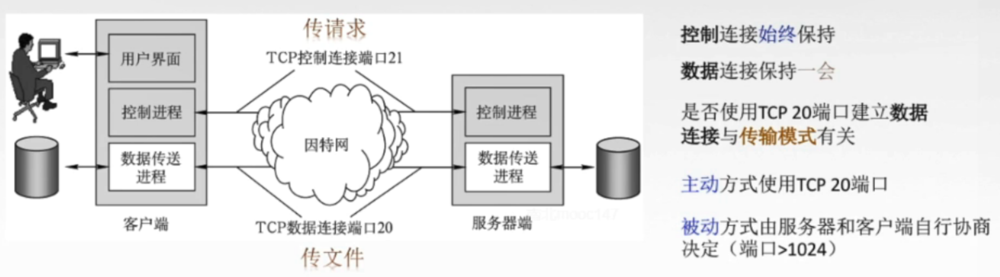
  
    	FTP传输模式
    		文本模式：ASCII模式
    		二进制模式：Binary模式 


6.2.5电子邮件

* 组成结构

  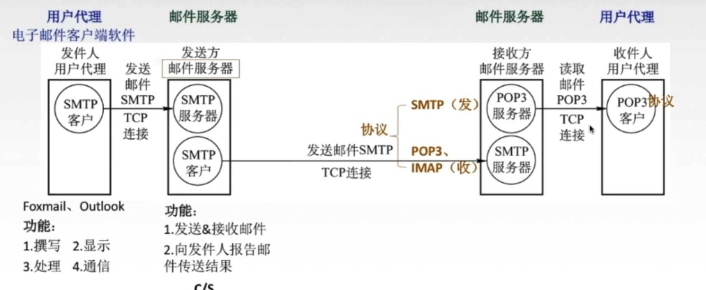

* SMTP协议

* 邮局协议 POP3

  > 工作方式
  > 	下载并保留
  > 	下载并删除
  > 综述
  > 	TCP连接，端口号110 C/S
  > IMAP协议
  >
  > ​	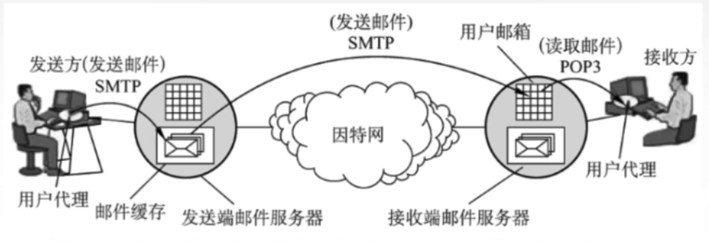

* 基于万维网的电子邮件


6.2.6万维网和HTTP协议

* 万维网概述

  > 1 是一个大规模的、联机式的星系存储所/资料空间，是无数个网络站点和网页的集合：资源（文字、视频、音频）
  >
  > 2 统一资源定位符URL------唯一标识---->资源
  >
  > 3 URL一般形式
  > 		<协议>://<主机>:<端口>/<路径>
  >
  > 4 HTML
  > 	使得万维网页面设计者可以很方便从一个界面的连接转到另一个界面，并能够在自己的屏幕上显示出来。

* HTTP协议

  * 定义：
    	定义了浏览器（万维网客户进程）怎样向万维网服务器请求万维网文档，以及服务器怎样把文档传送给浏览器

  * 流程

    

  * 特点

    > HTTP本身是无状态的
    > 实际中一些网站常常希望能够识别用户
    > Cookie是存储在用户主机的文本文件，记录一段时间用户的访问记录=》提供个性化服务
    > HTTp采用TCP作为传输层协议，但是HTTP协议本身是无连接的

  * 连接方式

    >1 持久连接
    >	非流水线式
    >	流水线s式
    >2 非持久连接
    >
    >3图解
    >
    >> 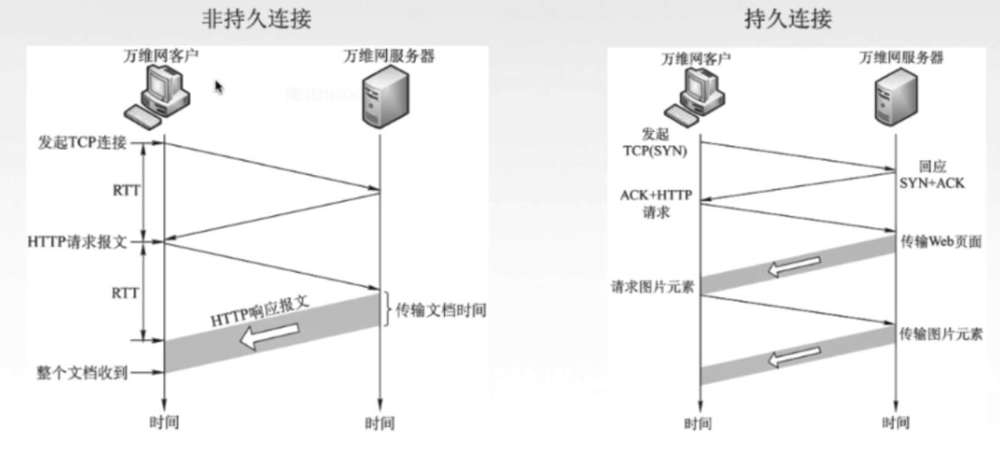

    

    